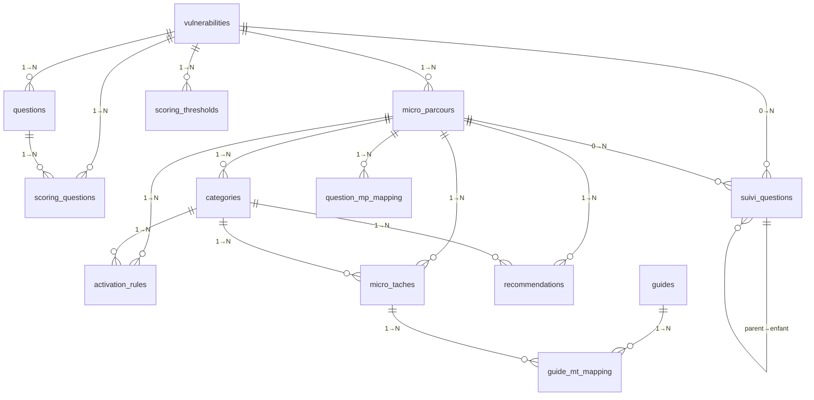

# 🏗️ ARCHITECTURE BASE DE DONNÉES — Moteur Clinique Monka

> **Version** : 1.0 — 22 février 2026  
> **Statut** : Document officiel de référence  
> **Plateforme** : Supabase (PostgreSQL 15)  
> **Projet** : `mbxeqrvofrmhqlwlefff`

---

## 1. Vue d'ensemble

### Principe d'architecture

La DB Monka stocke **toute la logique clinique** — aucun hardcoding dans le code. Le moteur (`clinicalEngine.ts`) est un évaluateur générique qui lit les tables et applique les règles. Pour modifier la logique clinique, on modifie les données, pas le code.

### Volumétrie live

| Table | Lignes | Rôle |
|---|---|---|
| `vulnerabilities` | 5 | 5 vulnérabilités (V1-V5) |
| `questions` | 165 | 150 questions + 15 triggers |
| `micro_parcours` | 24 | 24 MPs (R1-R4, A1-A4, S1-S4, F1-F6, M1-M6) |
| `categories` | 73 | Catégories par MP (2-4 par MP) |
| `activation_rules` | 240 | Règles : prev, std, crit, ccc |
| `micro_taches` | 390 | Recommandations concrètes |
| `scoring_questions` | 345 | Barème score par réponse |
| `scoring_thresholds` | — | Seuils de vulnérabilité |
| `content_blocks` | 355 | Documentation clinique |
| `question_mp_mapping` | 155 | Traçabilité question→MP |
| `guides` | 42 | Guides d'action (Tier 1-3) |
| `guide_mt_mapping` | 61 | Guide→MT liens |
| `suivi_questions` | 30 | Questions de suivi (futur) |
| `cr_templates` | — | Templates CR médecin |
| `recommendations` | — | Recommandations (legacy) |

---

## 2. Schéma relationnel



---

## 3. Description détaillée des tables

### 3.1 `vulnerabilities` — Les 5 axes de vulnérabilité

| Colonne | Type | PK/FK | Description |
|---|---|---|---|
| `id` | text | **PK** | V1, V2, V3, V4, V5 |
| `name` | text | | Nom complet (ex: "Vulnérabilité relationnelle de l'aidant") |
| `bloc_id` | integer | | Numéro du bloc de questions |
| `bloc_label` | text | | Label affiché |
| `question_count` | integer | | Nb de questions pour cette V |
| `weight` | numeric | | Poids dans le score global (0.20 = 20%) |

> **Sens** : Chaque V représente un axe d'évaluation indépendant. Le score V est calculé séparément via `scoring_questions`, puis combiné avec les `weight` pour le score global.

---

### 3.2 `questions` — 165 questions du questionnaire

| Colonne | Type | PK/FK | Description |
|---|---|---|---|
| `id` | text | **PK** | Identifiant unique (N7, E21, O53...) |
| `vulnerability_id` | text | **FK→vulnerabilities** | V d'appartenance |
| `ordre_global` | integer | | Ordre d'affichage |
| `bloc_id` | integer | | Bloc numérique |
| `bloc` | text | | Nom du bloc |
| `sous_bloc` | text | | Sous-catégorie |
| `question_text` | text | | Texte complet de la question |
| `response_type` | text | | Type : unique, multi, number, open |
| `response_options` | jsonb | | Options de réponse [{label, value}] |
| `is_trigger` | boolean | | true = question de profilage (15) |
| `classification` | text | | NE, E, O |
| `aidance` | text | | Type d'aidance ciblé |
| `condition_affichage` | text | | Condition d'affichage conditionnel |
| `sens_clinique` | text | | Justification clinique de la question |

> **Les 3 classifications** : **N** = Normal (questions systématiques), **E** = Évaluative (questions d'approfondissement), **O** = Observation (constat de l'aidant).

---

### 3.3 `micro_parcours` — 24 MPs

| Colonne | Type | PK/FK | Description |
|---|---|---|---|
| `id` | text | **PK** | R1, A1, S1, F1, M1... |
| `vulnerability_id` | text | **FK→vulnerabilities** | V parent |
| `nom` | text | | Nom du MP (ex: "Charge & épuisement") |
| `objectif` | text | | Objectif du MP |
| `signature_a` | text | | Signature ASR partie A |
| `signature_b` | text | | Signature ASR partie B |
| `asr_wording` | text | | Wording de l'ASR |
| `asr_criteres_validation` | text | | Critères de validation ASR |

> **Lien V→MP** : V1→R1-R4, V2→A1-A4, V3→S1-S4, V4→F1-F6, V5→M1-M6.

---

### 3.4 `categories` — 73 catégories (sous-axes des MPs)

| Colonne | Type | PK/FK | Description |
|---|---|---|---|
| `id` | text | **PK** | R1_CAT_01, R1_CAT_02... |
| `mp_id` | text | **FK→micro_parcours** | MP parent |
| `nom` | text | | Nom de la catégorie |
| `description` | text | | Description détaillée |
| `ordre` | integer | | Ordre d'affichage dans le MP |

> **Sens** : Les catégories structurent les MTs et les règles d'activation au sein d'un MP. Chaque catégorie a son propre niveau d'activation (prev, std, crit, ccc).

---

### 3.5 `activation_rules` — 240 règles d'activation

| Colonne | Type | PK/FK | Description |
|---|---|---|---|
| `id` | text | **PK** | V1_R1_STD_01, V4_F2_CCC_02... |
| `mp_id` | text | **FK→micro_parcours** | MP ciblé |
| `category_id` | text | **FK→categories** | Catégorie ciblée |
| `niveau` | text | | **prev**, **std**, **crit**, **ccc** |
| `condition_logic` | jsonb | | Conditions d'activation (AND/OR/_multi) |
| `delai_jours` | integer | | Délai d'action (7, 30, 90...) |
| `sens_clinique` | text | | Justification clinique de la règle |
| `justification_delai` | text | | Pourquoi ce délai |
| `justification_ccc` | text | | Pourquoi c'est un CCC (si niveau = ccc) |
| `rule_group` | text | | Regroupement logique |

> **Les 4 niveaux** : **prev** = prévention, **std** = standard (14j), **crit** = critique (7j), **ccc** = combinaison de conditions critiques (7-30j, parfois 0j).

#### Format de `condition_logic`

```json
// AND simple
[{"q": "E7", "op": "in", "vals": ["Très fatigué·e", "Épuisé·e"]},
 {"q": "E11", "op": "eq", "val": "Non, je risque de ne plus y arriver"}]

// OR (junction)
[{"q": "N38", "op": "eq", "val": "Oui", "junction": "OR"},
 {"q": "N39", "op": "eq", "val": "Oui", "junction": "OR"}]

// Composite (_multi : ≥N sur M)
[{"q": "_multi", "op": "gte", "val": 2, "conditions": [
  {"q": "E23", "op": "in", "vals": ["Pas plus d'1h", "Ne peut pas rester seul"]},
  {"q": "E24", "op": "in", "vals": ["Oui, souvent", "Oui, en permanence"]},
  {"q": "O8", "op": "eq", "val": "Tout le temps"}
]}]
```

**Opérateurs** : `eq`, `ne`, `in`, `nin`, `gte`, `has_any`, `count_gte`, `contains`

---

### 3.6 `micro_taches` — 390 recommandations

| Colonne | Type | PK/FK | Description |
|---|---|---|---|
| `id` | text | **PK** | MT_V1_033, MT_V4_006... |
| `mp_id` | text | **FK→micro_parcours** | MP parent |
| `category_id` | text | **FK→categories** | Catégorie parent |
| `libelle` | text | | Libellé court |
| `type` | text | | INFO, ORGA, SEC, STRUC |
| `acteur` | text[] | | Acteurs impliqués |
| `domaine` | text | | Domaine d'action |
| `is_contributive` | boolean | | Contribue à l'ASR ? |
| `is_prevention` | boolean | | MT de prévention ? |
| `is_parametric` | boolean | | MT paramétrée ? |
| `parametric_mapping` | jsonb | | Mapping paramétrique |
| `is_action` | boolean | | Est une action (vs info) ? |
| `aidance` | text | | Type d'aidance ("Tous" par défaut) |
| `ordre` | integer | | Ordre d'affichage |
| `wording_idec` | text | | Wording pour l'IDEC |
| `wording_utilisateur` | text | | Wording pour l'aidant |
| `wording_std` | text | | Wording niveau STD |
| `wording_ccc` | text | | Wording niveau CCC |
| `wording_crit` | text | | Wording niveau CRIT |
| `sens_clinique` | text | | Justification clinique |
| `justification_type` | text | | Pourquoi ce type (INFO, ORGA...) |
| `contribution_asr` | text | | Comment contribue à l'ASR |

> **Les 4 types** : **INFO** = information, **ORGA** = organisation, **SEC** = sécurisation, **STRUC** = structuration du parcours.

---

### 3.7 `scoring_questions` — 345 barèmes

| Colonne | Type | PK/FK | Description |
|---|---|---|---|
| `id` | serial | **PK** | Auto-incrémenté |
| `question_id` | text | **FK→questions** | Question source |
| `vulnerability_id` | text | **FK→vulnerabilities** | V scorée |
| `response_text` | text | | Texte exact de la réponse |
| `score` | integer | | Points attribués (0-3) |
| `max_score_vulnerability` | integer | | Score max de la V (cap) |
| `source` | text | | Source de la règle |

> **Principe** : Chaque combinaison question×réponse×V a un score. Le moteur somme les scores par V, cappé par `max_score_vulnerability`. Le scoring est **indépendant** de l'activation des MPs (Kernel K13).

---

### 3.8 `scoring_thresholds` — Seuils de vulnérabilité

| Colonne | Type | PK/FK | Description |
|---|---|---|---|
| `id` | serial | **PK** | Auto-incrémenté |
| `vulnerability_id` | text | **FK→vulnerabilities** | V ciblée |
| `level` | text | | Niveau (faible, modéré, élevé, très élevé) |
| `min_score` / `max_score` | integer | | Bornes du seuil |
| `description` | text | | Description du niveau |

---

### 3.9 `content_blocks` — 355 blocs de documentation clinique

| Colonne | Type | PK/FK | Description |
|---|---|---|---|
| `id` | uuid | **PK** | Auto-généré |
| `entity_type` | text | | question, micro_tache, rule, vulnerability, category |
| `entity_id` | text | | ID de l'entité documentée |
| `block_type` | text | | sens_clinique, justification_delai, etc. |
| `content` | text | | Contenu du bloc |
| `ordre` | integer | | Ordre d'affichage |

> **Pas de FK dure** : La clé est `entity_type + entity_id` (polymorphique). Permet de documenter n'importe quelle entité sans modifier le schéma.

---

### 3.10 `question_mp_mapping` — 155 liens question→MP

| Colonne | Type | PK/FK | Description |
|---|---|---|---|
| `id` | serial | **PK** | Auto-incrémenté |
| `question_id` | text | | ID de la question |
| `mp_id` | text | **FK→micro_parcours** | MP influencé |
| `nb_rules` | integer | | Nb de rules dans ce MP |
| `niveaux_triggered` | text | | Niveaux déclenchés (std, crit, ccc) |
| `justification` | text | | Pourquoi cette question impacte ce MP |
| `source` | text | | Source de la derivation |

---

### 3.11 `guides` — 42 guides d'action

| Colonne | Type | PK/FK | Description |
|---|---|---|---|
| `id` | text | **PK** | GUIDE_APA, GUIDE_MINI_TELEALARME... |
| `titre` | text | | Titre du guide |
| `sous_titre` | text | | Sous-titre explicatif |
| `domain` | text | | Domaine (A, F, R, S, M) |
| `tier` | integer | | Tier 1 (procédure), 2 (bilan), 3 (info) |
| `priority` | text | | urgent, recommended, optional |
| `duree_estimee` | text | | Durée estimée |
| `steps` | jsonb | | Étapes [{text, order, detail}] |
| `contacts` | jsonb | | Contacts [{name, role, phone}] |
| `documents` | jsonb | | Docs nécessaires |
| `tip` | text | | Conseil pratique |

### 3.12 `guide_mt_mapping` — 61 liens guide→MT

| Colonne | Type | PK/FK | Description |
|---|---|---|---|
| `id` | serial | **PK** | Auto-incrémenté |
| `guide_id` | text | **FK→guides** | Guide source |
| `mt_id` | text | **FK→micro_taches** | MT liée |

### 3.13 `suivi_questions` — 30 questions de suivi (futur)

| Colonne | Type | PK/FK | Description |
|---|---|---|---|
| `id` | text | **PK** | S000, S_V1, S_V1_R1... |
| `niveau` | integer | | 0=racine, 1=V, 2=MP |
| `question_text` | text | | Texte de la question |
| `response_type` | text | | Oui/Non |
| `vulnerability_id` | text | **FK→vulnerabilities** | V ciblée (nullable) |
| `mp_id` | text | **FK→micro_parcours** | MP ciblé (nullable) |
| `parent_id` | text | **FK→suivi_questions** | Parent hiérarchique |
| `questions_reouvertes` | text[] | | IDs des questions à réouvrir |

> **Arbre hiérarchique** : S000 (racine) → S_V1 (V filtré) → S_V1_R1 (MP ciblé). Les `questions_reouvertes` pointent vers les questions du questionnaire initial à réévaluer.

### 3.14 Autres tables

| Table | Rôle |
|---|---|
| `cr_templates` | Templates de comptes rendus médecin (wording par V et niveau) |
| `recommendations` | Table legacy de recommandations (parallèle aux MTs) |
| `micro_taches_backup_20260221` | Backup pré-migration |

---

## 4. Qualité de la base — Audit live

| Check | Résultat |
|---|---|
| Questions sans `sens_clinique` | **0** ✅ |
| Rules sans `sens_clinique` | **0** ✅ |
| MTs sans `sens_clinique` | **0** ✅ |
| CCC sans `justification_ccc` | **0** ✅ |
| Guides sans mapping MT | **0** ✅ |
| Question↔MP sans justification | **0** ✅ |
| MTs orphelines (MP inexistant) | **0** ✅ |
| Rules orphelines (MP inexistant) | **0** ✅ |

> **Verdict : 8/8 checks PASS — zéro données manquantes, zéro orphelins.**

---

## 5. Modifications planifiées

### 5.1 Questionnaire de suivi (validé, non implémenté)

> Réf : `FINAL/autres/REFLEXION_QUESTIONNAIRE_SUIVI.md`

| Table | Modification | Statut |
|---|---|---|
| `assessments` | **NOUVELLE** — sessions d'évaluation (versioning) | À créer |
| `assessment_responses` | **NOUVELLE** — réponses par session | À créer |
| `assessment_mp_states` | **NOUVELLE** — snapshots état MP par session | À créer |

### 5.2 CCC inter-V (validé, non implémenté)

> Réf : `CCC_CROSS_V_PROPOSALS.json`

| Table | Modification | Statut |
|---|---|---|
| `activation_rules` | +16 lignes (4 mono-sévères + 1 intra-V + 3 inter-MP + 8 cross-V) | À insérer |

> Aucune modification de schéma nécessaire — les tables actuelles supportent déjà les CCC cross-V.

---

## 6. Principes de conception

### Zero hardcoding
Toute la logique clinique est en DB. Le code ne contient que l'évaluateur générique. Pour modifier un score, un délai, une règle : modifier une ligne SQL, pas du TypeScript.

### Scoring indépendant de l'activation
Le score V est calculé à partir de `scoring_questions` (question × réponse → points). L'activation des MPs est calculée à partir de `activation_rules` (question × réponse → niveau). **Les deux systèmes sont indépendants** (Kernel K13).

### Traçabilité complète
- Chaque question a un `sens_clinique` (pourquoi on la pose)
- Chaque MT a un `justification_type` (pourquoi ce type INFO/ORGA/SEC/STRUC)
- Chaque CCC a un `justification_ccc` (pourquoi cette combinaison est critique)
- Chaque mapping question→MP a une `justification` (pourquoi cette question influence ce MP)

### Documentation polymorphique
La table `content_blocks` utilise un pattern `entity_type + entity_id` pour documenter n'importe quelle entité sans modifier le schéma. Ça permet d'ajouter des blocs de documentation à des questions, des MTs, des rules, des catégories ou des vulnérabilités sans créer de nouvelles tables.
