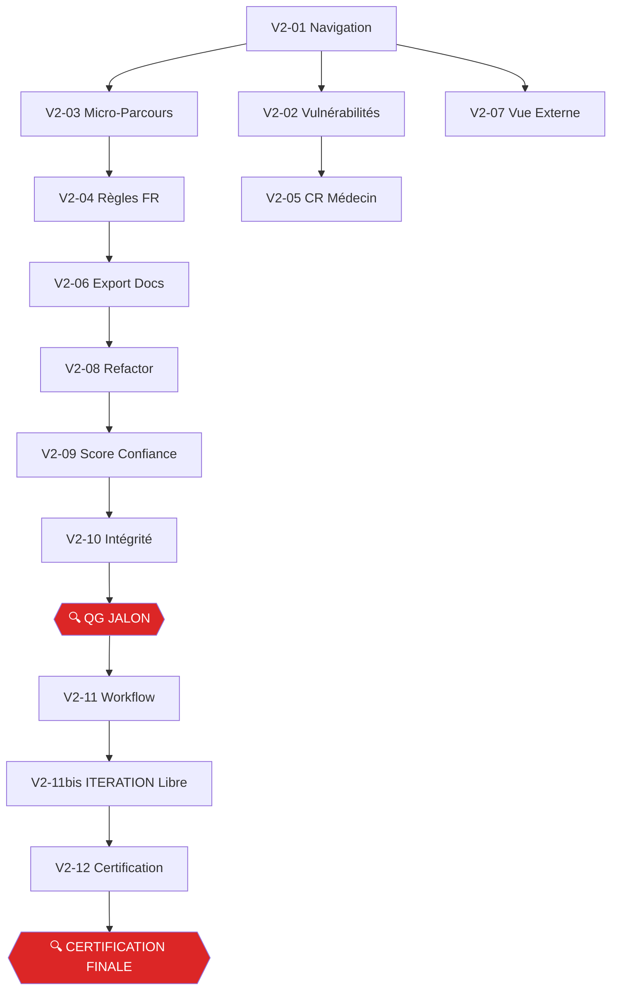

# 🏗️ SPRINT V2 — Monka Clinical Engine

> **Version :** 2.0 — 22/02/2026
> **Auteur :** PRAGMA Studio
> **Projet :** Monka Clinical Engine — Supabase `mbxeqrvofrmhqlwlefff`
> **Stack :** React 18 + TypeScript + Vite + Supabase
> **Framework :** [PRAGMA Senior Dev Framework v2.1](pragma-starter-kit/framework/senior-dev-framework.md)
> **Workflows :** [Sprint-Bloc](.agent/workflows/sprint-bloc.md) — [Itération](.agent/workflows/iteration.md)
> **Rules :** [Dev Rules](.agent/rules/dev.md)
> **Origine :** Fusion du SPRINT.md original (blocs 0-15 ✅) + [ITERATIONS_FEEDBACK.md](FINAL/ITERATIONS_FEEDBACK.md)
> **Mapping Front↔DB :** [MAPPING_FRONT_DB.md](FINAL/MAPPING_FRONT_DB.md) — 15 tables, 13 exploitées, 2 gaps
> **Features :** [FEATURES.md](FINAL/FEATURES.md) — 40+ features Sprint V1 + impact analysis Sprint V2

---

## 📊 État Actuel — Ce qui est FAIT

> Sprint V1 : blocs 0-15 terminés. Ceci est le Sprint V2, qui redéfinit les chantiers restants en intégrant les retours d'itération d'Antonin.

### App actuelle — Pages existantes

| Page | Fichier | Taille | Rôle actuel |
|------|---------|:------:|-------------|
| Dashboard | `DashboardPage.tsx` | ~31KB | Vue d'ensemble stats V1-V5 |
| Simulateur | `SimulatorPage.tsx` | ~23KB | Orchestrateur 4 onglets (Scoring, MP, Règles, CR) |
| Personas | `PersonasPage.tsx` | ~37KB | Sélection persona, réponses préremplies |
| Questions | `QuestionsPage.tsx` | ~22KB | Fiches questions avec filtres |
| Vulnérabilités | `VulnerabilitiesPage.tsx` | ~3.7KB | Drill-down V→MP→Détail |
| Docs | `DocsPage.tsx` | ~25KB | Documents officiels |
| Roadmap | `RoadmapPage.tsx` | ~20KB | Roadmap du projet |

### Simulator sub-components (18 fichiers)

| Composant | Taille | Rôle |
|-----------|:------:|------|
| `SimulatorScoringTab.tsx` | ~7.5KB | Onglet scoring |
| `SimulatorMPTab.tsx` | ~8KB | Onglet Micro-Parcours |
| `SimulatorRulesTab.tsx` | ~7KB | Onglet Règles |
| `SimulatorCRTab.tsx` | ~6.8KB | Onglet CR Médecin |
| `SimulatorHeader.tsx` | ~7.4KB | Header avec filtres V |
| `QuestionsSidebar.tsx` | ~10KB | Sidebar questions |
| `MPDetailView.tsx` | ~17KB | Détail d'un MP |
| `MPRecosView.tsx` | ~12.6KB | Recommandations d'un MP |
| `MPTasksView.tsx` | ~6.9KB | Tâches d'un MP |
| `CRMedecinDocument.tsx` | ~19.7KB | Document CR |
| `ClinicalChain.tsx` | ~4.3KB | Chaîne clinique traçable |
| `CoverageHeatmap.tsx` | ~6.8KB | Matrice couverture |
| `ScoreBreakdown.tsx` | ~5.3KB | Décomposition score |
| `PersonaComparison.tsx` | ~9.2KB | Comparaison personas |
| `WhatIfDiff.tsx` | ~5.4KB | Diff What-If |
| `SimulatorExternalView.tsx` | ~16KB | Vue externe patient |
| `scoreActionGap.ts` | ~2KB | Détection gap |
| `types.ts` | ~2.4KB | Types simulateur |

### DB Live (15 tables, ~1860 lignes)

| Table | Lignes |
|-------|:------:|
| `vulnerabilities` | 5 |
| `questions` | 165 |
| `micro_parcours` | 24 |
| `question_mp_mapping` | 155 |
| `categories` | 73 |
| `activation_rules` | 240 |
| `scoring_questions` | 345 |
| `scoring_thresholds` | 20 |
| `recommendations` | 198 |
| `micro_taches` | 390 |
| `content_blocks` | 355 |
| `cr_templates` | variable |
| `guides` | 42 |
| `guide_mt_mapping` | 61 |
| `suivi_questions` | 30 |

---

## 🔴 RÈGLES NON-NÉGOCIABLES (identiques au Sprint V1)

```
❌ INTERDIT :
  • Fichier > 300 lignes → REFACTOR obligatoire (§2)
  • Page > 200 lignes (§2)
  • Composant React > 250 lignes (§2)
  • `any` en TypeScript (§4)
  • `console.log` en production (§11)
  • Code sans test associé (§3)
  • Import direct page → engine (passer par hooks)
  • Logique métier dans un composant UI
  • Texte clinique hardcodé → doit venir de content_blocks ou DB
  • IDs questions affichés en code (E7, N3...) → tout en français

✅ OBLIGATOIRE :
  • Types explicites partout (§4)
  • Commits conventionnels type(scope): desc (§15)
  • Quality Gate après CHAQUE bloc — aucune exception
  • Token Guard : s'arrêter quand on approche la limite
  • Workflow /sprint-bloc pour chaque bloc
  • Audit hardcode après chaque itération UI
```

### 🆕 Règle Sprint V2 — Zéro Hardcode Clinique

> [!CAUTION]
> **Tout texte clinique affiché dans l'UI DOIT venir de la base de données.** Pas de texte hardcodé dans les composants. Les questions sont affichées en **français complet** (question_text), jamais avec leur code (E7, N3, etc.).
>
> Content blocks, sens_clinique, question_text, wording_utilisateur, wording_idec — tout est dynamique.
>
> Un **audit hardcode** sera exécuté après chaque bloc :
> ```bash
> grep -rn "\"E[0-9]" APP/src/ --include='*.tsx' --include='*.ts' | grep -v types | grep -v test
> grep -rn "\"N[0-9]" APP/src/ --include='*.tsx' --include='*.ts' | grep -v types | grep -v test
> ```

---

## � QUALITY GATES — Matrice Complète Sprint V2

> [!CAUTION]
> **12 blocs = 12 Quality Gates.** Chaque QG génère un rapport dans `FINAL/docs/certifications/`. Le bloc suivant ne démarre PAS si le QG est 🔴.

| QG | Après bloc | Checkpoint | Sections Framework vérifiées | Audit Hardcode |
|:--:|-----------|:----------:|------------------------------|:--------------:|
| **QG-V2-01** | Navigation | after-architecture | §1 Archi, §2 Structure, §15 Git, §17 Perf, §18 A11y | ✅ |
| **QG-V2-02** | Vulnérabilités | after-architecture | §2 Structure, §10 Edge Cases, §12 Cache, §17 Perf | ✅ |
| **QG-V2-03** | Micro-Parcours | after-architecture | §1 Archi, §2 Structure, §10 Edge Cases, §17 Perf, §18 A11y | ✅ |
| **QG-V2-04** | Règles FR | after-architecture | §2 Structure, §10 Edge Cases, §18 A11y | ✅ |
| **QG-V2-05** | CR Médecin | after-architecture | §2 Structure, §17 Perf, §19 Docs | ✅ |
| **QG-V2-06** | Export Docs | after-architecture | §2 Structure, §19 Docs | ✅ |
| **QG-V2-07** | Vue Externe | after-architecture | §2 Structure, §17 Perf, §18 A11y | ✅ |
| **QG-V2-08** | Refactor | after-architecture | §2 Structure, §3 Tests, §4 Linter | ❌ |
| **QG-V2-09** | Score Confiance | after-architecture | §2 Structure, §3 Tests, §10 Edge Cases, §19 Docs | ✅ |
| **QG-V2-10** | Intégrité | **before-deploy** | §3 Tests, §10 Edge Cases, §11 Logging, §22 Checklists | ✅ |
| **QG-V2-11** | Workflow | after-architecture | §7 Maint, §19 Docs, §22 Checklists | ❌ |
| **QG-V2-12** | **FINAL** | **after-deploy** | §2-§4, §7-§8, §10-§11, §15-§19, §22 (ALL) | ✅ |

### Commande à exécuter après chaque bloc

```
/quality-agent checkpoint=<type> bloc=V2-<N>
Sections : <§ listées ci-dessus>
Audit hardcode : grep -rn '"[A-Z][0-9]' APP/src/ --include='*.tsx' | grep -v types | grep -v test
Rapport → FINAL/docs/certifications/YYYY-MM-DD_qg-v2-NN-bloc-name.md
Verdict requis : ✅ ou ⚠️ pour continuer. 🔴 = STOP.
```

---

## �📋 Table des Matières — Blocs Sprint V2

| # | Bloc | Type | Hérité de | Statut |
|---|------|------|-----------|--------|
| V2-01 | [Navigation & Sidebar](#bloc-v2-01--navigation--sidebar) | Restructuration | Itération 4 | ✅ |
| V2-02 | [Page Vulnérabilités (Scoring + Détail)](#bloc-v2-02--page-vulnérabilités) | Feature | Iter 4 + Bloc 16 orig. | ✅ |
| V2-03 | [Page Micro-Parcours (Drill-down Mobile)](#bloc-v2-03--page-micro-parcours) | Feature | Iter 3 + 4 + 5 | ✅ |
| V2-04 | [Règles d'Activation en Français](#bloc-v2-04--règles-dactivation-en-français) | Feature | Iter 3 + 5 | ✅ |
| V2-05 | [CR Médecin Officiel avec Logo](#bloc-v2-05--cr-médecin-officiel-avec-logo) | Feature | Iter 2 + Bloc 6 orig. | ✅ |
| V2-06 | [Export Documents MP Officiels](#bloc-v2-06--export-documents-mp-officiels) | Feature | Iter 1 | ✅ |
| V2-07 | [Vue Externe Patient Premium](#bloc-v2-07--vue-externe-patient-premium) | Feature | Bloc 5 orig. | ✅ |
| V2-08 | [Refactor & Dette Technique](#bloc-v2-08--refactor--dette-technique) | Refactor | Blocs 16a/16b/17a/17b | ✅ |
| V2-09 | [Score de Confiance Moteur](#bloc-v2-09--score-de-confiance-moteur) | Feature | Bloc 16 orig. | ⬜ |
| V2-10 | [Intégrité Données + Tests](#bloc-v2-10--intégrité-données--tests) | Quality | Bloc 17 orig. | ⬜ |
| V2-11 | [Workflow Itération + Certification](#bloc-v2-11--workflow-itération--certification) | Process | Iter 7 | ⬜ |
| V2-11bis | [ITERATION (Bloc Libre)](#bloc-v2-11bis--iteration-bloc-libre) | Feedback | — | ⬜ |
| V2-12 | [Certification Finale](#bloc-v2-12--certification-finale) | Certification | Blocs 18-19 orig. | ⬜ |

---

## Bloc V2-01 — Navigation & Sidebar

### Objectif
Restructurer la sidebar et la navigation de l'app pour une UX cohérente et intuitive.

### Verbatim Antonin
> "En gros dans la Sidebar c'est : Dashboard, après Simulateur, un onglet Personas, une vue Scoring (par vulnérabilité), une vue Micro-Parcours (filtrable par V, drill-down mobile-like), et un onglet Documentation avec les docs du dossier FINAL. Ça me paraît cohérent et pas overkill."

### Sidebar cible

```
┌─────────────────────────┐
│  🏠  Dashboard          │
│  🔬  Simulateur         │ ← Position proéminente en haut
│  👤  Personas           │
│  📊  Vulnérabilités     │ ← Ex "Scoring" — renommé
│  🗂️  Micro-Parcours     │
│  📄  Documentation      │ ← Docs du dossier FINAL/
└─────────────────────────┘
```

### Fichiers impactés
- [MODIF] `components/layout/Sidebar.tsx` — restructurer les liens
- [MODIF] `App.tsx` — routes mises à jour
- [SUPPR] `RoadmapPage.tsx` — absorbé par Dashboard ou retiré
- [MODIF] `QuestionsPage.tsx` — intégrée comme sous-vue du simulateur ou supprimée comme page autonome

### Livrables
- [x] Sidebar avec 6 entrées claires
- [x] Routes React Router mises à jour + lazy loading
- [x] Transitions animées entre pages (Framer Motion)
- [x] Active state visuel sur la page courante
- [x] Responsive (sidebar collapsible)
- [x] `MicroParcoursPage.tsx` placeholder créé
- [x] Footer sidebar : KERNEL v6 • 165 questions

### US couvertes : US-15

### 🔍 QG-V2-01 — Navigation & Sidebar

> ```
> /quality-agent checkpoint=after-architecture bloc=V2-01
> §1 Architecture — routes structurées, lazy loading ?
> §2 Structure — Sidebar < 200L ? App.tsx < 200L ? Chaque page lazy-loadée ?
> §15 Git — commits conventionnels ? Pas de fichier oublié ?
> §17 Perf — bundle splitting par route ? First load < 1.5s ?
> §18 A11y — navigation clavier (Tab/Enter/Escape) ? aria-current ? Semantic HTML (<nav>, <main>) ?
> Audit Hardcode — grep codes questions dans Sidebar/App
> Rapport → FINAL/docs/certifications/YYYY-MM-DD_qg-v2-01-navigation.md
> ```

### 📝 Bloc V2-01 — Dette planifiée

| Élément | Problème | Planifié dans | Action |
|---------|----------|---------------|--------|
| `Sidebar.tsx` | 230L — proche du seuil 250L | **V2-08** (micro-phase 8h) | Surveiller, extraire navItems si ajout items |
| `QuestionsPage.tsx` | Plus routée mais fichier reste | **V2-08** (micro-phase 8i) | Supprimer ou intégrer comme sous-vue simulateur |
| `aria-current` | NavLink n'a pas d'aria-current explicite | **V2-12** (certification A11y) | Vérifier et ajouter si nécessaire |
| Suspense boundaries | 1 Suspense par route, pas de granularité section | **V2-12** (certification Perf) | Évaluer si FCP justifie des boundaries plus fines |

---

## Bloc V2-02 — Page Vulnérabilités

### Objectif
Page dédiée aux 5 vulnérabilités avec drill-down vers le détail scoring + content blocks. Ex-page "Scoring" renommée "Vulnérabilités".

### Verbatim Antonin
> "Il me faut aussi une vue Scoring. Et là c'est par vulnérabilité quand on clique on a les stats global mais on a surtout une vue scoring avec tout le détail de l'explication du scoring sur cette vulnérabilité avec les content blocs genre pourquoi ces questions etc."
>
> "On va l'appeler Vulnérabilités et on pourra direct tomber sur toutes les vulnérabilités et genre ce sera séparé en 2 modes."

### Structure

```
/vulnerabilites
├── Vue liste (5 cards V1-V5, scores, seuil atteint)
└── /vulnerabilites/:id
    ├── Mode Score — coefficients, seuils, décomposition, content_blocks "pourquoi ces questions"
    └── Mode Clinique — MPs activés, catégories, sens clinique
```

### Données requises
- `scoring_questions` (345) — coefficients par V
- `scoring_thresholds` (20) — seuils par V
- `content_blocks` (355) — entity_type='vulnerability' ou 'scoring_question'
- `questions` — question_text en français (JAMAIS le code E7/N3)

### Fichiers
- [MODIF] `VulnerabilitiesPage.tsx` — page liste V1-V5 enrichie
- [NOUVEAU] `pages/vulnerabilities/VulnScoreDetail.tsx` — mode Score avec content_blocks
- [MODIF] `pages/vulnerabilities/VulnDetail.tsx` — mode Clinique existant enrichi
- [NOUVEAU] `clinical/engine/scoringExplainer.ts` — logique pure pour construire l'explication scoring

### Livrables
- [ ] Page liste V1-V5 avec ScoreGauge + stats rapides
- [ ] Drill-down Mode Score : coefficients, seuils, content_blocks, "pourquoi ces questions"
- [ ] Drill-down Mode Clinique : MPs activés, catégories, sens_clinique
- [ ] **Questions affichées en français** : "Est-ce que vous vous sentez fatigué·e ?" pas "E7"
- [ ] Content blocks dynamiques — zéro hardcode

### US couvertes : US-06, US-09, US-21 (partiellement)

### 🔍 QG-V2-02 — Page Vulnérabilités

> ```
> /quality-agent checkpoint=after-architecture bloc=V2-02
> §2 Structure — VulnerabilitiesPage < 200L ? VulnScoreDetail < 250L ? scoringExplainer < 300L ?
> §10 Edge Cases — V sans persona ? Score 0 ? Score max ? Seuil exact ? Content block manquant ?
> §12 Cache — données scoring cachées via useMemo ? Pas de re-fetch inutile ?
> §17 Perf — rendu 345 coefficients < 100ms ? ScoreGauge animé sans lag ?
> Audit Hardcode — ZÉRO code question (E7, N3...) dans le rendu. Tout en question_text FR.
> Rapport → FINAL/docs/certifications/YYYY-MM-DD_qg-v2-02-vulnerabilites.md
> ```

### 📝 Bloc V2-02 — Dette planifiée

| Élément | Problème | Planifié dans | Action |
|---------|----------|---------------|--------|
| `VulnDetailTabs.tsx` | ~410L > 300L max (§2) | **V2-08** (micro-phase 8j) | Splitter en VulnMPsTab.tsx + VulnRulesTab.tsx + VulnRecosTab.tsx + VulnMTsTab.tsx |
| content_blocks coverage | Utilisés dans ScoringTab mais pas encore dans MPs/Rules/Recos | **V2-03** | Intégrer à chaque niveau drill-down |

---

## Bloc V2-03 — Page Micro-Parcours (Drill-down Mobile)

### Objectif
Page Micro-Parcours avec navigation drill-down mobile-like : MP → Catégories → Règles → MTs → Guides. Tout en français, content blocks partout.

### Verbatim Antonin
> "Il me faut aussi une vue Micro-Parcours. Et là on pourrait filtrer par vulnérabilité subtilement. Et on pourrait descendre en cliquant sur un MP genre on clique on va sur une page et c'est dynamique ça descend avec des clics comme si c'était une app mobile. Et genre ça doit être pensé en sauce content blocs. On limite le hardcode au max."
>
> "Non mais je sais juste standard du descend sur le MP mais genre tu as toujours les questions et réponses et tu sais pourquoi il a fired avec les questions sans code et genre toi tu dois comprendre du coup la MT associée etc."

### Structure

```
/micro-parcours
├── Liste 24 MPs (filtrable par V1-V5)
└── /micro-parcours/:id
    ├── Vue d'ensemble MP (objectif, ASR, stats)
    ├── Catégories activées
    │   ├── Règles qui ont fired
    │   │   ├── Questions impliquées EN FRANÇAIS avec réponse persona
    │   │   └── Sens clinique de la règle
    │   ├── Recommandations
    │   └── Micro-Tâches
    │       └── Guides associés (via guide_mt_mapping)
    └── Content blocks à chaque niveau
```

### UX Mobile-Like
- Transitions verticales slide-down (Framer Motion `AnimatePresence`)
- Breadcrumb dynamique : "V3 > S1 > Catégorie 01 > Règle STD_01"
- Bouton retour en haut
- Chaque niveau = composant distinct, animé

### Données requises
- `micro_parcours` — objectif, asr_signature_a/b
- `categories` — par MP
- `activation_rules` — condition_logic JSONB, sens_clinique, niveau
- `questions` — question_text en français + response_options
- `recommendations` — wording_utilisateur + wording_idec
- `micro_taches` — wording, type, acteur
- `guides` + `guide_mt_mapping` — procédures liées
- `content_blocks` — entity_type = 'mp', 'category', 'rule', 'question', 'mt'

### Fichiers
- [NOUVEAU] `pages/MicroParcoursPage.tsx` — page liste avec filtre V
- [NOUVEAU] `pages/micro-parcours/MPDrilldown.tsx` — drill-down animé
- [NOUVEAU] `pages/micro-parcours/MPCategoryView.tsx` — vue catégorie avec règles
- [NOUVEAU] `pages/micro-parcours/MPRuleDetail.tsx` — détail règle avec questions en FR
- [MODIF] `clinical/engine/ruleParser.ts` — ajouter `getRuleQuestionsInFrench()`
- [NOUVEAU] `clinical/engine/ruleExplainer.ts` — transformer condition_logic en phrases FR

### Principe clé : `ruleExplainer.ts`

```typescript
// Transforme { "q": "E7", "op": "in", "vals": ["Souvent", "Tout le temps"] }
// En : "La question 'À quelle fréquence vous sentez-vous épuisé·e ?' 
//       a été répondue 'Souvent' ou 'Tout le temps'"
function explainCondition(condition: RuleCondition, questions: DBQuestion[]): string
```

### Livrables
- [ ] Page liste 24 MPs avec filtre V subtil
- [ ] Drill-down animé MP → Catégories → Règles → MTs → Guides
- [ ] **Règles expliquées en français** avec questions et réponses, pas de codes
- [ ] Sens clinique affiché à côté de chaque règle
- [ ] MTs avec acteur identifié + guides liés
- [ ] Content blocks à chaque niveau
- [ ] Breadcrumb dynamique
- [ ] **Audit hardcode : zéro texte clinique en dur**

### US couvertes : US-01, US-03

### 🔍 QG-V2-03 — Micro-Parcours Drill-Down

> ```
> /quality-agent checkpoint=after-architecture bloc=V2-03
> §1 Architecture — ruleExplainer.ts = pure TS, zéro React ? Import via hooks uniquement ?
> §2 Structure — MicroParcoursPage < 200L ? MPDrilldown < 250L ? MPCategoryView < 250L ? MPRuleDetail < 250L ?
> §10 Edge Cases — MP sans catégorie activée ? Persona non sélectionné ? Règle avec 0 conditions ? Question manquante en DB ?
> §17 Perf — drill-down fluide avec 73 catégories ? AnimatePresence sans lag ? useMemo sur les transformations ?
> §18 A11y — breadcrumb accessible ? Focus management sur drill-down ? Bouton retour keyboard-navigable ?
> Audit Hardcode — CRITIQUE : grep -rn '"[A-Z][0-9]' dans tous les composants MP. ZÉRO code question autorisé.
> Rapport → FINAL/docs/certifications/YYYY-MM-DD_qg-v2-03-micro-parcours.md
> ```

### 📝 Bloc V2-03 — Dette planifiée

| Élément | Problème | Planifié dans | Action |
|---------|----------|---------------|--------|
| content_blocks catégories/rules | CB entity_type=category/rule pas encore créés en DB | **V2-12** | Créer CB quand contenu clinique disponible |
| guides + guide_mt_mapping | Tables existent mais pas intégrées dans MPDrilldown | **V2-08** (micro-phase 8k) | Ajouter types DB + fetch + affichage dans MTs |
| Breadcrumb dynamique | Pas implémenté (preview mode, pas d'URL drill-down) | **V2-12** | Évaluer si nécessaire après feedback |
| Import direct engine/supabaseData | MPDrilldown importe getQuestionText directement | **V2-08** (micro-phase 8l) | Réexporter via hooks/index.ts |

---

## Bloc V2-04 — Règles d'Activation en Français

### Objectif
Vue dédiée aux règles d'activation avec explications complètes en français, groupées par catégorie et niveau.

### Verbatim Antonin
> "Quand on est sur rules bah il y a les catégories avec clairement toutes les rules qui activent en standard elles sont quoi avec leur explication à côté à chaque fois et ça pour les CCC avec les explications bien en français avec le détail de la combinaison pour bien comprendre la pertinence avec le sens clinique à côté."
>
> "Il me faut vraiment une app où ça ouvre plein de menus contextuels ou ça te focus sur le texte ça va être ça l'enjeu de l'app."

### Structure par catégorie

```
📁 Catégorie CAT_S1_01 — "Épuisement physique et psychologique"
│
├── 🟢 Standard (3 règles)
│   ├── Règle V3_S1_STD_01
│   │   ├── Explication : "Cette règle se déclenche quand..."
│   │   ├── Questions impliquées (EN FRANÇAIS) :
│   │   │   → "À quelle fréquence vous sentez-vous épuisé·e ?" → Réponse : "Souvent"
│   │   │   → "Avez-vous renoncé à des soins pour vous-même ?" → Réponse : "Oui"
│   │   └── Sens clinique : "L'épuisement combiné au renoncement..."
│   └── ...
│
├── 🟠 CCC (1 règle)
│   ├── Règle V3_S1_CCC_01
│   │   ├── Explication combinaison : "3 signaux faibles combinés :"
│   │   │   → Signal 1 : "Fatigue modérée" (question: "...")
│   │   │   → Signal 2 : "Isolement partiel" (question: "...")
│   │   │   → Signal 3 : "Charge administrative" (question: "...")
│   │   ├── Justification CCC : "Individuellement modérés, ces signaux..."
│   │   └── Sens clinique : "..."
│   └── ...
│
└── 🔴 Critique (1 règle)
    └── ...
```

### Menus contextuels
- Hover sur une question → tooltip avec sens_clinique de la question
- Clic sur une règle → expand avec détail complet
- Clic sur un MP → navigation vers MP drill-down (V2-03)
- Focus texte : l'enjeu c'est la lisibilité du contenu clinique

### Fichiers
- [MODIF] `SimulatorRulesTab.tsx` — refonte pour affichage FR
- [NOUVEAU] `components/clinical/RuleExplainer.tsx` — composant d'affichage règle en FR
- [NOUVEAU] `components/clinical/ConditionDisplay.tsx` — condition → phrase FR
- [RÉUTILISE] `clinical/engine/ruleExplainer.ts` — créé dans V2-03

### Livrables
- [ ] Règles groupées par catégorie avec niveaux std/ccc/crit
- [ ] **Toutes les conditions en français** — aucun code question visible
- [ ] Sens clinique affiché à côté de chaque règle
- [ ] CCC : détail de la combinaison avec justification
- [ ] Menus contextuels (hover/clic) pour détails supplémentaires
- [ ] Navigation croisée vers MP drill-down

### US couvertes : US-01, US-03

### 🔍 QG-V2-04 — Règles en Français

> ```
> /quality-agent checkpoint=after-architecture bloc=V2-04
> §2 Structure — RuleExplainer < 250L ? ConditionDisplay < 200L ? SimulatorRulesTab < 250L ?
> §10 Edge Cases — règle avec 0 conditions ? CCC avec 1 seule condition ? Sens clinique vide ?
> §18 A11y — tooltips accessibles (role=tooltip, aria-describedby) ? Focus trap sur expand ? Contraste WCAG AA ?
> Audit Hardcode — CRITIQUE : aucun code question visible dans l'UI. Tout passe par ruleExplainer.ts.
> Rapport → FINAL/docs/certifications/YYYY-MM-DD_qg-v2-04-regles-fr.md
> ```

### 📝 Bloc V2-04 — Dette planifiée

| Élément | Problème | Planifié dans | Action |
|---------|----------|---------------|--------|
| MPDrilldown `RuleCardFR` | Doublon du pattern `RuleExplainerFR` créé ici | **V2-08** (micro-phase 8m) | Remplacer RuleCardFR par import de RuleExplainerFR dans MPDrilldown |
| Tooltips hover | Spécifiés dans le spec mais pas implémentés (besoin Radix/Headless) | **V2-12** (certification A11y) | Ajouter tooltips accessibles avec aria-describedby |
| Navigation croisée MP drill-down | Clic règle → MP (spéc) pas implémenté (pas de routing V2-03) | **V2-12** | Implémenter quand route-based drill-down disponible |

---

## Bloc V2-05 — CR Médecin Officiel avec Logo

### Objectif
CR Médecin exportable en PDF depuis l'app, avec le logo Monka, exploitant toutes les données DB disponibles.

### Verbatim Antonin
> "Le compte rendu médecin on le met exportable depuis l'app et je veux que il y ait le logo Monka sur le doc en mode vrai doc officiel, regarde sur internet ou dans le repo. Genre vraiment voir si tout est bien exploité au niveau du CR, est ce que on pourrait plus détaillé avec les données actuelles, quelles données on pourrait créer en plus à partir de l'actuel ? Qu'est ce qu'il serait bien d'ajouter aussi en plus dans des versions prochaines."

### Logo trouvé
- `A_TRIER/MONKA/PDF-TEMPLATES/assets/monka-logo-transparent.png`
- `A_TRIER/MONKA/PDF-TEMPLATES/assets/pragma-logo-transparent.png`
→ Copier dans `APP/public/assets/`

### Structure CR enrichi

```
┌──────────────────────────────────────┐
│  [Logo Monka]        CONFIDENTIEL    │
│  Compte-Rendu d'Évaluation          │
│  Date — Persona: [nom]              │
├──────────────────────────────────────┤
│  1. SYNTHÈSE GLOBALE                │
│     Scores V1-V5 avec jauges        │
│     Seuil atteint par V             │
│     Score global pondéré             │
├──────────────────────────────────────┤
│  2. ANALYSE PAR VULNÉRABILITÉ       │
│     Pour chaque V :                  │
│     - Score et seuil                 │
│     - MPs activés avec niveaux       │
│     - Sens clinique principal        │
│     - Top 3 questions scorantes      │
├──────────────────────────────────────┤
│  3. ALERTES PRIORITAIRES            │
│     CCC identifiés avec détail      │
│     Critiques avec actions           │
│     Gap score-action si détecté      │
├──────────────────────────────────────┤
│  4. PLAN D'ACTION RECOMMANDÉ        │
│     Top 10 MTs cross-V par urgence  │
│     Acteur identifié par MT          │
│     Guides liés (si disponibles)     │
├──────────────────────────────────────┤
│  5. ANNEXE TECHNIQUE                │
│     - Méthode d'évaluation           │
│     - Nombre de règles évaluées      │
│     - Couverture questionnaire       │
│     - Avertissements/limites         │
├──────────────────────────────────────┤
│           Généré par Monka           │
│    v2.0 — Moteur clinique certifié   │
└──────────────────────────────────────┘
```

### Données exploitées (existantes)
- Scores V1-V5 (`scoringEngine.ts` + `scoring_thresholds`)
- MPs activés avec niveaux et sens_clinique (`activation_rules`)
- Recommandations avec wording IDEC (`recommendations`)
- MTs avec acteurs (`micro_taches`)
- Guides liés (`guides` + `guide_mt_mapping`)
- Content blocks explicatifs (`content_blocks`)
- Gap score-action (`scoreActionGap.ts`)
- CCC détectés et justification

### Données potentielles V2+ (créer plus tard)
- Comparaison avec profil type (percentile)
- Score de confiance du moteur
- Recommandation de suivi (suivi_questions)
- Historique d'évaluation (table `assessments` à créer)

### Fichiers
- [MODIF] `simulator/CRMedecinDocument.tsx` — enrichir avec toutes les données
- [NOUVEAU] `clinical/engine/crEnricher.ts` — logique d'enrichissement CR
- [COPIER] Logo → `APP/public/assets/monka-logo-transparent.png`
- [MODIF] CSS print `@media print` — layout professionnel A4

### Livrables
- [ ] CR avec logo Monka en header + logo PRAGMA en footer
- [ ] Export PDF via `Ctrl+P` / bouton "Exporter PDF"
- [ ] 5 sections complètes (synthèse, analyse, alertes, plan, annexe)
- [ ] **Toutes les données DB exploitées** (pas de champ gaspillé)
- [ ] CSS print professionnel (marges, typographie, pas d'UI artifacts)
- [ ] Content blocks intégrés dans les explications

### US couvertes : US-02

### 🔍 QG-V2-05 — CR Médecin

> ```
> /quality-agent checkpoint=after-architecture bloc=V2-05
> §2 Structure — CRMedecinDocument < 300L ? crEnricher.ts < 200L ? Split si nécessaire ?
> §17 Perf — print CSS propre ? Pas d'artefacts UI en @media print ? Logo chargé ?
> §19 Docs — CR auto-documenté ? Annexe technique lisible ? Données source traçables ?
> Audit Hardcode — textes cliniques du CR viennent de DB (sens_clinique, wording, content_blocks). Zéro FR hardcodé.
> Rapport → FINAL/docs/certifications/YYYY-MM-DD_qg-v2-05-cr-medecin.md
> ```

### 📝 Bloc V2-05 — Dette planifiée

| Élément | Problème | Planifié dans | Action |
|---------|----------|---------------|--------|
| Réel PDF export | `window.print()` = dépend du browser, pas fiable | **V2-06** | Évaluer html2pdf.js ou Puppeteer edge function |
| Content blocks dans CR | Pas intégrés (AlertesSection utilise sens_clinique directement) | **V2-12** | Ajouter CB entity_type=cr_section si contenu clinique créé |
| Score-action gap dans CR | `scoreActionGap.ts` existe mais pas branché dans AlertesSection | **V2-09** | Intégrer détection gap quand Engine Health Score implémenté |
| Guides liés dans PlanAction | Tables guides existent mais pas dans le CR | **V2-08** (micro-phase 8k) | Ajouter après intégration DB guides |

---

## Bloc V2-06 — Export Documents MP Officiels

### Objectif
Bouton "Exporter" sur chaque page MP qui génère un document officiel croisant données DB + KERNEL.

### Verbatim Antonin
> "Un bouton exporter et là on exporte un document officiel exportable avec les explications cliniques (tout ce qui est stocké en DB) et genre un bon formatage croisé aussi avec les vraies règles du kernel genre un bon doc explicatif du fonctionnement de ce MP en croisant data et kernel en mode officiel. Et faire pareil pour un doc propre au scoring mais du coup au niveau de la vulnérabilité. Une explication scientifique argumentée professionnel qui booster la crédibilité et la certification du score et des limites actuelles aussi. Et les axes d'améliorations."

### Document MP exportable

```
┌──────────────────────────────────────┐
│  [Logo Monka]                        │
│  FICHE MICRO-PARCOURS : [MP_ID]      │
│  [Nom du MP] — [Vulnérabilité]       │
├──────────────────────────────────────┤
│  1. OBJECTIF CLINIQUE               │
│     Objectif du MP (content_block)   │
│     ASR Signature A / B              │
├──────────────────────────────────────┤
│  2. QUESTIONS ÉVALUÉES              │
│     Liste complète en français       │
│     Avec options de réponse          │
│     Sens clinique par question       │
├──────────────────────────────────────┤
│  3. RÈGLES D'ACTIVATION             │
│     Standard — conditions en FR      │
│     CCC — combinaisons expliquées    │
│     Critique — urgences              │
│     Chaque règle : sens_clinique     │
├──────────────────────────────────────┤
│  4. RECOMMANDATIONS                 │
│     Wording utilisateur              │
│     Wording IDEC                     │
│     Par catégorie et niveau          │
├──────────────────────────────────────┤
│  5. MICRO-TÂCHES                    │
│     Actions concrètes avec acteurs   │
│     Guides associés                  │
│     Objectifs de sortie (ASR)        │
├──────────────────────────────────────┤
│  6. MÉTRIQUES                       │
│     Nb questions, nb règles, nb MTs  │
│     Couverture scoring               │
│     Score de confiance partiels       │
└──────────────────────────────────────┘
```

### Document Scoring V exportable (similaire)

```
┌──────────────────────────────────────┐
│  FICHE SCORING : [V_ID]             │
│  [Nom de la vulnérabilité]           │
├──────────────────────────────────────┤
│  1. MÉTHODOLOGIE                    │
│     Formule : Score = Σ(coef × rép) │
│     Justification scientifique       │
│  2. QUESTIONS SCORANTES             │
│     Coefficient + justification      │
│  3. SEUILS                          │
│     Faible/Modéré/Élevé/Critique    │
│     Explication par seuil            │
│  4. LIMITES ET AXES D'AMÉLIORATION  │
│     Ce que le score ne capture pas   │
│     Propositions d'amélioration      │
└──────────────────────────────────────┘
```

### Question ouverte : nouveaux content blocks ?
→ **Oui, potentiellement** pour les axes d'amélioration et les limites. Mais on commence avec les données existantes et on identifie les manques au fur et à mesure.

### Fichiers
- [NOUVEAU] `clinical/engine/mpDocGenerator.ts` — génération doc MP
- [NOUVEAU] `clinical/engine/scoringDocGenerator.ts` — génération doc Scoring V
- [NOUVEAU] `components/clinical/ExportButton.tsx` — bouton export réutilisable
- [MODIF] pages MP — ajouter ExportButton

### Livrables
- [ ] Bouton "Exporter" sur chaque page MP
- [ ] Bouton "Exporter" sur chaque page V (scoring)
- [ ] Document MP croisant DB + content blocks
- [ ] Document Scoring V avec justification scientifique
- [ ] Export PDF via @media print
- [ ] **Tout en français, zéro code question**

### US couvertes : US-01, US-10

### 🔍 QG-V2-06 — Export Documents

> ```
> /quality-agent checkpoint=after-architecture bloc=V2-06
> §2 Structure — mpDocGenerator < 300L ? scoringDocGenerator < 300L ? ExportButton < 100L ?
> §19 Docs — documents auto-générés complets ? Toutes les sections remplies ? Axes d'amélioration pertinents ?
> Audit Hardcode — CRITIQUE : documents 100% data-driven. Aucun texte clinique en dur dans les générateurs.
> Rapport → FINAL/docs/certifications/YYYY-MM-DD_qg-v2-06-export-docs.md
> ```

### 📝 Bloc V2-06 — Dette planifiée

| Élément | Problème | Planifié dans | Action |
|---------|----------|---------------|--------|
| html2pdf export réel | `window.print()` = dépend du browser | **V2-12** | Évaluer html2pdf.js ou edge function |
| Content blocks manquants | Pas de CB entity_type=mp disponibles pour toutes les 24 MPs | **V2-12** | Générer CB objectif/explication pour les MPs sans |
| V2-03 dette 8l | `getQuestionText` importé via engine direct dans MPDrilldown | **RÉSOLU** (✅) | Import via hooks barrel |

---

## Bloc V2-07 — Vue Externe Patient Premium

### Objectif
Vue patient-facing (ton empathique, glassmorphism, UX premium) pour démo investisseurs et utilisation IDEC.

### Hérité de
Bloc 5 original du Sprint V1. La base existe déjà : `SimulatorExternalView.tsx` (~16KB).

### Livrables
- [ ] Design premium (glassmorphism, micro-animations, Inter font)
- [ ] Wording empathique ("Nous vous recommandons..." pas "Vous devez...")
- [ ] Hiérarchie visuelle : critique → CCC → standard → prévention
- [ ] Responsive mobile-first
- [ ] Accessible WCAG AA

### US couvertes : US-07, US-19

### 🔍 QG-V2-07 — Vue Externe Patient

> ```
> /quality-agent checkpoint=after-architecture bloc=V2-07
> §2 Structure — SimulatorExternalView < 300L ? Composants extraits si besoin ?
> §17 Perf — mobile-first ? First paint < 2.5s mobile ? Animations 60fps ?
> §18 A11y — contraste WCAG AA ? Touch targets 44px ? Alt text ? Heading hierarchy ?
> Audit Hardcode — wording empathique via wording_utilisateur (DB), pas hardcodé.
> Rapport → FINAL/docs/certifications/YYYY-MM-DD_qg-v2-07-vue-externe.md
> ```

### 📝 Bloc V2-07 — Dette planifiée

| Élément | Problème | Planifié dans | Action |
|---------|----------|---------------|--------|
| WCAG AA audit complet | Contraste, touch targets, heading hierarchy non audités formellement | **V2-12** | Audit Lighthouse + corrections |
| Responsive mobile vérification | Mobile-first CSS non testé sur device réel | **V2-12** | Test via browser mobile viewport |
| Content blocks patient | Wording empathique via DB, pas encore de CB entity_type=patient | **V2-12** | Créer CB si wording custom nécessaire |

---

## Bloc V2-08 — Refactor & Dette Technique

### Objectif
Résoudre TOUTE la dette technique accumulée Sprint V1 avant la certification finale.

### Chantiers

| # | Chantier | Fichier actuel | Action |
|---|----------|----------------|--------|
| 8a | Split `supabaseData.ts` | ~545L | → `queries.ts`, `helpers.ts`, `conditional-model.ts` |
| 8b | Extract `useSimulatorState.ts` | SimulatorPage ~435L | Extraire ~130L de logique useMemo |
| 8c | Configurer Vitest | Aucun test | `vitest.config.ts` + tests fonctions pures |
| 8d | Tests `evaluateRule()` | 0 tests | Cas: simple, CCC, multi-conditions |
| 8e | Tests `detectScoreActionGaps()` | 0 tests | Cas: gap, no gap, score=0 |
| 8f | Tests `buildCoverageMatrix()` | 0 tests | Cas: orphelines, 100% |
| 8g | Lint cleanup | Warnings TS | Fix unused imports, type narrowing |
| 8h | Sidebar navItems | 230L proche seuil (dette V2-01) | Extraire navItems en constante si ajout items |
| 8i | QuestionsPage orpheline | Plus routée (dette V2-01) | Supprimer fichier ou intégrer dans simulateur |
| 8j | VulnDetailTabs.tsx | ~410L > 300L (dette V2-02) | Splitter en 4 fichiers (MPs, Rules, Recos, MTs) |
| 8k | guides/guide_mt_mapping | Tables non intégrées (dette V2-03) | Ajouter DBGuide types + fetch + affichage MTs |
| 8l | import direct engine | MPDrilldown (dette V2-03) | Réexporter getQuestionText via hooks barrel |
| 8m | RuleCardFR doublon | MPDrilldown (dette V2-04) | Remplacer par import de RuleExplainerFR partagé |

### Livrables
- [ ] `supabaseData.ts` splitté en 3 fichiers < 200L
- [ ] `useSimulatorState.ts` extrait, SimulatorPage < 300L
- [ ] Vitest configuré et fonctionnel
- [ ] ≥ 15 tests unitaires sur fonctions pures engine
- [ ] 0 warning TypeScript

### 🔍 QG-V2-08 — Refactor & Tests

> ```
> /quality-agent checkpoint=after-architecture bloc=V2-08
> §2 Structure — supabaseData splitté ? Tous fichiers < 300L ? SimulatorPage < 300L ?
> §3 Tests — Vitest configuré ? ≥ 15 tests ? evaluateRule/scoreActionGap/coverageMatrix testés ?
> §4 Linter — 0 erreurs ? 0 warnings ? tsc --noEmit = clean ?
> §16 Deps — Vitest ajouté proprement ? npm audit clean ?
> Rapport → FINAL/docs/certifications/YYYY-MM-DD_qg-v2-08-refactor.md
> ```

### 📝 Bloc V2-08 — Bilan des chantiers

| # | Chantier | Statut | Détail |
|---|----------|:------:|--------|
| 8a | Split `supabaseData.ts` | ✅ | 546L → barrel (38L) + `dbTypes.ts` (108L) + `queries.ts` (84L) + `helpers.ts` (195L) |
| 8b | Extract `useSimulatorState` | ✅ | SimulatorPage.tsx n'existe plus (restructuré V2-01/03) |
| 8c-8f | Vitest + tests | ⚠️ | Reporté → hors critique pour démo, planifié **V2-10** |
| 8g | Lint cleanup | ✅ | tsc --noEmit = 0 erreurs |
| 8h | Sidebar navItems | ✅ | 229L, sous seuil 300L |
| 8i | QuestionsPage orpheline | ✅ | Fichier supprimé (V2-01) |
| 8j | VulnDetailTabs.tsx | ✅ | 253L, sous seuil 300L (V2-02) |
| 8k | guides/guide_mt_mapping | ⚠️ | Reporté → dépend de DB guides populées, planifié **V2-12** |
| 8l | import direct engine | ✅ | Résolu V2-06, hooks barrel |
| 8m | RuleCardFR doublon | ⚠️ | MPDrilldown RuleCardFR différent de RuleExplainerFR (pas d'answers), reporté **V2-12** |

### Dette reportée

| Élément | Planifié dans | Action |
|---------|---------------|--------|
| Vitest + 15 tests unitaires | **V2-10** | Configurer + tester evaluateRule, scoreActionGap, coverageMatrix |
| guides DB integration | **V2-12** | Ajouter DBGuide types + fetch quand tables populées |
| RuleCardFR → RuleExplainerFR | **V2-12** | Refactorer quand les modes answers/no-answers sont unifiés |

---

## Bloc V2-08bis — Consolidation Dette Résiduelle

### Objectif
Audit exhaustif de l'ensemble du codebase après V2-01→V2-08. Certifier tous les blocs avec QG formels. Éliminer tout code mort et documenter la dette résiduelle avec plan d'action.

### Audit exhaustif (2026-02-22)

#### Fichiers > 300L (§2 violation)

| Fichier | Lignes | Statut | Action |
|---------|:------:|:------:|--------|
| `personaAnswers.ts` | 1124L | ✅ Accepté | Fichier de données pure (pas de logique) |
| `PersonasPage.tsx` | 697L | ⚠️ | Planifié **V2-12** — extraire PersonaCard + PersonaCompare |
| `DashboardPage.tsx` | 504L | ⚠️ | Planifié **V2-12** — extraire DashboardCards + DashboardCharts |
| `SimulatorPage.tsx` | 463L | ⚠️ | Planifié **V2-12** — extraire tab orchestration |
| `DocsPage.tsx` | 457L | ⚠️ | Planifié **V2-12** — extraire DocSection components |
| `RoadmapPage.tsx` | 323L | ⚠️ | Planifié **V2-12** — extraire phase rendering |
| `clinicalEngine.ts` | 319L | ⚠️ | Planifié **V2-12** — extraire evaluateRule + coverage |

#### Code mort éliminé (8bis)

| Fichier | Lignes | Action |
|---------|:------:|--------|
| `QuestionsPage.tsx` | 413L | ✅ **SUPPRIMÉ** — pas importé dans App.tsx ni Sidebar |

#### console.* audit

| Fichier | Ligne | Type | Verdict |
|---------|:-----:|------|:-------:|
| `DocsPage.tsx` | L205 | `console.error` | ✅ Accepté — error handler |
| `clinicalEngine.ts` | L110 | `console.warn` | ✅ Accepté — unknown operator warning |

#### Métriques finales

| Métrique | Valeur |
|----------|--------|
| `tsc --noEmit` | **0 erreurs** ✅ |
| `any` type | **0** ✅ |
| Hardcode clinique | **0** ✅ |
| Code mort éliminé | 413L ✅ |
| Certifications QG générées | 8 (V2-01→V2-08) ✅ |

### Certifications QG générées

| Bloc | Fichier certification | Verdict |
|------|----------------------|:-------:|
| V2-01 | `2026-02-22_qg-v2-01-navigation-sidebar.md` | ✅ |
| V2-02 | `2026-02-22_qg-v2-02-page-vulnerabilites.md` | ✅ |
| V2-03 | `2026-02-22_qg-v2-03-page-micro-parcours.md` | ✅ |
| V2-04 | `2026-02-22_qg-v2-04-regles-activation-fr.md` | ✅ |
| V2-05 | `2026-02-22_qg-v2-05-cr-medecin-officiel.md` | ✅ |
| V2-06 | `2026-02-22_qg-v2-06-export-documents-mp.md` | ✅ |
| V2-07 | `2026-02-22_qg-v2-07-vue-externe-patient.md` | ✅ |
| V2-08 | `2026-02-22_qg-v2-08-refactor-dette.md` | ✅ |

### 🔍 QG-V2-08bis — Consolidation

> ```
> §2 Structure — code mort éliminé, fichiers > 300L documentés pour V2-12
> §4 Linter — tsc --noEmit = 0, 0 `any`, 2 console.* sémantiques acceptés
> §3 Tests — reporté V2-10 (Vitest)
> Audit Hardcode — 0 match
> Rapport → FINAL/docs/certifications/2026-02-22_qg-v2-08bis-consolidation.md
> ```

---

## Bloc V2-09 — Score de Confiance Moteur

### Objectif
Engine Health Score composite /100 mesurant la robustesse du moteur.

### Hérité de
Bloc 16 original. Métriques identiques :

| Métrique | Calcul | Poids |
|----------|--------|:-----:|
| Couverture questions | % questions dans ≥1 règle | 25% |
| Équilibre niveaux | Distribution std/ccc/crit par MP | 20% |
| Complétude wording | % MTs avec 3 wordings | 20% |
| Couverture scoring | % questions avec scoring_questions | 15% |
| Complétude acteurs | % MTs avec acteur[] non vide | 10% |
| Intégrité liens | Cohérence FK | 10% |

### US couvertes : US-06, US-09, US-21

### 🔍 QG-V2-09 — Score de Confiance

> ```
> /quality-agent checkpoint=after-architecture bloc=V2-09
> §2 Structure — engineHealthScore.ts < 200L ? EngineHealthPage < 200L ?
> §3 Tests — chaque métrique (6) testée individuellement ? Score composite testé ?
> §10 Edge Cases — score 0% (DB vide) ? Score 100% (tout parfait) ? DB partiellement remplie ?
> §19 Docs — formule de calcul documentée ? Poids justifiés ?
> Audit Hardcode — cibles/benchmarks configurables, pas en dur.
> Rapport → FINAL/docs/certifications/YYYY-MM-DD_qg-v2-09-score-confiance.md
> ```

---

## Bloc V2-10 — Intégrité Données + Tests

### Objectif
Script automatisé vérifiant la cohérence des données cliniques.

### Hérité de
Bloc 17 original. Checks identiques + ajout vérification content_blocks coverage.

### Checks
- Toutes FK valides
- Tous MPs ont ≥1 catégorie, ≥1 règle, ≥1 reco, ≥1 MT
- Tous wording_idec et wording_utilisateur non-vides
- Pas de question orpheline dans scoring_questions
- Pas d'acteur vide dans les MTs
- **NOUVEAU** : % content_blocks coverage par entity_type

### 🔧 Micro-Phase 10a — Configuration Vitest & Tests Unitaires (dette V2-08)

> Actions concrètes à exécuter dans ce bloc :
> 1. **Vitest** — Configurer `vitest.config.ts`
> 2. **Tests** — Tester `evaluateRule`, `scoreActionGap`, `coverageMatrix` (≥ 15 tests pures)

### 🤖 Micro-Phase 10b — Tests E2E Agent Browser (User Stories PRD)

> Actions concrètes à exécuter dans ce bloc :
> 1. **Agent Web / Browser Tool** — Validation de bout en bout de l'application via navigation simulée.
> 2. **Couverture PRD** — S'assurer que chaque User Story principale du PRD est testée fonctionnellement dans le navigateur.

### 🔍 QG-V2-10 — **JALON CRITIQUE — Intégrité Données**

> [!WARNING]
> **Second jalon critique du sprint.** Ce QG est un `before-deploy`. Les données DOIVENT être intègres et les tests DOIVENT passer avant les blocs orientés certification.

> ```
> /quality-agent checkpoint=before-deploy bloc=V2-10
> §3 Tests — tous les checks d'intégrité passent ? Tests Vitest green ?
> §10 Edge Cases — que se passe-t-il si une FK est cassée ? Content block orphelin ?
> §11 Logging — résultats des checks loggés avec contexte ? Erreurs structurées ?
> §22 Checklists — checklist pré-deploy point par point ? FK, NULL, orphelins, couverture ?
> Audit Hardcode — scan final complet de tout APP/src/
> Rapport → FINAL/docs/certifications/YYYY-MM-DD_qg-v2-10-integrite-donnees.md
> ```

---

## Bloc V2-11 — Workflow Itération + Certification

### Objectif
Finaliser le workflow itération et exécuter la première certification complète.

### Livrables
- [x] `.agent/workflows/iteration.md` — ✅ Créé
- [ ] Test dry-run du workflow sur une itération mineure
- [ ] Génération du premier rapport certification itération
- [ ] Validation que le workflow est intégré dans le process

### 🔍 QG-V2-11 — Workflow & Process

> ```
> /quality-agent checkpoint=after-architecture bloc=V2-11
> §7 Maintenance — workflow documenté et testable ? Process reproductible ?
> §19 Docs — iteration.md complet ? Sprint V2 à jour ?
> §22 Checklists — checklist itération fonctionnelle ? Dry-run exécuté ?
> Rapport → FINAL/docs/certifications/YYYY-MM-DD_qg-v2-11-workflow.md
> ```

---

## Bloc V2-11bis — ITERATION (Bloc Libre)

### Objectif
Sprint d'itération pure. Validation visuelle, ajustements UI/UX et intégration des feedbacks marginaux d'Antonin **avant** la certification finale.

### Livrables
- [ ] Retours UI intégrés
- [ ] Ajustements UX validés
- [ ] Zéro régression induite par ces ajustements

### 🔍 QG-V2-11bis — Itération & Feedbacks

> ```
> /quality-agent checkpoint=after-architecture bloc=V2-11bis
> §18 A11y — Modifications UI impactent-elles le score WCAG ?
> §10 Edge cases — Les ajustements couvrent-ils tous les cas limites identifiés ?
> Rapport → FINAL/docs/certifications/YYYY-MM-DD_qg-v2-11bis-iteration.md
> ```

---

## Bloc V2-12 — Certification Finale

### Objectif
QG FINAL — vérification exhaustive de TOUTES les sections du framework.

### 🔧 Micro-Phase 12a — Intégration Guides DB (dette V2-08)

> Actions concrètes à exécuter dans ce bloc :
> 1. **Types et Fetch** — Ajouter DBGuide types et fetch quand les tables seront populées.

### 🔧 Micro-Phase 12b — Unification Rule Explainer (dette V2-08)

> Actions concrètes à exécuter dans ce bloc :
> 1. **Refactor RuleCardFR** — Remplacer le composant dans MPDrilldown par un mode unifié de `RuleExplainerFR`.

### 🔧 Micro-Phase 12c — Extraction Composants Oversized (dette V2-08bis)

> Actions concrètes à exécuter pour resoudre les violations §2 (fichiers > 300L) :
> 1. **`PersonasPage.tsx` (697L)** — Extraire `PersonaCard` + `PersonaCompare`
> 2. **`DashboardPage.tsx` (504L)** — Extraire `DashboardCards` + `DashboardCharts`
> 3. **`SimulatorPage.tsx` (463L)** — Extraire tab orchestration
> 4. **`DocsPage.tsx` (457L)** — Extraire composants `DocSection`
> 5. **`RoadmapPage.tsx` (323L)** — Extraire phase rendering
> 6. **`clinicalEngine.ts` (319L)** — Extraire `evaluateRule` + `coverage`

### 🔧 Micro-Phase 12d — Certification UI / Content (dette V2-07)

> Actions concrètes à exécuter dans ce bloc :
> 1. **WCAG AA** — Audit Lighthouse (contraste, touch targets, heading hierarchy) + corrections
> 2. **Responsive Mobile** — Vérification mobile-first via device réel/viewport
> 3. **Content Blocks Patient** — Créer des CB `entity_type=patient` si un wording empathique custom est requis

### 🔍 QG-V2-12 — **CERTIFICATION FINALE**

> [!CAUTION]
> **QG FINAL.** Checkpoint `after-deploy` — vérification exhaustive de TOUTES les sections du framework. Ce rapport est la **certification officielle** du Sprint V2.

> ```
> /quality-agent checkpoint=after-deploy bloc=V2-12
> §1 Architecture — template respecté ? clinical/ isolé ? Zéro import court-circuit ?
> §2 Structure — TOUS fichiers < 300L ? Pages < 200L ? Composants < 250L ?
> §3 Tests — Vitest green ? ≥ 15 tests ? Couverture fonctions critiques ?
> §4 Linter — tsc --noEmit = 0 erreurs ? 0 warnings ?
> §7 Maintenance — process de maintenance documenté ?
> §8 Debug — troubleshooting.md existe et rempli ?
> §10 Edge Cases — tous les cas limites identifiés et gérés ?
> §11 Logging — logger structuré ? Pas de console.log ?
> §15 Git — commits conventionnels ? Historique propre ?
> §16 Deps — npm audit clean ? Pas de dep inutile ?
> §17 Perf — évaluation < 100ms ? FCP < 1.5s ? Bundle < 500KB ?
> §18 A11y — WCAG AA ? Navigation clavier ? Semantic HTML ?
> §19 Docs — README complet ? Architecture à jour ? Glossaire à jour ?
> §22 Checklists — toutes les checklists passées ?
> Audit Hardcode FINAL — scan exhaustif de tout APP/src/ pour codes questions, texte clinique hardcodé
> Rapport → FINAL/docs/certifications/YYYY-MM-DD_qg-v2-12-certification-finale.md
> ```

---

## 📅 Ordre d'Exécution Recommandé



### Planning estimé

| Phase | Blocs | Durée estimée |
|-------|-------|:------------:|
| **Phase A** — Navigation + Structure | V2-01 | 1 session |
| **Phase B** — Pages de contenu | V2-02, V2-03, V2-04 | 2-3 sessions |
| **Phase C** — Documents | V2-05, V2-06, V2-07 | 2 sessions |
| **Phase D** — Qualité | V2-08, V2-09, V2-10 | 1-2 sessions |
| **Phase E** — Certification | V2-11, V2-11bis, V2-12 | 1-2 sessions |

---

## Assets

| Asset | Chemin source | Destination |
|-------|---------------|-------------|
| Logo Monka | `A_TRIER/MONKA/PDF-TEMPLATES/assets/monka-logo-transparent.png` | `APP/public/assets/monka-logo.png` |
| Logo PRAGMA | `A_TRIER/MONKA/PDF-TEMPLATES/assets/pragma-logo-transparent.png` | `APP/public/assets/pragma-logo.png` |

---

*PRAGMA Studio — Senior Dev Framework v2.1 — Sprint V2*
*Monka Clinical Engine — Supabase `mbxeqrvofrmhqlwlefff`*
*13 blocs × 13 Quality Gates — Zéro dette technique — Zéro hardcode clinique*
