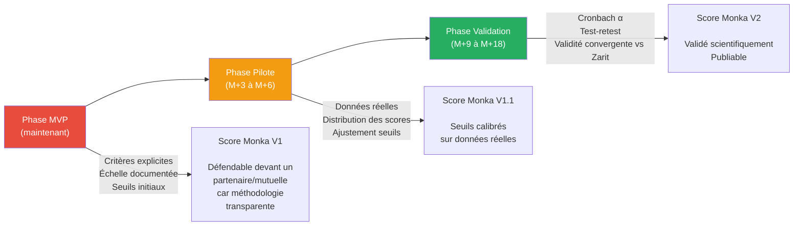

# 📊 MONKA — Méthodologie de Scoring par Vulnérabilité

> **Version** : v1 — 16/02/2026  
> **Statut** : 🔓 DRAFT — à valider avec Dr. Monka  
> **Objectif** : Définir les fondements, les critères et l'échelle du scoring Monka  
> **Docs liés** : [KERNEL_V5.md](file:///Users/antonin/monka/KERNEL/KERNEL_V5.md) (K13), [reflexion_methodologie_scoring.md](file:///Users/antonin/monka/LIVRABLES/Audit/scoring/reflexion_methodologie_scoring.md)

---

## 1. POURQUOI CE DOCUMENT EXISTE

Le KERNEL définit la règle **K13** : le scoring mesure l'intensité d'une vulnérabilité. Il ne déclenche jamais un MP.

Le KERNEL dit **quoi**. Ce document dit **comment** et **pourquoi** :

| Question fondamentale | Réponse attendue dans ce doc |
|---|---|
| Que mesure le score d'une V ? | §2 — Philosophie |
| Pourquoi une question est scorante et pas une autre ? | §3 — Critères d'inclusion |
| Que signifie un +1 ou un +2 ? | §4 — Échelle de notation |
| Comment interpréter le score final ? | §5 — Seuils et interprétation |
| Comment ça se compare à Zarit ? | §6 — Ancrage scientifique |
| Quelles sont les limites ? | §7 — Honnêteté méthodologique |

---

## 2. PHILOSOPHIE — CE QUE LE SCORE MESURE

### 2.1 — Définition

Le **score d'une vulnérabilité** est une mesure de **l'intensité de l'atteinte ressentie et observée** de l'aidant dans un domaine donné, **au moment de l'évaluation**.

Ce n'est **pas** :
- Un diagnostic médical
- Un prédicteur de risque futur (ça nécessiterait un modèle prédictif + données longitudinales)
- Un déclencheur d'action (les MPs s'activent par les règles, pas par le score — K13)

C'est :
- Un **indicateur d'intensité** — comme un thermomètre : il mesure, il n'intervient pas
- Un **outil de comparaison** — entre vulnérabilités d'un même aidant, et dans le temps
- Un **signal de communication** — il traduit une situation complexe en un chiffre lisible par des tiers (mutuelles, institutions)

### 2.2 — Analogie avec les échelles validées

| Échelle | Ce qu'elle mesure | Nombre d'items | Méthodologie |
|---|---|---|---|
| **Zarit (ZBI-22)** | Fardeau de l'aidant | 22 | Auto-questionnaire, Likert 0-4, somme = 0-88 |
| **GDS-15** | Dépression gériatrique | 15 | Oui/Non, seuil à 5 |
| **Barthel** | Autonomie fonctionnelle | 10 | 0/5/10/15 par item, somme = 0-100 |
| **NPI-Q** | Troubles neuropsychiatriques | 12 | Présence + sévérité + retentissement |
| **SEGA volet A** | Fragilité de la personne âgée | 13 | 0/1/2 par item, somme = 0-26, 3 seuils |
| **Monka (par V)** | Intensité de vulnérabilité | Variable (6-22/V) | Likert adapté, somme normalisée sur 100 |

**Ce que Monka emprunte à Zarit** (V1, V2, V3 — vulnérabilités centrées sur l'aidant) :
- L'auto-évaluation par l'aidant (c'est sa perception qui compte)
- La somme pondérée comme méthode de calcul
- Les seuils d'interprétation en 4 niveaux
- Le focus sur le **ressenti** autant que sur les faits objectifs

**Ce que Monka emprunte à SEGA volet A** (V4, V5 — vulnérabilités centrées sur le proche) :
- L'évaluation multi-critères de la fragilité (mobilité, cognition, nutrition, autonomie…)
- L'échelle à 3 niveaux par item (0/1/2) — identique à l'échelle Monka (+0/+1/+2)
- Les seuils à 3 paliers (peu fragile / fragile / très fragile)
- Le focus sur des **observables cliniques**, pas uniquement du ressenti

**Ce en quoi Monka innove** :
- 5 dimensions séparées (Zarit agrège tout en un score global, SEGA en un score unique)
- Scoring indépendant des recommandations (ni Zarit ni SEGA ne génèrent d'actions)
- Scoring normalisé sur 100 pour comparabilité inter-V malgré des nombres d'items différents

### 2.4 — Double ancrage : Zarit + SEGA volet A

Monka couvre **deux populations** dans un seul questionnaire — l'**aidant** et son **proche**. Ce double focus nécessite deux ancrages distincts :

| Vulnérabilités | Population évaluée | Échelle de référence | Pourquoi |
|---|---|---|---|
| **V1** Social, **V2** Administratif, **V3** Santé aidant | L'**aidant** lui-même | **Zarit (ZBI-22)** | Zarit est le gold standard du fardeau de l'aidant. Même logique : auto-évaluation du ressenti et de l'impact sur la vie quotidienne |
| **V4** Fragilité du proche, **V5** Parcours médical | Le **proche aidé** (évalué par l'aidant) | **SEGA volet A** | SEGA est conçu pour évaluer la fragilité gériatrique. Même logique : items fonctionnels et médicaux, évaluation par un tiers (ici l'aidant au lieu du soignant) |

#### SEGA volet A — Structure de référence

La grille SEGA volet A (Short Emergency Geriatric Assessment) évalue la **fragilité** de la personne âgée à travers **13 items**, chacun coté **0, 1 ou 2** :

| # | Item SEGA | Cotation 0 / 1 / 2 | Items Monka correspondants (V4/V5) |
|---|---|---|---|
| 1 | **Âge** | <75 / 75-85 / >85 | Trigger (O1) — hors scoring |
| 2 | **Provenance** | Domicile seul / Domicile + aide / Institution | Questions F1, F2 (organisation de l'aide) |
| 3 | **Médicaments** | <4 / 4-6 / >6 | Questions M2 (accès soins) |
| 4 | **Humeur** | Normale / Anxiété-tristesse / Dépression | Questions M4 (troubles psychiques) |
| 5 | **Perception santé** | Bonne / Moyenne / Mauvaise | Questions S1, S3 (santé aidant — cross-V) |
| 6 | **Chutes (6 mois)** | Aucune / 1 sans gravité / Multiples | Questions F6 (autonomie, chutes) |
| 7 | **Nutrition** | Stable / Perte appétit / Dénutrition | Questions F4 (état général) |
| 8 | **Maladies associées** | 0-1 / 2-3 / >3 | Questions M1 (diagnostic), F5 |
| 9 | **AIVQ** (activités instrumentales) | Autonome / Aide partielle / Dépendant | Questions F1, F2, F5 |
| 10 | **Mobilité** | Normale / Difficultés / Grabataire | Questions F6 (autonomie) |
| 11 | **Continence** | Continent / Occasionnelle / Permanente | Questions F4 (état général) |
| 12 | **Prise des repas** | Autonome / Aide partielle / Dépendant | Questions F1 (quotidien) |
| 13 | **Fonctions cognitives** | Normales / Confusion légère / Démence | Questions F3 (mémoire, comportement) |

**Score SEGA : 0–26 pts** → ≤8 = peu fragile · 9–11 = fragile · ≥12 = très fragile

> [!NOTE]
> **Monka ne reproduit pas SEGA item pour item.** SEGA est une référence de structure — elle montre que l'évaluation de la fragilité par items cotés 0/1/2 est une approche validée scientifiquement. Les questions Monka V4/V5 couvrent les mêmes dimensions (mobilité, cognition, nutrition, autonomie, comorbidités) mais sont formulées pour être remplies par **l'aidant**, pas par un soignant en urgence gériatrique.

### 2.3 — Ce que le score permet concrètement

```
Score V3 = 72/100 (Élevé)
→ "La santé de l'aidant est significativement impactée"
→ L'IDEC le voit, le comprend, ajuste sa vigilance
→ La mutuelle le voit, comprend le niveau de détresse
→ Au suivi M+3, le même score à 45 = progression mesurable
```

Le score est un **langage commun** entre l'aidant, le professionnel et l'institution.

---

## 3. CRITÈRES D'INCLUSION — POURQUOI UNE QUESTION EST SCORANTE

### 3.1 — La question fondamentale

Le §2 définit le score comme une **mesure d'intensité de l'atteinte** dans une vulnérabilité. La question d'inclusion découle directement de cette définition :

> **Une question est scorante si sa réponse nous informe sur l'intensité de la vulnérabilité — et si cette information est fiable et reproductible.**

Tout le reste (critères, règles, filtres) n'est qu'une traduction opérationnelle de ce principe.

### 3.2 — Trois approches ont été envisagées

(cf. [réflexion détaillée](file:///Users/antonin/monka/LIVRABLES/Audit/scoring/reflexion_methodologie_scoring.md))

| Approche | Principe | Verdict |
|---|---|---|
| **Jugement clinique pur** | "Le médecin choisit les questions pertinentes" | ❌ Valide cliniquement, mais **indéfendable devant un tiers** — un autre médecin pourrait choisir d'autres questions |
| **Règle classification** | "Toute question classée **état** est scorante, point" | ❌ Propre sur le papier, mais **force des reclassifications malhonnêtes** (E1, N20) et **casse V1/V2** (trop peu de questions état pures) |
| **Conditions vérifiables** | Tests explicites, reproductibles par un tiers | ✅ **Retenu** — on va le détailler ci-dessous |

### 3.3 — Les 2 conditions d'inclusion

Une question est **scorante** si elle remplit **les 2 conditions** suivantes :

---

#### CONDITION 1 — Informativité (la réponse parle de l'intensité)

> **La réponse à cette question nous dit-elle quelque chose sur « à quel point l'aidant est touché » dans cette vulnérabilité ?**

C'est le filtre principal. Il élimine les questions qui sont utiles au moteur (activation, contexte, aiguillage) mais qui ne mesurent **pas** une intensité.

| Passe le filtre ✅ | Ne passe pas ❌ | Pourquoi |
|---|---|---|
| "Vous sentez-vous isolé ?" | "Avez-vous consulté un gériatre ?" | L'isolement *est* une intensité. La consultation est une **action** — elle dit ce qu'on a fait, pas ce qu'on vit |
| "À quelle fréquence aidez-vous ?" | "Quel est votre lien de parenté ?" | La fréquence d'aide aggrave l'atteinte. Le lien de parenté est un **contexte fixe** — il ne bouge pas entre deux évaluations |
| "Vivez-vous sous le même toit ?" | "Type de pathologie du proche" | La cohabitation intensifie le vécu. La pathologie décrit **l'aidé**, pas l'atteinte de l'aidant |
| "Idées suicidaires ?" | "Âge de l'aidant" | La présence d'idées suicidaires est un signal d'intensité maximale. L'âge est un **facteur démographique** |

> [!NOTE]
> **Ce critère ne dépend PAS de la classification état/facteur.** N20 ("sous le même toit") est classée "facteur" dans le KERNEL, mais elle passe le test d'informativité : la cohabitation est un prédicteur fort d'intensité du fardeau dans la littérature (Zarit). **Le scoring ne regarde pas la nature de la question, il regarde ce que la réponse nous apprend.**

---

#### CONDITION 2 — Fiabilité (le score qu'on en tire est défendable)

> **Peut-on attribuer un score (+0, +1, +2) à chaque option de réponse de manière non ambiguë ?**

C'est le filtre qualité. Une question peut être informative mais **impossible à scorer proprement** :

| Passe le filtre ✅ | Ne passe pas ❌ | Pourquoi |
|---|---|---|
| "Jamais / Parfois / Souvent / Toujours" → +0/+1/+1/+2 | "Décrivez votre situation" (texte libre) | Pas de réponses fermées = pas de score reproductible |
| "Oui / Non" → +0/+1 | "Quels professionnels avez-vous consultés ?" (liste à cocher variable) | Trop de combinaisons possibles, pas d'échelle "plus ou moins grave" |
| "Aucune / 1 à 3 / Plus de 3" → +0/+1/+2 | Questions conditionnelles dont la non-réponse est ambiguë | Si la question n'est pas posée (condition non remplie), le score serait faussé |

Ce test vérifie deux choses :
1. **Les options de réponse forment une échelle** — on peut ordonner les options du "moins atteint" au "plus atteint"
2. **L'attribution des points est non ambiguë** — deux évaluateurs différents arriveraient au même score pour la même réponse

### 3.4 — Arbre de décision complet

```
165 questions
    │
    ├── 15 Triggers → ❌ HORS PÉRIMÈTRE
    │   (contexte/profil, jamais scorés — K13)
    │
    └── 150 questions état/facteur
         │
         ├── CONDITION 1 : La réponse informe    NON
         │   sur l'intensité de la vulnérabilité ? ───→ ❌ NON SCORANTE
         │                     │                        (ex: lien de parenté,
         │                     │ OUI                     type de pathologie,
         │                     ↓                         consultation faite)
         │
         ├── CONDITION 2 : On peut attribuer      NON
         │   un score non ambigu aux réponses ? ────→ ❌ NON SCORANTE
         │                     │                        (ex: texte libre,
         │                     │ OUI                     listes variables,
         │                     ↓                         questions conditionnelles)
         │
         └── ✅ SCORANTE
             Attribution des points (+0/+1/+2) selon l'échelle §4
```

### 3.5 — Exemple détaillé : 5 questions passées au filtre

| Question | V | Cond. 1 (Informativité) | Cond. 2 (Fiabilité) | Verdict |
|---|---|---|---|---|
| **E4** — "Vous sentez-vous seul ?" | V1 | ✅ L'isolement est un signal d'intensité | ✅ Oui/Non → +1/+0 clair | ✅ **Scorante** |
| **N20** — "Vivez-vous sous le même toit ?" | V1 | ✅ La cohabitation intensifie le fardeau (littérature Zarit) | ✅ Oui/Non → +1/+0 clair | ✅ **Scorante** (même si classée "facteur") |
| **O13** — "Consultation gériatrique faite ?" | V2 | ❌ Informe sur une **action passée**, pas sur une intensité. Avoir consulté ne dit pas si on souffre | — | ❌ **Non scorante** |
| **N3** — "Nature de la pathologie du proche" | Système | ❌ Informe sur **l'aidé**, pas sur l'atteinte de l'aidant | — | ❌ **Non scorante** |
| **N25** — "Avez-vous des idées suicidaires ?" | V3 | ✅ Signal d'intensité maximale | ✅ Oui/Non → +0/+2 (risque vital) | ✅ **Scorante (+2)** |

### 3.6 — Séparation scoring / classification

> [!IMPORTANT]
> **La classification (état/facteur) et le scoring sont deux axes indépendants.**
>
> | | Scorante | Non scorante |
> |---|---|---|
> | **Question "état"** | Cas normal (ex: E4, N25) | Possible si fiabilité insuffisante |
> | **Question "facteur"** | Possible si informative (ex: N20, E1) | Cas normal (ex: O13, lien parenté) |
>
> La classification décrit la **nature** de la question (ce qu'elle demande).
> Le scoring décrit son **utilité** pour mesurer l'intensité (ce que la réponse nous apprend).
> **Ce sont deux choses différentes.** Une question "facteur" peut scorer. Une question "état" peut ne pas scorer.

---

## 4. ÉCHELLE DE NOTATION — QUE SIGNIFIE CHAQUE POINT

### 4.1 — Fondement : l'échelle de Likert adaptée

Zarit utilise une échelle unique de 0 à 4 (Jamais → Presque toujours). Monka ne peut pas faire la même chose parce que les 150 questions n'ont **pas le même format de réponse** — certaines sont des OUI/NON, d'autres des choix multiples, d'autres des échelles de fréquence.

Le scoring Monka utilise donc une **échelle de points par réponse** :

| Points | Signification | Quand l'attribuer |
|---|---|---|
| **+0** | **Pas d'atteinte** — la réponse indique une situation saine ou protectrice | Réponse "positive" (pas de problème détecté), option neutre, ou la question n'est pas pertinente pour cet aidant |
| **+1** | **Atteinte présente** — la réponse indique un signal de vulnérabilité | La réponse révèle un manque, un symptôme, un isolement, un risque identifié — mais pas de danger immédiat |
| **+2** | **Atteinte grave** — la réponse indique un signal de vulnérabilité à risque vital ou à impact fonctionnel sévère | La réponse indique un danger pour l'intégrité physique ou psychologique de l'aidant ou de l'aidé. **Réservé aux questions à risque vital** |

### 4.2 — Sémantique par type de question

| Type de question | +0 | +1 | +2 |
|---|---|---|---|
| **Fréquence** ("À quelle fréquence…") | Jamais / Rarement | Parfois / Régulièrement | Quotidien / Permanent |
| **Intensité** ("À quel point…") | Pas du tout / Légèrement | Modérément | Sévèrement / Totalement |
| **Binaire** ("Oui/Non") | Réponse protectrice | Réponse à risque | — (pas de +2 sur binaire sauf risque vital) |
| **Durée** ("Depuis combien de temps…") | < 1 an | 1-5 ans | > 5 ans |
| **Évaluation** ("Comment évaluez-vous…") | Bon / Satisfaisant | Moyen / Dégradé | Mauvais / Critique |

### 4.3 — Pourquoi +2 maximum (pas +3, +4…)

| Nombre de niveaux | Avantage | Inconvénient |
|---|---|---|
| 2 niveaux (0/1) | Ultra-simple | Perd la nuance "grave" |
| **3 niveaux (0/1/2)** | **Capture l'essentiel : absent / présent / grave** | — |
| 4+ niveaux | Plus granulaire | Frontières subjectives (+2 vs +3 ?), impossible à défendre sans données |

L'échelle 0-1-2 est un **compromis de phase MVP** :
- Assez fine pour distinguer un signal d'un danger
- Assez simple pour qu'un médecin puisse justifier chaque attribution de points devant un tiers
- Extensible : si les données empiriques post-déploiement montrent qu'une granularité 0-4 (type Zarit) est nécessaire, on peut migrer sans casser la logique

### 4.4 — Les questions à +2 : le périmètre "risque vital"

Le +2 est **strictement réservé** aux questions dont une réponse extrême indique un danger pour l'intégrité de la personne :

| Domain | Exemples de questions à +2 |
|---|---|
| **Risque suicidaire** | N25 — Idées suicidaires |
| **Automutilation** | N22 — Comportements d'automutilation |
| **Sécurité physique** | E27 — Comportements dangereux du proche |
| **Épuisement extrême** | Combinaison charge >25h/semaine + pas de relais |

> [!CAUTION]
> **Le +2 n'est pas "important". C'est "vital".** Si on hésite entre +1 et +2, c'est +1. Le +2 est une alarme, pas une nuance.

---

## 5. SCORE, NORMALISATION ET SEUILS

### 5.1 — Calcul du score brut

```
Score brut V[x] = Σ (points attribués à chaque question scorante de V[x])
```

Chaque V a un **score max théorique** = somme des points max de chaque question scorante.

### 5.2 — Normalisation sur 100

Pourquoi normaliser ? Parce que V4 a 55 questions et V5 en a 18. Sans normalisation, les scores bruts ne sont **pas comparables**.

```
Score normalisé = (score brut / score max théorique) × 100
```

| V | Questions scorantes (estimé) | Score max brut | Score normalisé max |
|---|---|---|---|
| V1 | ~6 | ~8 | 100 |
| V2 | ~9 | ~12 | 100 |
| V3 | ~16 | ~22 | 100 |
| V4 | ~22 | ~32 | 100 |
| V5 | ~13 | ~18 | 100 |

> Les valeurs exactes seront figées dans les Templates E par V une fois les critères d'inclusion (§3) appliqués à chaque question.

### 5.3 — Seuils d'interprétation

Inspirés de Zarit (4 niveaux), adaptés au contexte Monka :

| Plage normalisée | Niveau | Code couleur | Signification clinique | Analogie Zarit |
|---|---|---|---|---|
| **0-20** | Faible | 🟢 Vert | L'aidant ne présente pas de vulnérabilité significative dans ce domaine. Mode prévention. | 0-20 = Little or no burden |
| **21-40** | Modéré | 🟡 Jaune | Des signaux de vulnérabilité sont présents. Suivi recommandé, vigilance. | 21-40 = Mild to moderate |
| **41-60** | Élevé | 🟠 Orange | La vulnérabilité est installée et impactante. Action corrective nécessaire. | 41-60 = Moderate to severe |
| **61-100** | Critique | 🔴 Rouge | Atteinte sévère. Situation à risque nécessitant une mobilisation immédiate. | 61-88 = Severe burden |

> [!NOTE]
> **Les seuils sont différents de Zarit.** Zarit coupe à 20/40/60 sur un max de 88 — ce qui fait 23%/45%/68%. Monka coupe à 20/40/60 sur 100 — c'est plus strict. C'est un choix délibéré : mieux vaut surestimer la vulnérabilité (faux positif = suivi renforcé) que la sous-estimer (faux négatif = on rate un aidant en détresse).

### 5.4 — Précision sur les seuils

Ces seuils sont des **valeurs initiales de départ**. Ils seront ajustés :
1. **Après les premiers tests cliniques** — Dr. Monka teste avec des cas réels
2. **Après le déploiement pilote** — données empiriques sur la distribution des scores
3. **Par V si nécessaire** — V1 (15Q) et V5 (18Q) ont des échelles brutes plus courtes, les seuils pourraient être ajustés indépendamment

---

## 6. ANCRAGE SCIENTIFIQUE

### 6.1 — Ce que Monka n'est pas (encore)

| Critère de validation scientifique | Zarit ZBI-22 | Monka V1 |
|---|---|---|
| Panel d'experts initial | ✅ Zarit, Reever, Bach-Peterson (1980) | ✅ Dr. Monka (médecin gériatre) |
| Étude pilote sur cohorte | ✅ Cohortes étudiées depuis 45 ans | ❌ Pas encore de données |
| Cohérence interne (Cronbach α) | ✅ α = 0.92 | ❌ À mesurer post-déploiement |
| Test-retest | ✅ Validé | ❌ À mesurer |
| Validité convergente | ✅ Corrélé avec dépression, troubles comportementaux | ❌ À tester |
| Publication peer-reviewed | ✅ Gerontologist, 1980 | ❌ Pas encore |

### 6.2 — Ce que Monka a (et Zarit n'a pas)

| Point | Monka | Zarit |
|---|---|---|
| **Multi-dimensionnel** | 5 scores séparés → profil de vulnérabilité | 1 score global → fardeau agrégé |
| **Actionnable** | Score + recommandations personnalisées | Score seul (pas de reco associée) |
| **Dynamique** | Suivi entonnoir → réévaluation continue | Passation unique ou ponctuelle |
| **Adaptatif** | Triggers + personas modifient le contexte | Questionnaire fixe |

### 6.3 — La stratégie de crédibilité



> [!IMPORTANT]
> **Le scoring Monka n'est pas "non scientifique". Il est "pré-validé".** La méthodologie est structurée, les critères sont explicites, l'échelle est documentée. Ce qui manque, ce sont les données empiriques — et ce manque est assumé, documenté, et la feuille de route de validation est définie.

---

## 7. HONNÊTETÉ MÉTHODOLOGIQUE — CE QU'ON SAIT QU'ON NE SAIT PAS

### 7.1 — Limites assumées

| Limite | Explication | Impact | Mitigation |
|---|---|---|---|
| **Pas de validation empirique** | Les seuils 20/40/60 sont des valeurs de départ, pas des cut-offs validés | Un aidant "Modéré" pourrait être "Élevé" dans la réalité | Ajustement post-pilote |
| **Pondération +1/+2 par jugement clinique** | Le choix entre +1 et +2 est du Dr. Monka, pas d'une analyse factorielle | Le poids relatif des questions pourrait être inexact | Analyse factorielle post-données |
| **Pas de score bi-dimensionnel** | On n'a pas séparé état/risque en deux sous-scores | Un aidant à "état modéré + contexte à risque" pourrait être sous-estimé | Évolution vers bi-dimensionnel en V2 si données le justifient |
| **Nombre d'items variable par V** | V1 a ~6 questions scorantes, V4 en a ~22 | La résolution du score n'est pas la même. Un V1 à 50/100 peut sauter par pas de 16 pts, un V4 par pas de 3 pts | Connu et documenté. Les seuils par V pourront être ajustés individuellement |

### 7.2 — Ce qui nous rend quand même crédibles

1. **Méthodologie transparente** — chaque décision est documentée et justifiée
2. **Critères d'inclusion explicites** (§3) — un tiers peut reproduire notre raisonnement
3. **Échelle sémantique** (§4) — chaque point a une signification définie, pas un chiffre arbitraire
4. **Ancrage dans la littérature** — les critères C4 s'appuient sur des prédicteurs reconnus (Zarit, HAS)
5. **Feuille de route de validation** (§6) — on sait ce qui manque et comment on compte l'obtenir
6. **Séparation scoring/activation** (K13) — le score n'a pas de conséquence algorithmique automatique, ce qui réduit le risque d'erreur

---

## 8. RÉSUMÉ EN UNE PAGE

```
┌─────────────────────────────────────────────────────────┐
│                   SCORING MONKA                          │
│                                                         │
│  QUOI ?   Score d'intensité par vulnérabilité (V1-V5)  │
│  POUR ?   Mesurer, communiquer, comparer dans le temps  │
│  PAS ?    Déclencher des actions (K13)                  │
│                                                         │
│  INCLUSION (2 conditions) :                             │
│    1 — Informativité : la réponse parle de l'intensité  │
│    2 — Fiabilité : le score est non ambigu              │
│                                                         │
│  ÉCHELLE :                                              │
│    +0 = Pas d'atteinte                                  │
│    +1 = Atteinte présente                               │
│    +2 = Atteinte grave (risque vital uniquement)        │
│                                                         │
│  NORMALISATION :                                        │
│    Score normalisé = (brut / max) × 100                 │
│                                                         │
│  SEUILS :                                               │
│    🟢  0-20  Faible     (prévention)                    │
│    🟡 21-40  Modéré     (suivi conseillé)               │
│    🟠 41-60  Élevé      (action requise)                │
│    🔴 61-100 Critique   (mobilisation immédiate)        │
│                                                         │
│  STATUT : Pré-validé. Validable post-déploiement.       │
└─────────────────────────────────────────────────────────┘
```

---

## 9. DÉCISIONS ATTENDUES (Dr. Monka)

| # | Décision | Statut | Action demandée |
|---|---|---|---|
| **D1** | **Valider les 2 conditions d'inclusion** (§3.3) | ✅ **Validé** | Informativité + Fiabilité = les 2 conditions retenues |
| **D2** | **Valider l'échelle 0/+1/+2** (§4) | ✅ **Principe validé** | 3 niveaux confirmés. La liste des questions à +2 (risque vital) sera établie après passage au filtre |
| **D3** | **Valider les seuils 20/40/60** (§5.3) | ✅ **Validé** | Valeurs de départ, ajustables post-pilote |
| **D4** | **Appliquer les conditions aux 150 questions** | ⏳ **À faire** | Passer chaque question au filtre Informativité + Fiabilité → établir la liste officielle des questions scorantes par V et leur poids (+0/+1/+2) |

> [!TIP]
> D4 est le vrai travail : passer chaque question au filtre des 2 conditions, déterminer pour chaque réponse le score à attribuer. Ce travail se fait sur les données réelles du questionnaire. C'est ce qui alimentera ensuite les Templates E par vulnérabilité.

---

> 📊 **METHODOLOGIE_SCORING v1 — Fondement du scoring Monka. À valider avant production des Templates E.**
