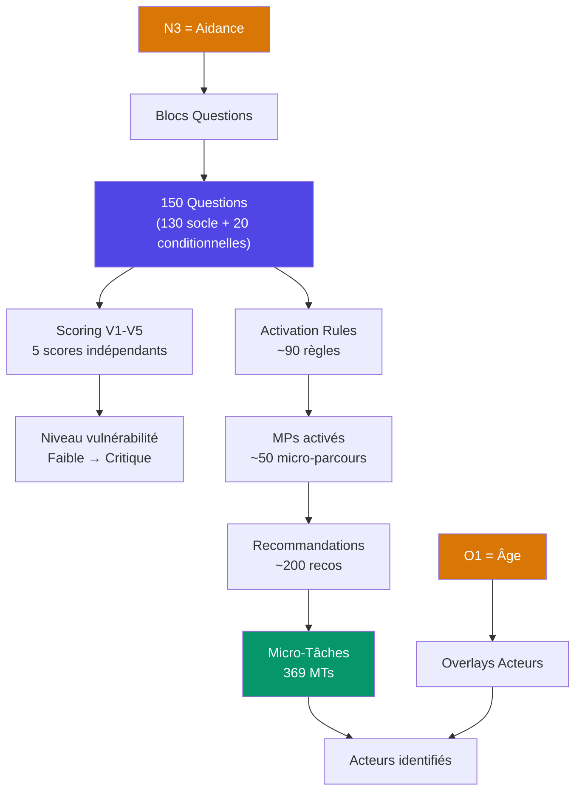

# Stratégie de Personnalisation du Moteur Clinique — My Monka

> **Document stratégique — PRAGMA pour Monka**
> Date : 19 février 2026 | Auteur : Antonin Rimaud (PRAGMA)
> Statut : Réflexion structurée — à valider avec Dr. Monka
> Objectif : Cartographier le potentiel de personnalisation du moteur clinique et planifier son déploiement progressif en versions

---

## Résumé exécutif

Le moteur clinique Monka exploite **150 questions** pour produire un parcours personnalisé pour chaque aidant. Aujourd'hui, cette personnalisation opère sur **2 axes** (type d'aidance × âge) avec une granularité limitée. Ce document démontre que le moteur peut atteindre une personnalisation **quasi-unitaire** (chaque utilisateur reçoit un parcours unique) en exploitant progressivement les données collectées.

**Le plafond n'est pas technique. Il est clinique** — combien de contenu personnalisé Dr. Monka peut produire et valider.

Ce document propose **3 versions du moteur** (M1 → M2 → M3), une roadmap calée sur le lancement des expérimentations dans 6 semaines, et une stratégie de production du contenu clinique.

---

## 1. L'architecture de personnalisation actuelle

### Ce que le moteur fait aujourd'hui



### Les données brutes collectées

| Source | Volume | Exploité aujourd'hui | Potentiel inexploité |
|---|---|---|---|
| **Réponses questionnaire** | ~500 data points (150 Q × options) | Scoring + activation rules | Personnalisation MTs, wording, CR |
| **N3 (aidance)** | 5 catégories × multi-choix | Blocs de questions | Wording contextualisé par aidance |
| **O1 (âge)** | 4 tranches | Overlay acteurs | Adaptation profondeur MTs |
| **Questions scorantes** | ~80 questions avec poids | Score par V | Sous-scores, radar fin |
| **Combinaisons CCC** | ∞ (toutes paires/triplets possibles) | ~30 règles CCC | Détection patterns cliniques complexes |
| **Questions non-scorantes** | ~70 questions "contexte" | Peu exploité | Personnalisation MTs et recos |

---

## 2. Analyse approfondie — Les 5 couches de personnalisation

### Couche 1 — Profilage (N3 × O1) — ✅ FAIT

**Ce qui est en place :**

L'utilisateur est classé dans 1 des 73 combinaisons possibles. Cela détermine :
- Quelles **questions** il voit (130 à 150)
- Quels **acteurs** sont priorisés (overlay âge)
- Quels **blocs aidance** sont actifs

**Réflexion :** Cette couche est **terminée et optimale**. On ne peut pas aller plus loin sans ajouter des questions trigger. La seule extension possible serait un N3bis ("Quel est le diagnostic principal ?") mais c'est prématuré pour la V1.

> [!TIP]
> **Argument de vente** : "73 profils d'aidants possibles dès le premier écran — aucun concurrent ne propose cette granularité d'entrée."

---

### Couche 2 — Scoring et vulnérabilité — ✅ FAIT, extensible

**Ce qui est en place :**

5 scores indépendants (V1-V5) avec 4 niveaux (faible → critique). Environ 80 questions contribuent au scoring avec des poids C1/C2.

**Ce qui n'est PAS exploité :**

#### 2a. Sous-scores par sous-bloc

Chaque vulnérabilité est structurée en **sous-blocs** (ex: V4 a "Autonomie", "Cognition", "Douleur/Sommeil", "Épisodes aigus"). Aujourd'hui on calcule un score global V4. On pourrait calculer un **radar** à l'intérieur de chaque V :

```
V4 — Vie quotidienne
├── Autonomie fonctionnelle    ████████░░ 80%
├── Cognition / Comportement   ██████████ 100% ← alerte
├── Douleur / Fatigue          ████░░░░░░ 40%
├── Épisodes aigus             ██████░░░░ 60%
└── Cadre de vie               ██░░░░░░░░ 20%
```

**Impact** : Le CR Médecin traitant passe de "V4 = Élevé" à "V4 = Élevé, principalement sur l'axe cognition/comportement". Le médecin sait immédiatement où agir.

#### 2b. Score de complexité situationnelle

Au-delà des 5V individuelles, on pourrait calculer un **score de complexité** qui capture l'interaction entre vulnérabilités :

```
Complexité = f(nombre de V élevées, multi-aidance, isolement, polymédication)
```

Ce score ne vient pas d'UN questionnaire mais de la **convergence** de signaux faibles à travers toutes les réponses. C'est ce qu'aucun outil existant ne fait.

> [!IMPORTANT]
> **Argument de vente** : "Notre moteur ne se contente pas d'évaluer 5 dimensions indépendantes. Il détecte la **complexité situationnelle** — quand les vulnérabilités se renforcent mutuellement."

---

### Couche 3 — Activation des Micro-Parcours — ⚡ Partiellement, fort potentiel

**Ce qui est en place :**

~90 règles d'activation déterminent quels MPs sont activés. Certaines règles utilisent des conditions simples (1 question), d'autres des CCC (combinaisons).

**Ce qui manque cruellement :**

#### 3a. Graduation de l'urgence par MP

Aujourd'hui : un MP est activé (oui/non). Demain :

| Niveau | Déclencheur | Conséquence |
|---|---|---|
| 🔴 **Critique** | Règle individuelle à seuil haut (ex: idées suicidaires) | Alerte immédiate IDEC, MTs prioritaires |
| 🟠 **CCC** | Combinaison de conditions convergentes | MPs activés avec flag "combinaison à risque" |
| 🟢 **Standard** | Règle simple activée | MTs normales |
| 💡 **Prévention** | MP non activé mais profil à risque | MTs de prévention affichées en "recommandé" |

**L'impact est majeur** : le médecin ne reçoit plus une liste plate de 15 MPs activés. Il reçoit "3 critiques à traiter d'urgence, 5 à surveiller, 7 en prévention".

#### 3b. Combinaisons cliniques non encore exploitées

Le questionnaire contient des **signaux faibles** qui, individuellement, ne déclenchent rien mais qui **ensemble** révèlent un pattern :

| Combinaison | Ce que ça révèle | MP à activer/renforcer |
|---|---|---|
| N14 (difficultés traitement) + O3 (≥5 médicaments) + O1 (60+) | **Risque iatrogénique majeur** | Revue ordonnance → CRITIQUE |
| N27 (isolement social) + E22 (>20h aide/sem) + E16 (pas de rdv médical) | **Épuisement aidant masqué** | Répit + suivi aidant → CRITIQUE |
| O6 (chutes) + O13 (détérioration cognitive) + E23 (<2h seul) | **Dépendance lourde non sécurisée** | Adaptation domicile + téléassistance → CRITIQUE |
| E34 ("Non" compréhension maladie) + E37 (avis contradictoires) + E43 (rupture suivi) | **Errance médicale active** | Coordination parcours → CCC |
| N19 (changements humeur) + N25 (idées suicidaires = Non) + E13 (danger pour autrui) | **Troubles comportementaux sans suivi psy** | Évaluation neuro-psy → CCC |

> Ce sont des **détections que le médecin traitant seul ne fait pas** parce qu'il n'a pas toutes ces informations en même temps. C'est la valeur unique de Monka.

> [!CAUTION]
> **Argument de vente décisif** : "Notre moteur croise 150 data points simultanément pour détecter des patterns cliniques que même un médecin expérimenté ne verrait pas en consultation de 20 minutes. C'est de l'aide à la décision clinique, pas un simple questionnaire."

---

### Couche 4 — Personnalisation des Micro-Tâches — ❌ Plus grand potentiel

C'est le **bout de la chaîne** — ce que l'utilisateur voit et fait. Aujourd'hui les 369 MTs sont identiques quel que soit le profil.

#### 4a. Variantes d'action par profil

Chaque MT générique peut être déclinée en **variante actionable** selon N3 × O1 :

**Exemple : MT "Vérifier l'accès aux droits sociaux"**

| Profil | Variante personnalisée |
|---|---|
| Personne Âgée + 75+ | "Vérifier les droits APA et l'évaluation GIR auprès du Conseil Départemental. Si GIR 1-4, l'APA est un droit — contacter le CLIC local." |
| Handicap + < 18 | "Vérifier la notification MDPH enfant (AEEH + complément). Contacter l'enseignant référent pour le PPS scolaire." |
| Handicap + 60+ | "Informer sur le choix PCH vs APA à 60 ans. Prendre RDV avec l'assistant social du secteur pour évaluation comparative." |
| Psy + 18-59 | "Vérifier les droits AAH si taux d'incapacité ≥80%. Orienter vers le SAVS si besoin d'accompagnement social." |
| Maladie Chronique + 18-59 | "Vérifier la reconnaissance ALD auprès du médecin traitant. Si ALD accordée, 100% des soins liés sont pris en charge." |

**Volume** : 369 MTs × ~10 profils pertinents = ~3700 variantes théoriques. MAIS en pratique, beaucoup de MTs ne changent pas selon le profil. On estime **~800-1200 variantes réellement distinctes** à rédiger.

#### 4b. Adaptation du niveau de détail

Selon le **score de vulnérabilité**, on peut adapter la profondeur de chaque MT :

| Score V | Profondeur MT | Exemple |
|---|---|---|
| **Faible** | "Recommandé" — 1 ligne | "Pensez à vérifier l'accès APA" |
| **Modéré** | "Conseillé" — 3-5 lignes avec acteurs | "Contacter le CLIC pour demander une évaluation APA. Acteur : assistant social du Conseil Départemental." |
| **Élevé** | "Prioritaire" — guide complet avec étapes | Guide 10 lignes avec numéros, étapes, acteurs, délais |
| **Critique** | "Urgent" — action immédiate + alerte IDEC | Guide + flag "IDEC doit contacter dans les 48h" |

#### 4c. Acteurs contextualisés

Aujourd'hui le champ `acteur` est un texte générique. Demain :

| Donnée questionnaire | Acteur adapté |
|---|---|
| O1 < 18 + Psy | Pédopsychiatre (pas psychiatre) |
| O1 60+ + Addiction | Gériatre addictologue (pas CSAPA standard) |
| E39 > 30min trajet | Acteur télémédecine proposé en alternative |
| O59 = "aucun pro à domicile" | Priorité HAD ou SSIAD pour premier contact |
| E25 = "oui coordonnateur" | Passer par le coordonnateur existant (pas en créer un) |

---

### Couche 5 — Le Compte-Rendu Médecin — ❌ Non exploité

Le CR est le **produit final** envoyé au médecin traitant. C'est la vitrine de Monka. Aujourd'hui c'est un résumé technique. Demain ça devrait être un **vrai document d'aide à la décision** :

**Structure cible du CR personnalisé :**

```
📋 COMPTE-RENDU D'ÉVALUATION — My Monka
══════════════════════════════════════════

👤 PROFIL AIDANT
   Marie D., 55 ans, aidante de sa mère Jeanne (78 ans)
   Type d'aidance : Personne Âgée (perte d'autonomie / Alzheimer)
   Charge : 25h/semaine d'aide directe

📊 SYNTHÈSE VULNÉRABILITÉS
   V1 Santé mentale aidant    ████████░░ ÉLEVÉ
   V2 Ressources & aides      ██████░░░░ MODÉRÉ  
   V3 Santé physique aidant   ████░░░░░░ FAIBLE
   V4 Situation de l'aidé     ██████████ CRITIQUE ← axe Cognition
   V5 Parcours de soins       ████████░░ ÉLEVÉ

   Complexité situationnelle : HAUTE
   → convergence V1 + V4 + charge >20h → risque d'épuisement

🔴 ALERTES CRITIQUES (3)
   1. Détérioration cognitive rapide sans suivi neurologique
   2. Polymédication (7 médicaments) sans revue ordonnance récente
   3. Aidante en épuisement (score V1 élevé + arrêt travail récent)

📋 MICRO-PARCOURS PRIORITAIRES (extrait)
   MP "Sécurisation cognitive" → Consultation mémoire dans les 2 semaines
   MP "Revue thérapeutique" → RDV pharmacien + MT dans les 10 jours
   MP "Répit aidant" → Orienter vers accueil de jour (CLIC du secteur)

👥 ACTEURS RECOMMANDÉS
   Dr. [Médecin traitant] — revue ordonnance
   Neurologue — bilan cognitif
   Assistant social CD — évaluation APA/GIR
   CLIC [secteur] — accueil de jour et répit
```

> [!IMPORTANT]
> **Argument de vente ultime** : "Le médecin traitant reçoit un document de synthèse qu'aucun autre outil ne produit — un bilan multi-dimensionnel personnalisé avec des actions concrètes, des acteurs identifiés et des priorités claires. En 5 minutes de lecture, il sait exactement quoi faire."

---

## 3. Versions du moteur — Roadmap de finesse

### Contrainte : expérimentations dans ~6 semaines (début avril 2026)

Le moteur doit être **validé et opérationnel** pour les premières expérimentations cliniques avec Klésia. Cela impose une montée en puissance progressive.

---

### M1 — Moteur Fondation (🎯 cible expérimentations — semaines 1-4)

> **Objectif** : Un moteur fiable, auditté, qui produit des résultats cliniquement corrects. Pas de fioritures, mais zéro erreur.

| Composant | État | Ce qui reste |
|---|---|---|
| Questionnaire 150Q adaptatif | ✅ Fait | Valider blocs + faux amis avec Dr. Monka |
| Scoring V1-V5 (C1+C2) | ✅ Fait | Audit final des poids |
| 73 combinaisons profil | ✅ Fait | Valider dans simulateur |
| ~90 activation rules | ✅ Fait | Vérifier cohérence avec Dr. Monka |
| MPs → Recos → MTs (chaîne complète) | ✅ Fait | Audit complétude |
| CR Médecin basique | ⚡ En cours | Finaliser template |
| Overlays âge (acteurs) | ✅ Fait | Valider avec Dr. Monka |
| Routage IDEC/Care Manager | ✅ Fait | Tester scénarios Klésia |

**Livrables M1 :**
- App simulateur propre avec les 4 onglets (Micro-Parcours, Scoring, Règles, CR)
- CR Médecin basique (scores + MPs activés + recos)
- Documentation clinique complète pour CEOP
- Export PDF du CR

**Personnalisation M1** : Par profil (N3 × O1) uniquement. Scoring par V. Activation binaire des MPs.

**Délai** : **4 semaines** (livraison ~19 mars 2026)

---

### M2 — Moteur Intelligent (🎯 post-expé V1 — semaines 5-10)

> **Objectif** : Exploiter les combinaisons CCC et produire un CR contextualisé. Le moteur devient un vrai outil d'aide à la décision.

| Composant | Description | Effort |
|---|---|---|
| **Graduation des MPs** | Critique / CCC / Standard / Prévention | 1 semaine dev + 2 semaines contenu |
| **Règles CCC enrichies** | 20-30 combinaisons cliniques nouvelles | 2 semaines (Dr. Monka pilote) |
| **Sous-scores par sous-bloc** | Radar V4 par axe (cognition, autonomie, etc.) | 3 jours dev |
| **CR contextualisé** | Phrases adaptées au profil N3 × niveau V | 2 semaines contenu |
| **Score de complexité** | Détection convergence inter-V | 2 jours dev |
| **Explications cliniques** | Sens clinique par règle / MP affiché dans l'app | 2 semaines contenu |

**Personnalisation M2** : Par profil + par niveau de vulnérabilité + par combinaisons CCC. Le CR est contextualisé. Les MPs ont une urgence graduée.

**Délai** : **6 semaines après M1** (livraison ~fin avril 2026)

**Impact business** :
- Différenciation massive vs concurrents (aucun ne fait de CCC)
- Arguments CEOP : "Le moteur détecte des patterns que le médecin seul ne voit pas"
- Base pour publications scientifiques

---

### M3 — Moteur Personnalisé (🎯 avant scaling — mois 4-6)

> **Objectif** : Chaque utilisateur reçoit un parcours véritablement unique. Les MTs sont contextualisées, le wording est adapté, le CR est un document médical professionnel.

| Composant | Description | Effort |
|---|---|---|
| **MTs variantes par profil** | ~800-1200 variantes contextualisées | **Effort majeur** : 3-4 mois |
| **Wording recos par profil** | Adapter le langage aidance + âge | 2 mois |
| **Acteurs dynamiques** | Acteur calculé par profil + réponses individuelles | 2 semaines dev |
| **CR personnalisé complet** | Document pro avec radar, alertes, guide d'action | 3 semaines dev + 2 mois contenu |
| **Scoring temporel** | Comparer T0 vs T+3 mois | 1 semaine dev |
| **Mode patient** | Questionnaire simplifié pour le patient lui-même | 1 mois dev |

**Personnalisation M3** : Quasi-unitaire. Chaque utilisateur reçoit un parcours, un CR et des MTs uniques basés sur ses 150 réponses.

**Délai** : **4-6 mois après M2** (livraison ~septembre 2026)

**Impact business** :
- Produit véritablement différenciant sur le marché
- Base solide pour labellisation HAS / marquage CE (si visé)
- Arguments investisseurs : scalabilité + personnalisation = rétention

---

## 4. Le goulot d'étranglement : la production de contenu clinique

### Le moteur technique est prêt à ~80%

| Capacité technique | Prêt ? | Effort restant |
|---|---|---|
| Parser les réponses questionnaire | ✅ | 0 |
| Calculer des scores par sous-bloc | ⚡ | 3 jours |
| Activer des MPs avec graduation | ⚡ | 1 semaine |
| Afficher des variantes de MTs | ❌ | 2 semaines |
| Générer un CR contextualisé | ❌ | 3 semaines |
| Stocker le contenu en base | ✅ | 0 (tables prêtes) |

### Le contenu clinique est le vrai goulot

| Contenu à produire | Volume | Producteur | Cadence estimée |
|---|---|---|---|
| Règles CCC supplémentaires | ~30-50 règles | Dr. Monka | ~5/jour |
| Sens clinique par règle existante | ~90 textes | Dr. Monka | ~10/jour |
| Variantes MTs par profil | ~800-1200 textes | Dr. Monka + équipe | ~20/jour |
| Wording recos contextualisé | ~300-500 textes | Dr. Monka | ~15/jour |
| Phrases CR par situation | ~100 templates | Rédacteur médical | ~10/jour |
| Explications pédagogiques MPs | ~50 textes | Dr. Monka | ~5/jour |

**Estimation totale** : ~1500-2000 contenus cliniques à produire pour M3 complet.
**Cadence** : ~20 contenus/jour → **~75-100 jours de production pure** → ~3-4 mois.

> [!WARNING]
> **Recommandation forte** : Ne pas attendre M3 pour commencer à produire le contenu. Dès M1 validé, Dr. Monka devrait commencer à rédiger les variantes MTs pour les 3 profils les plus fréquents (Personne Âgée 60+, Handicap adulte, Maladie chronique adulte). Cela alimente M2 et prépare M3.

---

## 5. Recommandations stratégiques

### R1 — Prioriser les 3 profils les plus fréquents

Ne pas essayer de tout personnaliser d'un coup. Commencer par :

| Profil | Pourquoi prioritaire | Volume MTs à contextualiser |
|---|---|---|
| **Personne Âgée + 60+** | Cas le plus fréquent, le plus urgent médicalement | ~150 MTs pertinentes |
| **Handicap + Adulte** | 2e population, gros enjeu MDPH/droits | ~120 MTs pertinentes |
| **Maladie Chronique + Adulte** | Population Klésia, enjeu expérimentation | ~100 MTs pertinentes |

→ Ça fait ~370 variantes au lieu de 1200. **Réalisable en 4-6 semaines.**

### R2 — Exploiter les CCC comme argument de vente #1

Les combinaisons de conditions cliniques sont le **différenciateur absolu** de Monka :
- Aucun concurrent ne croise 150 data points
- Le médecin traitant en consultation de 20 min ne peut pas faire cette analyse
- C'est de l'**aide à la décision clinique** — pas un simple scoring

**Action** : Faire valider 10 CCC "wow" par Dr. Monka et les mettre en avant dans le pitch CEOP.

### R3 — Le CR Médecin est la vitrine commerciale

C'est le document que le médecin traitant va lire. S'il est impressionné, Monka gagne. S'il ressemble à un tableau Excel, c'est perdu.

**Action** : Investir le temps de design/contenu dans le CR plutôt que dans l'app. Le CR est le produit, l'app est l'outil.

### R4 — Versionner publiquement le moteur

Communiquer sur les versions du moteur comme argument de professionnalisme :

| Version | Titre public | Message |
|---|---|---|
| **M1** | "Moteur Clinique certifié" | "150 questions validées, 5 vulnérabilités, parcours personnalisé par type d'aidance" |
| **M2** | "Aide à la décision intelligente" | "Détection de patterns cliniques complexes, graduation d'urgence, CR contextualisé" |
| **M3** | "Parcours personnalisé unitaire" | "Chaque aidant reçoit un parcours unique basé sur ses 150 réponses — micro-tâches, acteurs et CR adaptés à sa situation exacte" |

→ Chaque version est un **communiqué de presse**, un **argument investisseur**, un **palier de crédibilité**.

### R5 — Préparer la traçabilité pour la labellisation

Si Monka vise une labellisation HAS ou un marquage CE (dispositif médical numérique), chaque décision clinique doit être **traçable** :

- Question → Règle → MP → Reco → MT : chaîne complète documentée
- Chaque règle a un `sens_clinique` validé par Dr. Monka
- Les variantes MTs sont validées et versionées
- Le scoring est documenté et reproductible

**Action** : Dès M1, s'assurer que la chaîne de traçabilité est complète. C'est un prérequis réglementaire qu'il vaut mieux avoir dès le départ.

---

## 6. Roadmap consolidée

```
Février 2026                                           Mars                        Avril
━━━━━━━━┿━━━━━━━━━━━━━━━━━━━━━━━━━━━━━━━━━━━━━━━━━━━┿━━━━━━━━━━━━━━━━━━━━━━━━━┿━━━━━━━━
        S1         S2         S3         S4         S5         S6        S7
        ├──────────┼──────────┼──────────┼──────────┼──────────┼─────────┤
        │   REFONTE UX + AUDIT MOTEUR    │  CR + DOCS OFFICIELS  │ EXPÉ V1 │
        │                                │                       │ KLÉSIA  │
        ├────────────────────────────────────────────────────────┤         │
        │              M1 — MOTEUR FONDATION                     │         │
        └────────────────────────────────────────────────────────┘         │
                                                                  ┌───────┘
                                                                  │
Avril                        Mai                       Juin
━━━━━━━━┿━━━━━━━━━━━━━━━━━━━┿━━━━━━━━━━━━━━━━━━━━━━━┿━━━━━━━━
        S8       S9       S10       S11       S12     S13
        ├────────┼────────┼─────────┼─────────┼───────┤
        │   RETOURS EXPÉ V1  │  PRODUCTION CONTENU   │
        │   AJUSTEMENTS      │  CCC + VARIANTES MTs  │
        ├────────────────────┼───────────────────────┤
        │    M2 — MOTEUR INTELLIGENT                 │
        └────────────────────────────────────────────┘


Juillet                     Août                     Septembre
━━━━━━━━┿━━━━━━━━━━━━━━━━━━┿━━━━━━━━━━━━━━━━━━━━━━┿━━━━━━━
        S14      S15     S16      S17      S18    S19
        ├────────┼───────┼────────┼────────┼──────┤
        │  PRODUCTION CONTENU MASSIF     │ TESTS │
        │  MTs variantes + CR pro        │       │
        ├────────────────────────────────────────┤
        │    M3 — MOTEUR PERSONNALISÉ            │
        └────────────────────────────────────────┘
```

### Jalons clés :

| Date | Jalon | Livrable |
|---|---|---|
| **~19 mars** | M1 validé | App + moteur + CR basique + docs CEOP |
| **~1er avril** | Lancement expé V1 Klésia | Moteur M1 en production |
| **~15 avril** | Premiers retours expé | Ajustements scoring / rules |
| **~fin avril** | M2 livré | CCC + graduation + CR contextualisé |
| **~juin** | Production contenu MTs | Variantes profils prioritaires |
| **~septembre** | M3 livré | Personnalisation unitaire complète |

---

## 7. Synthèse

| Question | Réponse |
|---|---|
| **Jusqu'où peut aller la personnalisation ?** | Quasi-unitaire — chaque aidant pourrait recevoir un parcours unique |
| **Qu'est-ce qui limite ?** | La production de contenu clinique validé par Dr. Monka |
| **Le moteur technique est-il prêt ?** | À 80% — le code peut supporter M2 en 2-3 semaines de dev |
| **Quel est le ROI de chaque version ?** | M1 = crédibilité, M2 = différenciation, M3 = rétention |
| **Par quoi commencer ?** | M1 stable pour les expé, puis CCC (M2) comme argument de vente |
| **Combien de contenu à produire ?** | ~370 variantes MTs pour les 3 profils prioritaires (M2), ~1500 pour M3 |
| **Combien de temps ?** | M1 = 4 semaines, M2 = +6 semaines, M3 = +4 mois |

> **Le moteur Monka n'est pas un questionnaire. C'est un système d'aide à la décision clinique qui exploite 150 data points pour produire un parcours personnalisé unique. La question n'est pas "peut-on personnaliser plus" mais "quel niveau de finesse déployer à quel moment".**
