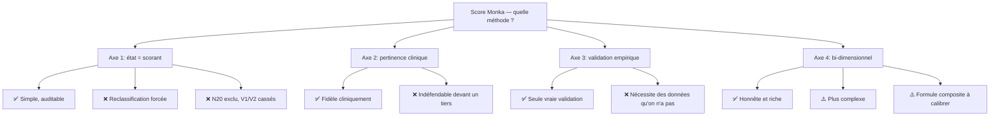

# 🧠 Réflexion — Méthodologie de Scoring Monka

> **Date** : 10/02/2026
> **Statut** : Réflexion interne — travail préparatoire pour Dr. Monka
> **Objet** : Quel fondement méthodologique pour le scoring des vulnérabilités ?

---

## Le point de départ

Monka évalue 5 vulnérabilités (V1-V5) à travers 150 questions. Chaque question est classifiée :
- **État** (55 questions) — mesure la situation actuelle : « Vous sentez-vous isolé ? »
- **Facteur** (91 questions) — mesure le contexte/risque : « Vivez-vous sous le même toit ? »
- **Triggers** (15 questions) — questions d'aiguillage, hors scoring

Le scoring legacy (hérité du CAT de Dr. Monka) utilise **38 questions scorantes** choisies par jugement clinique. Parmi elles, 34 sont des questions "état" et 4 sont des questions "facteur".

**La question centrale** : quelle est la bonne règle pour déterminer quelles questions contribuent au score ?

---

## Axe 1 : La règle « état = scorant » — élégante mais fragile

### L'idée

Si le score d'une V mesure un **état** de vulnérabilité, alors logiquement seules les questions qui mesurent un état devraient être scorantes. C'est propre : une classification, une règle, zéro ambiguïté.

### Ce qui marche

- **Simplicité** — `if classification == 'etat' then scorante`. Une ligne de code.
- **Auditabilité** — un tiers peut vérifier : est-ce que chaque question est bien classifiée ? La règle est-elle appliquée ?
- **Reproductibilité** — deux évaluateurs avec la même grille arrivent au même score.

### Ce qui casse

**Problème 1 : La classification n'a pas été conçue pour le scoring.**

La classification état/facteur a été faite pour comprendre la nature de chaque question, pas pour déterminer quelles questions doivent scorer. En l'utilisant comme critère de scoring, on détourne son usage initial.

**Problème 2 : On doit reclassifier des questions pour que ça marche.**

4 questions "facteur" sont actuellement scorées dans le legacy. Au lieu de questionner la règle, on questionne la classification :

| Question | Classif. actuelle | Contenu | Reclassification proposée |
|---|---|---|---|
| E1 | facteur | Depuis combien de temps aidez-vous ? | → état |
| E2 | facteur | À quelle fréquence aidez-vous ? | → état |
| N20 | facteur | Vivez-vous sous le même toit ? | → rester facteur |
| E43 | facteur | Hospitalisations ces 12 derniers mois ? | → état |

**C'est du raisonnement circulaire** : on veut scorer E1, donc on la reclassifie état. Mais E1 (« depuis combien de temps ? ») est objectivement un facteur contextuel — c'est une durée, pas un état subjectif. La reclassifier "état" pour satisfaire la règle, c'est forcer la réalité dans le modèle.

**Problème 3 : N20 révèle la contradiction.**

N20 (cohabitation avec la personne aidée) est l'un des prédicteurs les plus forts de l'épuisement de l'aidant dans la littérature gériatrique. L'exclure du scoring parce que c'est un "facteur" est cliniquement incohérent. Mais l'inclure en le reclassifiant "état" serait intellectuellement malhonnête — vivre sous le même toit n'est pas un "état", c'est une circonstance.

**Problème 4 : V1 et V2 s'effondrent.**

- V1 (Social) n'a que 2 questions état pures → score max de ~4 pts, non discriminant
- V2 (Fragilité) n'a que 4 questions état → passe de max 22 à max 8

On se retrouve à devoir reclassifier encore plus de questions pour "sauver" ces V. La règle simple génère de la complexité.

---

## Axe 2 : Le scoring par « pertinence clinique » — fidèle mais indéfendable

### L'idée

Dr. Monka choisit les questions scorantes par jugement clinique, comme il l'a fait pour les 38 du legacy. Pas de règle formelle, pas de classification requise.

### Ce qui marche

- **Fidélité clinique** — le scoring reflète l'expertise du gériatre
- **Pas de reclassification** — chaque question garde sa vraie nature
- **Le legacy est le point de départ** — on capitalise sur le travail déjà fait

### Ce qui casse

**Le jour où il faut défendre le scoring devant un tiers.**

Si Monka se présente devant une mutuelle, un organisme de certification, ou un partenaire institutionnel :

| Question du tiers | Réponse avec « pertinence clinique » |
|---|---|
| « Comment le score est-il construit ? » | « Notre médecin a choisi les questions pertinentes » |
| « Un autre médecin obtiendrait le même score ? » | « Pas forcément, ça dépend de son jugement » |
| « Comment vérifie-t-on que le score est correct ? » | « On fait confiance au Dr. Monka » |
| « Pourquoi E1 est scorante et pas E3 ? » | « Parce que le Dr. a jugé que c'était pertinent » |

**Ce n'est pas une méthodologie. C'est un avis d'expert.** Ça tient dans un cabinet médical, pas dans un dossier d'homologation.

---

## Axe 3 : Ce que font les échelles cliniques validées

Aucune échelle validée (Zarit, Barthel, GDS, NPI) ne sépare état et facteur pour le scoring. Leur processus est :

```
1. Panel d'experts → sélection d'items par consensus clinique
2. Étude pilote → test sur une cohorte réelle
3. Validation statistique → cohérence interne, test-retest, validité convergente
4. Publication → revue par les pairs
5. Adoption → devient un standard
```

**Ce que ça nous apprend :**

- La crédibilité ne vient ni de la règle « état = scorant » ni du jugement d'un seul médecin. Elle vient de la **validation empirique** : est-ce que le score prédit effectivement la gravité ?
- Monka n'a pas encore de données de cohorte → aucun système de scoring ne peut être "validé" au sens scientifique pour l'instant
- **Tout scoring actuel est provisoire** — c'est une V1 destinée à être validée empiriquement

---

## Axe 4 : Le scoring bi-dimensionnel — la piste V2

### L'idée

Au lieu de forcer état et facteur dans une même dimension, les séparer :

```
Score d'état     = somme des questions état → mesure la GRAVITÉ actuelle
Indice de risque = somme des facteurs clés  → mesure le CONTEXTE aggravant
Score composite  = état × risque            → pilote les activations
```

### Exemple concret — V1 Social

Un aidant se présente avec :
- **État** E4=1, E5=1 → score état = 2/4 (modéré — isolement léger)
- **Facteurs** E1=3 (10 ans), E2=2 (quotidien), N20=oui → indice risque = élevé

Avec le scoring simple : score = 2/4 → niveau faible → activation standard
Avec le scoring bi-dimensionnel : état modéré × risque élevé → **activation élevée**

Le deuxième est cliniquement plus juste : cet aidant est à risque même si son état subjectif semble gérable.

### Avantages

| Point | Scoring simple (état seul) | Scoring bi-dimensionnel |
|---|---|---|
| Fidélité clinique | ⚠️ Ignore les facteurs aggravants | ✅ Prend tout en compte |
| Honnêteté | ⚠️ Force des reclassifications | ✅ Chaque question garde sa nature |
| Auditabilité | ✅ Une règle simple | ✅ Deux règles simples |
| N20 (cohabitation) | ❌ Exclu du scoring | ✅ Contribue comme facteur |
| Complexité kernel | ✅ Simple | ⚠️ Plus complexe (2 scores + formule) |
| Données requises | ✅ Déployable maintenant | ⚠️ Formule composite à calibrer |

### Inconvénients

- Il faut définir la **formule composite** : addition simple (état + risque) ? multiplication (état × risque) ? pondération (0.7 × état + 0.3 × risque) ? Sans données empiriques, ce choix est arbitraire
- Deux scores au lieu d'un → plus complexe à communiquer aux aidants et aux partenaires
- Le kernel et le simulateur doivent gérer deux dimensions

---

## Axe 5 : La question qu'on ne pose pas — à quoi sert le score ?

Selon la réponse, la méthodologie change fondamentalement :

| Le score mesure... | Questions pertinentes | Méthodologie |
|---|---|---|
| **La gravité actuelle** | Uniquement les questions état | Règle « état = scorant » |
| **Le besoin d'intervention** | État + facteurs aggravants | Scoring bi-dimensionnel |
| **Le risque futur** | Surtout les facteurs | Modèle prédictif (nécessite des données) |

Pour Monka, le score pilote les **niveaux d'activation** des micro-parcours (critique / ccc / standard / prévention). C'est une décision d'intervention : « cette personne a-t-elle besoin d'aide, et à quel niveau ? »

Le besoin d'aide dépend autant du contexte que de l'état :
- État grave + contexte favorable → intervention modérée (car les ressources sont là)
- État modéré + contexte à risque → intervention élevée (car rien ne protège la personne)

**Si le score pilote des interventions, il devrait mesurer le besoin d'intervention, pas uniquement l'état.** C'est l'argument le plus fort pour le scoring bi-dimensionnel.

---

## Synthèse : quel chemin pour Monka ?



### Recommandation en deux temps

| Phase | Approche | Pourquoi |
|---|---|---|
| **Maintenant (MVP)** | **Scénario D** — état = scorant, avec reclassification des ~15 questions | C'est le compromis le plus déployable. Pas parfait, mais structuré, auditable, et suffisant pour un premier déploiement. |
| **V2 (post-déploiement)** | **Scoring bi-dimensionnel** — état + facteurs en deux dimensions | Quand on aura des données réelles, on pourra calibrer la formule composite et valider empiriquement. |

**L'honnêteté intellectuelle** : le Scénario D est un compromis pragmatique, pas une vérité scientifique. La reclassification de certaines questions (E1, E2, E43) est une approximation nécessaire pour avoir un système déployable. On en est conscients, c'est documenté, et on sait qu'on itérera.

> La vraie validation — celle qui convainc une mutuelle — viendra des données. Pas de la règle. La règle sert à structurer le système pour qu'il soit validable. C'est une différence fondamentale.
