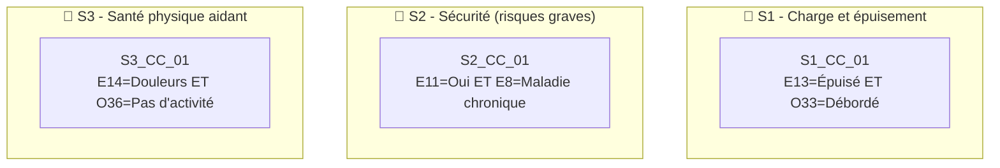

# 🧪 Test Complet – Vulnérabilité "Santé de l'Aidant"

> **Document de référence** démontrant le fonctionnement du moteur Monka sur la vulnérabilité V3.
> 
> Date : 04/02/2026

---

## 📋 Table des matières

1. [Référentiel des questions](#1-référentiel-des-questions)
2. [Règles de déclenchement](#2-règles-de-déclenchement)
3. [Mapping Question → Recommandations](#3-mapping-question--recommandations)
4. [Scoring et calcul](#4-scoring-et-calcul)
5. [Cas de test simulés](#5-cas-de-test-simulés)
6. [Conformité Legacy](#6-conformité-legacy)

---

## 1. Référentiel des questions

### 1.1 Questions avec typologie

| ID | Libellé complet | Type | Scoring |
|----|-----------------|------|---------|
| **E7** | Comment évaluez-vous votre état de santé général ? | Scorante | ✅ |
| **E8** | Avez-vous des problèmes de santé chroniques ? | Descriptive + Déclenchante | ❌ |
| **E9** | Prenez-vous des médicaments régulièrement ? | Descriptive | ❌ |
| **E10** | Avez-vous consulté un médecin pour vous-même ces 6 derniers mois ? | Déclenchante | ❌ |
| **E11** | Avez-vous renoncé à des soins pour vous-même ? | **Critique directe** + Déclenchante | ❌ |
| **E12** | Comment décririez-vous votre sommeil ? | Scorante | ✅ |
| **E13** | Vous sentez-vous fatigué(e) de manière persistante ? | Scorante + Déclenchante | ✅ |
| **E14** | Avez-vous des douleurs physiques liées à l'aide apportée ? | Scorante | ✅ |
| **E15** | Vous arrive-t-il de pleurer sans raison apparente ? | Scorante + Déclenchante | ✅ |
| **E16** | Ressentez-vous de l'anxiété ou de l'angoisse ? | Scorante | ✅ |
| **E17** | Avez-vous des pensées négatives récurrentes ? | **Critique directe** + Scorante | ✅ |
| **E18** | Avez-vous eu des idées de vous faire du mal ? | **Critique directe** | ❌ |
| **O32** | Comment évaluez-vous votre niveau de stress ? | Scorante | ✅ |
| **O33** | Avez-vous le sentiment d'être débordé(e) ? | Scorante | ✅ |
| **O34** | Avez-vous le sentiment de ne plus avoir de temps pour vous ? | Scorante | ✅ |
| **O35** | Comment qualifieriez-vous votre alimentation ? | Déclenchante | ❌ |
| **O36** | Pratiquez-vous une activité physique régulière ? | Descriptive | ❌ |

> **Total** : 27 questions (17 principales + options)

---

## 2. Règles de déclenchement

### 2.1 Questions déclenchantes simples

| ID | Réponse déclenchante | Micro-parcours | Sens clinique |
|----|---------------------|----------------|---------------|
| **E10** | "Non" | **S1** | Négligence de sa propre santé |
| **E13** | "Oui, épuisé" | **S1** | Fatigue chronique/épuisement |
| **E15** | "Oui, souvent" | **S4** | Détresse émotionnelle |
| **O35** | "Déséquilibrée/Insuffisante" | **S3** | Risque nutritionnel de l'aidant |

### 2.2 Questions critiques directes → Priorité Niveau 1

| ID | Réponse critique | Effet Legacy | Sens clinique |
|----|-----------------|--------------|---------------|
| **E11** | "Oui, souvent" | ⚡ Priorité niveau 1 | Renoncement aux soins récurrent |
| **E17** | "Oui, envahissantes" | ⚡ Priorité niveau 1 | Idéation négative envahissante |
| **E18** | "Oui" | ⚡⚡ **URGENCE ABSOLUE** | Risque suicidaire |

> [!CAUTION]
> E18 = "Oui" déclenche un **protocole d'urgence immédiat** : contact médecin + entourage + 3114

### 2.3 Conditions Critiques Composites (CCC)



| Code | Questions | Logique booléenne | Micro-parcours | Sens clinique |
|------|-----------|-------------------|----------------|---------------|
| **S1_CC_01** | E13 + O33 | E13="Épuisé" **ET** O33="Débordé" | S1 | Syndrome d'épuisement complet |
| **S2_CC_01** | E11 + E8 | E11="Oui" **ET** E8="Maladie chronique" | S2 | Renoncement aux soins avec pathologie existante |
| **S3_CC_01** | E14 + O36 | E14="Douleurs" **ET** O36="Pas d'activité" | S3 | Douleurs sans compensation physique |

---

## 3. Mapping Question → Recommandations

### 3.1 E7 – État de santé général

| Réponse | Recommandation | Acteur | Micro-tâches |
|---------|----------------|--------|--------------|
| **Bon / Très bon** | — | — | — |
| **Moyen** | Surveillance et échange | IDEC | • Identifier les points de vigilance |
| **Mauvais / Très mauvais** | Consultation médicale recommandée | IDEC / Médecin | • Orienter vers le médecin traitant<br/>• Proposer un accompagnement |

### 3.2 E11 – Renoncement aux soins

| Réponse | Recommandation | Acteur | Micro-tâches |
|---------|----------------|--------|--------------|
| **Non, jamais** | — | — | — |
| **Parfois** | Identifier les freins aux soins | IDEC | • Explorer les causes du renoncement<br/>• Informer sur les droits |
| **Oui, souvent** 🔴 | Accompagnement urgent pour accès aux soins | IDEC / AS / Médecin | • Évaluer l'urgence des soins reportés<br/>• Organiser un RDV médical prioritaire<br/>• Identifier les solutions de répit |

> [!WARNING]
> La réponse "Oui, souvent" est une **critique directe** → Priorité niveau 1

### 3.3 E12 – Qualité du sommeil

| Réponse | Recommandation | Acteur | Micro-tâches |
|---------|----------------|--------|--------------|
| **Bon / Suffisant** | — | — | — |
| **Perturbé** | Échange sur les causes de perturbation | IDEC | • Identifier les facteurs de perturbation |
| **Très mauvais / Insomnie** | Consultation recommandée | IDEC / Médecin | • Orienter vers consultation<br/>• Proposer des solutions de répit nocturne |

### 3.4 E17 – Pensées négatives récurrentes

| Réponse | Recommandation | Acteur | Micro-tâches |
|---------|----------------|--------|--------------|
| **Non** | — | — | — |
| **Parfois** | Proposer un espace d'écoute | IDEC / Psychologue | • Offrir un temps d'échange<br/>• Évaluer le besoin de soutien |
| **Oui, envahissantes** 🔴 | Accompagnement psychologique urgent | Psychologue / Médecin | • Orienter vers un psychologue<br/>• Évaluer le risque suicidaire<br/>• Assurer un suivi rapproché |

### 3.5 E18 – Idées de se faire du mal

| Réponse | Recommandation | Acteur | Micro-tâches |
|---------|----------------|--------|--------------|
| **Non** | — | — | — |
| **Oui** 🔴🔴 | **PROTOCOLE D'URGENCE IMMÉDIAT** | Médecin / 3114 / Entourage | • APPELER LE 3114 IMMÉDIATEMENT<br/>• Contacter le médecin traitant<br/>• Alerter l'entourage identifié<br/>• Ne pas laisser la personne seule |

> [!DANGER]
> **URGENCE ABSOLUE** - Cette réponse active un protocole de crise immédiat

---

## 4. Scoring et calcul

### 4.1 Questions scorantes et pondération

> [!CAUTION]
> **INCOHÉRENCE MAJEURE DÉTECTÉE (04/02/2026)**
> 
> Les scorantes ci-dessous (extraites IA) **ne correspondent pas au Legacy scoring officiel**.
> 
> **Legacy scoring 310127.docx dit :**
> - 9 scorantes : **O29, O33, E7, E8, E9, E10, E11, O44, E18**
> - Score brut max = 18
> - Formule = (brut/18)×20
>
> **Notre fichier dit :**
> - 10 scorantes : E7, E12, E13, E14, E15, E16, E17, O32, O33, O34
> - Seulement 2 correspondent (E7, O33)
>
> **À RÉVISER D'URGENCE : aligner cette section sur le Legacy.**

| Question | Réponse | Score |
|----------|---------|-------|
| **⚠️ Section à réviser selon Legacy scoring** | | |

### 4.2 Formule de calcul (LEGACY)

```
Score brut max = 18 (9 questions scorantes - Legacy scoring)
Score normalisé = (Score brut / 18) × 20
```

> ⚠️ **Ancienne valeur erronée** : max 23 (10 scorantes) - À NE PLUS UTILISER

### 4.3 Grille de lecture

| Score /20 | Couleur | Interprétation |
|-----------|---------|----------------|
| 0 – 6 | 🟢 Vert | Santé de l'aidant préservée |
| 7 – 13 | 🟠 Orange | Signes d'épuisement, vigilance requise |
| 14 – 20 | 🔴 Rouge | Épuisement sévère, intervention prioritaire |

---

## 5. Cas de test simulés

### 5.1 Profil A – Martine, 62 ans (Critique directe → Niveau 1)

| Question | Réponse | Score |
|----------|---------|-------|
| E7 | Mauvais | 2 |
| E11 | **Oui, souvent** 🔴 | — |
| E12 | Très mauvais | 2 |
| E13 | Oui, épuisé | 2 |
| O33 | Oui, débordé | 2 |
| E17 | Parfois | 1 |

**Résultat :**
- **Score brut** = 9/23 → **Score normalisé = 7.8/20** 🟠
- **Question critique directe activée** : E11 = "Oui, souvent"
- **Priorité** : ⚡ **Niveau 1** (≤ 7 jours)
- **Micro-parcours activés** : **S1** + **S2**
- **CCC activées** : S1_CC_01

### 5.2 Profil B – Bernard, 68 ans (Urgence absolue)

| Question | Réponse | Score |
|----------|---------|-------|
| E7 | Très mauvais | 3 |
| E17 | Oui, envahissantes | 3 |
| E18 | **Oui** 🔴🔴 | — |

**Résultat :**
- **URGENCE ABSOLUE** - Protocole de crise immédiat
- **Priorité** : ⚡⚡ **IMMÉDIAT** - 3114 + Médecin + Entourage
- Toutes autres recommandations suspendues

### 5.3 Profil C – Françoise, 55 ans (Score modéré → Niveau 3)

| Question | Réponse | Score |
|----------|---------|-------|
| E7 | Moyen | 1 |
| E12 | Perturbé | 1 |
| E13 | Parfois | 1 |
| O32 | Modéré | 1 |
| E17 | Non | 0 |

**Résultat :**
- **Score brut** = 4/23 → **Score normalisé = 3.5/20** 🟢
- **Aucune critique directe**
- **Aucune CCC activée**
- **Priorité** : **Niveau 3** (>1 mois, planifié)
- **Micro-parcours** : Surveillance, proposer répit

---

## 6. Conformité Legacy

### Checklist de vérification

| Règle Legacy | Statut | Implémentation |
|--------------|--------|----------------|
| Score ne déclenche jamais | ✅ | Score utilisé uniquement pour temporalité |
| Critique directe = Niveau 1 | ✅ | E11, E17 critiques → priorité immédiate |
| E18 = Urgence absolue | ✅ | Protocole spécifique hors scoring |
| CCC = Niveau 2 | ✅ | 3 conditions composites |
| Max 3 micro-parcours actifs | ✅ | 4 MP disponibles (S1-S4) |
| Hiérarchie inter-vulnérabilités | ✅ | Santé de l'Aidant = rang 1/5 (prioritaire) |
| Sécurité médicale | ✅ | E18 hors workflow normal |

---

> 📄 Document généré le 04/02/2026 – Test vulnérabilité Santé de l'Aidant (V3)
