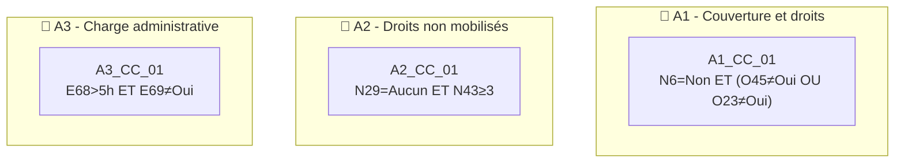

# 🧪 Test Complet – Vulnérabilité "Administrative"

> **Document de référence** démontrant le fonctionnement du moteur Monka sur la vulnérabilité V5.
> 
> Date : 04/02/2026

---

## 📋 Table des matières

1. [Référentiel des questions](#1-référentiel-des-questions)
2. [Règles de déclenchement](#2-règles-de-déclenchement)
3. [Mapping Question → Recommandations](#3-mapping-question--recommandations)
4. [Scoring et calcul](#4-scoring-et-calcul)
5. [Cas de test simulés](#5-cas-de-test-simulés)
6. [Conformité Legacy](#6-conformité-legacy)

---

## ⚠️ Particularité V5 : Orientation / Information

La vulnérabilité Administrative est **orientée information/orientation** :
- L'IDEC **informe** et **oriente** vers les bons interlocuteurs
- C'est **l'aidant qui réalise** les démarches administratives
- L'IDEC **ne fait pas** à la place de l'aidant
- Rôle de **guidance** plutôt que d'action directe

> "C'est l'aidant qui contacte l'AS, pas l'IDEC"

---

## 1. Référentiel des questions

### 1.1 Questions avec typologie

| ID | Libellé complet | Type | Scoring |
|----|-----------------|------|---------|
| **N6** | Votre proche bénéficie-t-il d'une mesure de protection juridique ? | Déclenchante | ❌ |
| **N29** | De quelles aides financières bénéficiez-vous actuellement ? | Déclenchante | ❌ |
| **N43** | Combien de structures avez-vous déjà sollicitées sans résultat ? | Scorante + Déclenchante | ✅ |
| **O23** | Avez-vous une mutuelle complémentaire ? | Déclenchante | ❌ |
| **O45** | Votre proche a-t-il une mutuelle complémentaire ? | Déclenchante | ❌ |
| **E68** | Combien de temps passez-vous par mois sur les démarches admin ? | Scorante | ✅ |
| **E69** | Êtes-vous à l'aise avec les démarches en ligne ? | Scorante + Déclenchante | ✅ |
| **E70** | Connaissez-vous vos droits en tant qu'aidant ? | Scorante | ✅ |
| **E71** | Avez-vous fait une demande d'APA pour votre proche ? | Déclenchante | ❌ |
| **E72** | Avez-vous fait une demande de PCH/AAH ? | Déclenchante | ❌ |
| **E73** | Avez-vous constitué un dossier MDPH ? | Déclenchante | ❌ |
| **E74** | Avez-vous anticipé la succession / protection future ? | Déclenchante | ❌ |

> **Total** : 18 questions (12 principales + options)

---

## 2. Règles de déclenchement

### 2.1 Questions déclenchantes simples

| ID | Réponse déclenchante | Micro-parcours | Sens clinique |
|----|---------------------|----------------|---------------|
| **N6** | "Non" | **A4** | Absence de protection juridique |
| **N29** | "Aucune/Je ne sais pas" | **A2** | Droits non mobilisés |
| **O23/O45** | "Non" | **A1** | Couverture santé insuffisante |
| **E69** | "Non, pas à l'aise" | **A3** | Fracture numérique |
| **E71** | "Non" et éligible | **A2** | APA non demandée |
| **N43** | "≥ 3 structures" | **A2** | Épuisement administratif |

### 2.2 Questions critiques directes → Priorité Niveau 1

| ID | Réponse critique | Effet Legacy | Sens clinique |
|----|-----------------|--------------|---------------|
| **O23+O45** | Les deux = "Non" | ⚡ Priorité niveau 1 | Aucune couverture santé complémentaire |
| **E68** | "> 10h/mois" + difficultés | ⚡ Priorité niveau 1 | Charge admin insoutenable |

> [!NOTE]
> Les critiques directes en V5 sont moins fréquentes car la vulnérabilité est moins urgente médicalement.

### 2.3 Conditions Critiques Composites (CCC)



| Code | Questions | Logique booléenne | Micro-parcours | Sens clinique |
|------|-----------|-------------------|----------------|---------------|
| **A1_CC_01** | N6 + O45/O23 | N6="Non" **ET** (O45≠"Oui" **OU** O23≠"Oui") | A1 | Protection juridique absente + couverture santé fragile |
| **A2_CC_01** | N29 + N43 | N29="Aucun" **ET** N43≥3 structures | A2 | Aucune aide malgré multiples sollicitations |
| **A3_CC_01** | E68 + E69 | E68>5h **ET** E69≠"Oui" | A3 | Charge admin élevée + difficultés numériques |

---

## 3. Mapping Question → Recommandations

### 3.1 N6 – Mesure de protection juridique

| Réponse | Recommandation | Acteur | Micro-tâches |
|---------|----------------|--------|--------------|
| **Oui (tutelle/curatelle/habilitation)** | — | — | — |
| **Non, pas nécessaire** | — | — | — |
| **Non, mais pourrait être utile** | Informer sur les mesures de protection | IDEC / AS | • **Rappeler à l'aidant de contacter l'AS**<br/>• Informer sur les différentes mesures<br/>• Expliquer la procédure |

> [!NOTE]
> L'IDEC **informe** mais ne constitue pas le dossier

### 3.2 N29 – Aides financières perçues

| Réponse | Recommandation | Acteur | Micro-tâches |
|---------|----------------|--------|--------------|
| **APA/PCH/AAH...** | — | — | — |
| **Aucune** | Réaliser un bilan des droits potentiels | AS | • **Rappeler à l'aidant de contacter l'AS**<br/>• Lister les aides potentiellement éligibles |
| **Je ne sais pas** | Clarifier la situation administrative | IDEC / AS | • **Rappeler à l'aidant de contacter l'AS**<br/>• Aider à identifier les aides existantes |

### 3.3 E68 – Temps passé sur les démarches

| Réponse | Recommandation | Acteur | Micro-tâches |
|---------|----------------|--------|--------------|
| **< 2h/mois** | — | — | — |
| **2-5h/mois** | Proposer une organisation | IDEC | • Identifier les démarches en cours |
| **> 5h/mois** | Orienter vers un accompagnement | IDEC / France Services | • Orienter vers France Services<br/>• Proposer un calendrier des échéances<br/>• Simplifier les procédures |

### 3.4 E69 – Aisance avec le numérique

| Réponse | Recommandation | Acteur | Micro-tâches |
|---------|----------------|--------|--------------|
| **Oui, tout à fait** | — | — | — |
| **Partiellement** | Proposer un accompagnement ponctuel | IDEC | • Identifier les points bloquants |
| **Non, pas à l'aise** | Orienter vers un accompagnant numérique | France Services / CCAS | • Orienter vers France Services<br/>• Proposer des alternatives au numérique<br/>• Informer sur les RDV physiques possibles |

### 3.5 E70 – Connaissance des droits

| Réponse | Recommandation | Acteur | Micro-tâches |
|---------|----------------|--------|--------------|
| **Oui, bien informé** | — | — | — |
| **Partiellement** | Informer sur les droits des aidants | IDEC | • Présenter le congé proche aidant<br/>• Informer sur l'AJPA |
| **Non, pas du tout** | Réaliser un bilan complet des droits | IDEC / AS | • **Rappeler à l'aidant de contacter l'AS**<br/>• Fournir une documentation adaptée<br/>• Proposer un RDV d'information |

---

## 4. Scoring et calcul

### 4.1 Questions scorantes et pondération

> [!CAUTION]
> **INCOHÉRENCE DÉTECTÉE (04/02/2026)**
> 
> Les scorantes ci-dessous (extraites IA) **diffèrent légèrement du Legacy scoring officiel**.
> 
> **Legacy scoring 310127.docx dit :**
> - 3 scorantes : **E66, E69, E70**
> - Score brut max = 6
> - Formule = (brut/6)×20
>
> **Notre fichier dit :**
> - 4 scorantes : N43, E68, E69, E70
> - E69 est la seule correspondance exacte
>
> **À VÉRIFIER : aligner les question IDs avec le Legacy.**

| Question | Réponse | Score |
|----------|---------|-------|
| **⚠️ Section à vérifier selon Legacy scoring** | | |

### 4.2 Formule de calcul (LEGACY)

```
Score brut max = 6 (3 questions scorantes - Legacy scoring)
Score normalisé = (Score brut / 6) × 20
```

> ⚠️ **Ancienne valeur** : max 8 (4 scorantes) - À VÉRIFIER

### 4.3 Grille de lecture

| Score /20 | Couleur | Interprétation |
|-----------|---------|----------------|
| 0 – 6 | 🟢 Vert | Situation administrative maîtrisée |
| 7 – 13 | 🟠 Orange | Difficultés administratives, accompagnement utile |
| 14 – 20 | 🔴 Rouge | Surcharge administrative, risque de non-recours aux droits |

> [!NOTE]
> Le scoring V5 est plus léger car la vulnérabilité administrative est moins critique médicalement.

---

## 5. Cas de test simulés

### 5.1 Profil A – Gisèle, 71 ans (CCC activées → Niveau 2)

| Question | Réponse | Score |
|----------|---------|-------|
| N6 | Non | — |
| O23 | Non | — |
| O45 | Non | — |
| N29 | Aucune | — |
| N43 | 4 structures | 2 |
| E68 | > 5h/mois | 2 |
| E69 | Non, pas à l'aise | 2 |

**Résultat :**
- **Score brut** = 6/8 → **Score normalisé = 15/20** 🔴
- **CCC activées** : A1_CC_01, A2_CC_01, A3_CC_01
- **Priorité** : ⚡ **Niveau 2** (≤ 7 jours)
- **Micro-parcours activés** : **A1** + **A2** + **A3**

### 5.2 Profil B – Michel, 65 ans (Score modéré → Niveau 3)

| Question | Réponse | Score |
|----------|---------|-------|
| N6 | Oui (curatelle) | — |
| O23 | Oui | — |
| O45 | Oui | — |
| N29 | APA | — |
| E68 | 2-5h/mois | 1 |
| E69 | Partiellement | 1 |
| E70 | Partiellement | 1 |

**Résultat :**
- **Score brut** = 3/8 → **Score normalisé = 7.5/20** 🟠
- **Aucune critique directe**
- **Aucune CCC activée**
- **Priorité** : **Niveau 3** (>1 mois, planifié)
- **Micro-parcours** : Surveillance, proposer information

### 5.3 Profil C – Danielle, 58 ans (Score faible → Surveillance)

| Question | Réponse | Score |
|----------|---------|-------|
| N6 | Oui (habilitation familiale) | — |
| O23 | Oui | — |
| O45 | Oui | — |
| N29 | PCH + APA | — |
| E68 | < 2h/mois | 0 |
| E69 | Oui, tout à fait | 0 |
| E70 | Oui, bien informée | 0 |

**Résultat :**
- **Score brut** = 0/8 → **Score normalisé = 0/20** 🟢
- **Aucune critique directe**
- **Aucune CCC activée**
- **Priorité** : **Surveillance** uniquement

---

## 6. Conformité Legacy

### Checklist de vérification

| Règle Legacy | Statut | Implémentation |
|--------------|--------|----------------|
| Score ne déclenche jamais | ✅ | Score utilisé uniquement pour temporalité |
| CCC = Niveau 2 | ✅ | 3 conditions composites |
| Max 3 micro-parcours actifs | ✅ | 4 MP disponibles (A1-A4) |
| Hiérarchie inter-vulnérabilités | ✅ | Administrative = rang 5/5 (moins prioritaire) |
| Rôle IDEC = Information/Orientation | ✅ | Pas d'action directe, guidance uniquement |
| L'aidant agit | ✅ | "C'est l'aidant qui contacte l'AS" |

### Spécificités V5

| Règle | Implémentation |
|-------|----------------|
| Moins de micro-tâches directes | ✅ Actions "Rappeler à l'aidant de..." |
| Focus orientation | ✅ Vers AS, France Services, CCAS |
| Pas de criticité médicale | ✅ Pas d'urgence vitale |

---

> 📄 Document généré le 04/02/2026 – Test vulnérabilité Administrative (V5)
