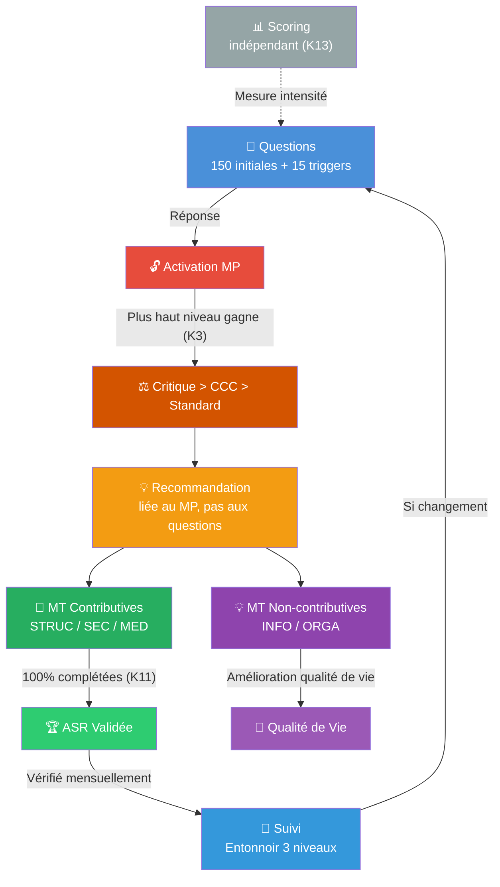
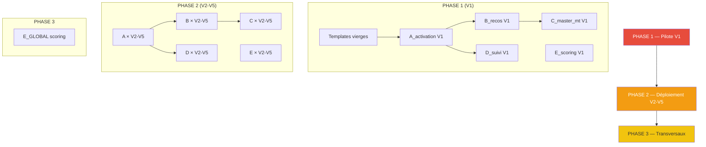

# 🏗️ MONKA KERNEL — Document de Fondation (v4 FINALE)

> **Date** : 07/02/2026  
> **Participants** : Dr. Monka (Médecin) + Antonin  
> **Objectif** : Figer les règles du moteur Monka avant production des documents détaillés  
> **Statut** : 🔒 À VALIDER DÉFINITIVEMENT

---

## 1. LE QUESTIONNAIRE (FIGÉ)

| Bloc | Description | Quantité |
|------|-------------|----------|
| **Questions initiales** | Réparties dans 5 vulnérabilités (V1→V5) | **150** |
| **Triggers** | Contexte/profil, ne déclenchent rien | **15** |
| **Questions de suivi** | Entonnoir 3 niveaux (voir §3) | **~30** |
| **TOTAL** | | **~195** |

> Les 15 triggers sont une **liste fermée** : `N3, O35, O36, N1, O64, O46, O14, O1, O63, O49, N26, E71, E72, O2, N31`

---

## 2. LES 13 RÈGLES DU KERNEL

> [!CAUTION]
> Ces règles définissent le fonctionnement du moteur. Toute modification invalide les documents en aval.

---

### BLOC A — Activation

| # | Règle | Énoncé |
|---|-------|--------|
| **K1** | Recos liées au MP | Les recommandations visent l'**objectif du MP (= l'ASR)**, pas les questions individuelles. Les questions servent uniquement à **activer** le MP. |
| **K2** | 3 niveaux d'activation | 🔴 Critique (≤7j) · 🟠 CCC (≤30j) · 🟢 Standard (≤90j) |
| **K3** | Le plus haut englobe | Si plusieurs niveaux activent le même MP, **seule la reco du niveau le plus haut est affichée**. Elle inclut et intensifie les niveaux inférieurs. |
| **K4** | Prévention si non activé | Chaque MP a aussi des recos de **prévention générale** (⚪) même s'il n'est pas activé. |

---

### BLOC B — Recommandations & Micro-Tâches

| # | Règle | Énoncé |
|---|-------|--------|
| **K5** | Reco = enveloppe de MT | Une recommandation **contient** des micro-tâches. Pas de séparation conceptuelle. |
| **K6** | Visibilité totale | L'utilisateur ET l'IDEC voient les **mêmes recos et MT**. Seul le **wording** est adapté (vulgarisé pour l'utilisateur). |
| **K7** | Autonomie par défaut | Le système est conçu pour que l'utilisateur puisse agir **sans IDEC**. L'IDEC est un support, pas une dépendance. |
| **K8** | Délégation au niveau reco | La décision "qui fait quoi" se prend au niveau de la **recommandation**, pas de chaque MT. |

---

### BLOC C — MT, ASR & Validation

| # | Règle | Énoncé |
|---|-------|--------|
| **K9** | 1 MP = 1 ASR | Chaque micro-parcours a **une et une seule** ASR (objectif = changement d'état). |
| **K10** | 2 catégories de MT | Les MT sont soit **contributives** (STRUC/SEC/MED) soit **non-contributives** (INFO/ORGA). |
| **K11** | 100% des contributives = ASR validée | L'ASR est validée quand **toutes les MT contributives** de la reco sont complétées. Pas de hiérarchie, pas de seuil partiel. |
| **K12** | Pas tous les types obligatoires | Un MP peut ne pas contenir les 3 types contributifs (ex: Admin peut ne pas avoir de MED). La règle K11 s'applique sur **ce qui existe**. |

---

### BLOC D — Scoring & Suivi

| # | Règle | Énoncé |
|---|-------|--------|
| **K13** | Scoring indépendant | Le score mesure l'**intensité** d'une vulnérabilité. Il ne déclenche **jamais** un MP. Scoring et criticité sont **indépendants**. |

---

## 3. LOGIQUE DÉTAILLÉE

### 3.1 — Activation des MP

```
3 NIVEAUX D'ACTIVATION (par ordre de priorité) :

🔴 NIVEAU 1 — Question Critique
   UNE réponse à UNE question suffit → Activation immédiate
   Délai : ≤ 7 jours

🟠 NIVEAU 2 — CCC (Condition Critique Composite)
   PLUSIEURS réponses combinées (aucune critique seule)
   Délai : ≤ 30 jours

🟢 NIVEAU 3 — Déclencheur Standard
   UNE réponse spécifique, priorité basse
   Délai : ≤ 90 jours
```

**Règle d'englobement** : Si Critique + CCC + Standard s'activent simultanément sur le même MP, seule la reco **Critique** est mise en avant. Elle englobe et intensifie les autres.

```
Exemple : MP R2

  Activation 🔴 E2="Personne"   → P1
  Activation 🟠 E1="Seul"+N4="Oui" → P2
  Activation 🟢 N4="Oui"        → P3

  → Résultat : RECO CRITIQUE affichée (englobe CCC et Standard)
  → L'objectif (ASR) reste le même, seule l'urgence change
```

---

### 3.2 — Structure d'une Recommandation

Une reco contient des MT réparties en **2 catégories** visibles séparément dans l'application :

```
RECOMMANDATION "[Libellé]"
│
├── 📍 ACTIONS DE SÉCURISATION (contributives → valident l'ASR)
│   ├── MT [STRUC] : "Mise en place d'un relais familial"
│   ├── MT [SEC]   : "Sécurisation des périodes critiques"
│   └── MT [MED]   : "RDV médecin traitant"
│   
│   → Barre de progression : 0/3 → 1/3 → 2/3 → 3/3 ✅ ASR VALIDÉE
│
└── 💡 ACTIONS D'AMÉLIORATION (non-contributives → qualité de vie)
    ├── MT [INFO]  : "Informer sur les droits APA/PCH"
    └── MT [ORGA]  : "Identifier les professionnels du secteur"
    
    → Pas de barre de progression, pas d'impact sur l'ASR
```

> [!IMPORTANT]
> **Dans l'application** : l'utilisateur voit clairement la séparation entre ses **actions à faire pour sécuriser sa situation** (progression visible) et les **actions complémentaires** pour améliorer son quotidien.

---

### 3.3 — Validation de l'ASR

```
ASR = Objectif du MP (changement d'état, pas une tâche)

CONDITION DE VALIDATION :
  100% des MT contributives complétées = ASR VALIDÉE ✅

Exemples :
  MP avec 2 STRUC + 1 SEC + 1 MED → 4 contributives → 4/4 = ✅
  MP avec 3 STRUC + 2 SEC         → 5 contributives → 5/5 = ✅  (pas de MED, c'est OK)
  MP avec 1 STRUC                 → 1 contributive  → 1/1 = ✅
```

**Les 3 statuts de l'ASR** :

| Statut | Signification | Condition |
|--------|---------------|-----------|
| ✅ **Atteinte** | Objectif validé | 100% des MT contributives complétées |
| ❌ **Non atteinte** | En cours | Au moins 1 MT contributive incomplète |
| ⏳ **Non confirmée** | Atteinte mais à revérifier | Au suivi mensuel (est-ce que ça tient ?) |

---

### 3.4 — Impact de la Méthode d'Activation

L'ASR (l'objectif) est **la même** quel que soit le niveau d'activation. Ce qui change :

| | 🔴 Critique | 🟠 CCC | 🟢 Standard |
|--|------------|--------|-------------|
| **Objectif (ASR)** | Identique | Identique | Identique |
| **Wording recos** | Urgent, action immédiate | Vigilance, mise en sécurité | Progressif, prévention |
| **Délai** | ≤ 7 jours | ≤ 30 jours | ≤ 90 jours |
| **Intensité des MT** | Maximale | Renforcée | Normale |
| **Nombre de MT** | Peut être plus élevé | Modéré | Minimum |

---

### 3.5 — Suivi Dynamique (Entonnoir 3 Niveaux)

```
NIVEAU 1 — Question Générale (1 question)
"Des changements depuis le dernier suivi ?"
  ├── NON → Fin. RDV mois prochain.
  └── OUI ↓

NIVEAU 2 — Par Vulnérabilité (5 questions, Oui/Non)
"Changements dans [V1] ?" ... "Changements dans [V5] ?"
  └── Si OUI sur V[x] ↓

NIVEAU 3 — Par Micro-Parcours (1 question par MP de la V)
"Changements concernant [Sujet du MP] ?"
  └── Si OUI → Réouvre les questions initiales liées à ce MP
```

| Niveau | Questions | Type |
|--------|-----------|------|
| N1 | 1 | Oui/Non |
| N2 | 5 | Oui/Non (une par V) |
| N3 | ~24 | Oui/Non (une par MP) |
| **Total** | **~30** | Questions chapeau |

---

### 3.6 — Les 5 Types de Micro-Tâches

| Type | Rôle | Contribue à l'ASR | Catégorie dans l'app |
|------|------|-------------------|---------------------|
| **STRUC** | Changement structurel durable | ✅ Oui | 📍 Sécurisation |
| **SEC** | Réduction d'un risque identifié | ✅ Oui | 📍 Sécurisation |
| **MED** | Acte médical / prescription | ✅ Oui | 📍 Sécurisation |
| **INFO** | Informer, expliquer | ❌ Non | 💡 Amélioration |
| **ORGA** | Préparer, coordonner | ❌ Non | 💡 Amélioration |

> Chaque MT a **exactement 1 type**, non cumulable, non modifiable.

---

## 4. LA CHAÎNE COMPLÈTE



---

## 5. LES 5 TEMPLATES (VALIDÉ)

### Vue d'ensemble

| Template | Rôle | Dupliqué par V ? |
|----------|------|-------------------|
| **A** — Activation | Comment chaque MP s'allume | ✅ ×5 (une par V) |
| **B** — Recommandations & Variations | Que dit-on selon le niveau d'activation | ✅ ×5 |
| **C** — Master MT & ASR | L'objectif, toutes les MT, la validation | ✅ ×5 |
| **D** — Suivi Dynamique | Les questions de suivi par MP | ✅ ×5 |
| **E** — Scoring | Pondération, seuils, échelles | ✅ ×5 + **1 E_GLOBAL** |

**Total : 26 documents** (5×5 par V + 1 scoring global)

> [!IMPORTANT]
> Chaque template est un **fichier indépendant par vulnérabilité** que le médecin peut valider isolément. Les templates sont liés entre eux par des **ID partagés** (MP_ID, MT_ID).

---

### 📄 TEMPLATE A — Activation *(par V)*

**Répond à** : *Comment chaque MP de cette V s'active-t-il, et quelles questions lui sont rattachées ?*

**Contenu pour chaque MP de la V** :

```
1. MP_ID + Nom du MP
2. ASR associée (libellé uniquement, le détail est dans C)
3. Méthode Critique :
   - Question ID + Libellé
   - Réponse déclenchante
   - Délai (≤7j)
4. Méthode CCC :
   - Combinaison : Q1=R1 ET Q2=R2 (ET ...)
   - Délai (≤30j)
5. Méthode Standard :
   - Question ID + Libellé
   - Réponse déclenchante
   - Délai (≤90j)
6. Liste des questions initiales liées à ce MP
   (= celles qui se réouvrent au suivi N3)
```

**Règles kernel couvertes** : K2, K3

**Lien sortant →** B *(le niveau d'activation détermine quelle version de reco afficher)*

---

### 📄 TEMPLATE B — Recommandations & Variations *(par V)*

**Répond à** : *Pour chaque MP de cette V, que dit-on à l'utilisateur selon le niveau d'activation ?*

**Contenu pour chaque MP de la V, ×4 versions** :

```
1. MP_ID (référence vers A)
2. VERSION CRITIQUE (si activation P1) :
   - Texte Reco (wording utilisateur)
   - Texte Reco (wording IDEC)
   - Liste des MT_ID référencées (définies dans C)
     séparées en : 📍 Contributives / 💡 Non-contributives
   - Délégation : Utilisateur autonome / Avec IDEC
3. VERSION CCC (si activation P2) :
   - Idem
4. VERSION STANDARD (si activation P3) :
   - Idem
5. VERSION PRÉVENTION (si MP non activé) :
   - Texte Reco informatif
   - MT_ID (probablement uniquement INFO/ORGA)
```

**Règles kernel couvertes** : K1, K3, K4, K5, K6, K7, K8, K10

**Lien entrant ←** A *(méthode d'activation)*
**Lien sortant →** C *(les MT_ID référencées ici sont définies dans C)*

---

### 📄 TEMPLATE C — Master MT & ASR *(par V)*

**Répond à** : *Pour chaque MP de cette V, quel est l'objectif, quelles sont toutes les MT, et comment valide-t-on ?*

> [!IMPORTANT]
> **C est la SOURCE DE VÉRITÉ** pour les micro-tâches. Le Template B ne fait que les **référencer** pour les afficher. Si on veut changer une MT, on la change dans C et ça se propage.

**Contenu pour chaque MP de la V** :

```
1. MP_ID + Nom
2. ASR : "[Objectif = changement d'état]"
3. TABLEAU DES MT CONTRIBUTIVES (📍 Sécurisation) :
   | MT_ID | Libellé | Type (STRUC/SEC/MED) | Acteur | Domaine (🏥/🤝) | Wording utilisateur |
4. TABLEAU DES MT NON-CONTRIBUTIVES (💡 Amélioration) :
   | MT_ID | Libellé | Type (INFO/ORGA) | Acteur | Domaine (🏥/🤝) | Wording utilisateur |
5. Condition de validation : X contributives → 100% = ASR ✅
6. Question de suivi N3 associée : "[Libellé]"
```

**Règles kernel couvertes** : K9, K10, K11, K12

**Lien entrant ←** A *(MP_ID et questions liées)*
**Lien entrant ←** B *(les MT_ID appelées par les recos sont définies ici)*
**Lien sortant →** D *(question de suivi N3)*

---

### 📄 TEMPLATE D — Suivi Dynamique *(par V)*

**Répond à** : *Quelles questions de suivi pour cette V, et que réouvrent-elles ?*

**Contenu** :

```
EN-TÊTE (rappel, identique pour toutes les V) :
  - N1 : "Des changements depuis le dernier suivi ?" → Oui/Non
  - N2 : "Changements dans [cette V] ?" → Oui/Non

POUR CHAQUE MP DE LA V :
  1. Question N3 :
     - ID
     - Libellé : "Changements concernant [sujet du MP] ?"
     - Réponses : Oui / Non
  2. Si Oui → Liste des questions initiales réouvertes
     (= la même liste que dans A, section 6)
  3. MP_ID référencé (lien vers A et C)
```

**Lien entrant ←** A *(questions initiales liées au MP)*
**Lien entrant ←** C *(question N3 et MP_ID)*

---

### 📄 TEMPLATE E — Scoring *(par V)*

**Répond à** : *Comment scorer cette V, quels seuils, quelles pondérations ?*

**Contenu** :

```
1. Métadonnées : Nombre de questions scorantes, score max
2. Tableau des questions scorantes :
   | Question ID | Libellé | Option | Score (+0/+1/+2/+3) |
3. Seuils d'interprétation :
   | Niveau | Plage | Signification |
   | Faible | 0-X | ... |
   | Modéré | X-Y | ... |
   | Élevé  | Y-Z | ... |
   | Critique | Z+ | ... |
4. Type de question (Facteur / État) — si applicable
```

**Règles kernel couvertes** : K13

---

### 📄 E_GLOBAL — Scoring Transversal *(1 seul doc)*

**Répond à** : *Comment comparer les V entre elles et produire un score exploitable ?*

```
1. Pondération relative entre V1-V5
2. Formule de normalisation (% du max ou score pondéré)
3. Score final sur 100
4. Grille d'interprétation exploitable par mutuelles/assurances
5. Distinction Questions Facteurs vs Questions État (MOKA)
```

---

## 6. MODÈLE RELATIONNEL ENTRE TEMPLATES

### Comment ils se parlent


### Détail des liens

| De → Vers | Clé partagée | Explication |
|-----------|-------------|-------------|
| **A → B** | `MP_ID` + `Activation_Method` | A dit "R2 est activé en Critique" → B affiche la reco Critique de R2 |
| **A → C** | `MP_ID` + `Questions liées` | A liste les questions rattachées au MP → C hérite de ce mapping |
| **B → C** | `MT_ID` | B dit "cette reco contient MT-R2-STRUC-01" → C définit cette MT (type, acteur, domaine, wording) |
| **A → D** | `Questions liées` | A dit "R2 est lié aux questions E1, E2, N4" → D sait quoi réouvrir |
| **C → D** | `Question N3` + `MP_ID` | C définit la question de suivi N3 → D l'intègre dans l'entonnoir |
| **E** | Indépendant | E ne dépend d'aucun autre template (scoring ≠ activation) |

### Pourquoi pas de doc supplémentaire ?

Le lien **MP → MT → ASR** est couvert par la combinaison de **B** (quelles MT dans quelle reco) et **C** (définition source des MT + condition de validation ASR). Le kernel (règles K1-K13) suffit pour valider la cohérence logique. **Pas besoin d'un 6ème doc.**

### Perspective Simulateur

Ces templates alimentent directement le simulateur (Vite/React) :

| Template | → Fichier JSON | Rôle dans le simulateur |
|----------|---------------|------------------------|
| **A** | `rules.json` | Moteur de déclenchement : quand allumer un MP |
| **B** | `content.json` | Couche UI : quoi afficher à l'écran |
| **C** | `engine.json` | Moteur de progression : validation ASR |
| **D** | `followup.json` | Boucle de suivi : questions de réévaluation |
| **E** | `scoring.json` | Calcul des scores d'intensité |

---

## 7. STRUCTURE DE FICHIERS

```
QUESTIONNAIRE_V2/
├── RECAP_FONDATION_MONKA.md              ← CE DOCUMENT (Kernel)
├── UNDERSTANDING.md                      ← Glossaire
│
├── TEMPLATES_FONDATION/                  ← TEMPLATES VIERGES
│   ├── TEMPLATE_A_activation.md
│   ├── TEMPLATE_B_recos_variations.md
│   ├── TEMPLATE_C_master_mt_asr.md
│   ├── TEMPLATE_D_suivi.md
│   ├── TEMPLATE_E_scoring.md
│   └── TEMPLATE_E_GLOBAL_scoring.md
│
├── V1_social_relationnel/                ← DONNÉES REMPLIES (par V)
│   ├── questions.md                      ← Existant
│   ├── A_activation.md                   ← Nouveau (rempli depuis template A)
│   ├── B_recos_variations.md             ← Nouveau (rempli depuis template B)
│   ├── C_master_mt_asr.md                ← Nouveau (rempli depuis template C)
│   ├── D_suivi.md                        ← Nouveau (rempli depuis template D)
│   ├── E_scoring.md                      ← Nouveau (rempli depuis template E)
│   ├── scoring.md                        ← Existant (données brutes legacy)
│   ├── ccc.md                            ← Existant
│   ├── declencheurs.md                   ← Existant
│   ├── recommendations.md                ← Existant
│   ├── asr.md                            ← Existant
│   └── suivi.md                          ← Existant
│
├── V2_fragilite_proche/                  ← Idem (même structure)
├── V3_sante_aidant/
├── V4_sante_proche/
├── V5_administrative/
│
├── all/
│   ├── progression.md
│   ├── triggers.md
│   └── E_GLOBAL_scoring.md               ← Scoring transversal
│
└── templates/                            ← Templates legacy (existants)
```

---

## 8. ORDRE DE PRODUCTION



| Phase | Contenu | Méthode |
|-------|---------|---------|
| **Phase 1** | V1 complète (A→B→C→D→E) | Pilote : le médecin valide en profondeur |
| **Phase 2** | V2-V5 (même templates) | Le pattern est calé, validation rapide |
| **Phase 3** | E_GLOBAL (scoring transversal) | Synthèse après que toutes les V soient prêtes |

---

## 9. QUESTIONS DE CLARIFICATION

| # | Question | Impact |
|---|----------|--------|
| **Q1** | Pour les recos de **prévention** (⚪ MP non activé) : uniquement INFO/ORGA ou aussi des contributives ? | Volume de contenu à produire |
| **Q2** | La **barre de progression** (X/Y contributives) : visible aussi par l'IDEC ou seulement l'utilisateur ? | UX à définir |
| **Q3** | Au **suivi N3** si l'utilisateur dit "oui changement" : réouvre **toutes** les questions liées au MP ou seulement les déclenchantes ? | Volume de questions re-posées |
| **Q4** | Le **domaine** (Médical vs Médico-social) de chaque MT : classifié par le médecin ou par l'IA + validation ? | Méthode de production du template C |
| **Q5** | La distinction MOKA **Facteurs vs État** : sur toutes les 150 questions ou un sous-ensemble ? | Impact sur le template E |

---

> 🔒 **Ce document est le KERNEL Monka. Une fois validé, il ne peut être modifié qu'avec une analyse d'impact sur les 26 documents en aval.**
