# 🏗️ SPRINT — Refonte UX/Clinique du Moteur Monka

> **Version :** 2.1 — 19/02/2026
> **Auteur :** PRAGMA Studio
> **Projet :** Monka Clinical Engine — Supabase `mbxeqrvofrmhqlwlefff`
> **Stack :** React + TypeScript + Vite + Supabase
> **Framework :** [PRAGMA Senior Dev Framework v2.1](pragma-starter-kit/framework/senior-dev-framework.md) — 28 sections, OBLIGATOIRE
> **Qualité :** [Quality Agent](pragma-starter-kit/.agent/workflows/quality-agent.md) — **Certification OBLIGATOIRE après CHAQUE bloc**

---

## 🔴 RÈGLES NON-NÉGOCIABLES (Framework §20)

> [!CAUTION]
> Ces règles s'appliquent à **CHAQUE ligne de code** de ce sprint. Violation = rollback.

```
❌ INTERDIT :
  • Fichier > 300 lignes → REFACTOR obligatoire (§2)
  • `any` en TypeScript → ERREUR lint bloquante (§4)
  • `console.log` en production → utiliser le logger structuré (§11)
  • Code sans test associé → PAS DE MERGE (§3)
  • Clé API / secret hardcodé dans le code → utiliser .env (§6.5)
  • Dépendance sans justification → refusée (§16)
  • Logique métier dans un composant UI → SÉPARATION (§2)

✅ OBLIGATOIRE :
  • Types TypeScript explicites partout (§4)
  • Commits conventionnels : type(scope): description (§15)
  • Tests unitaires en même temps que le code (§3)
  • Documentation à jour après chaque changement structurel (§19)
  • Logger structuré avec niveaux ERROR/WARN/INFO/DEBUG (§11)
  • 🔍 Quality Gate après CHAQUE bloc — AUCUNE exception
```

### Variables d'Environnement

| Clé | Stockage | Note |
|-----|----------|------|
| `VITE_SUPABASE_URL` | `.env` | URL du projet Supabase |
| `VITE_SUPABASE_ANON_KEY` | `.env` | Clé publique Supabase |

```
.env.example   → Committé, sans valeurs secrètes
.env.local     → Gitignored, valeurs réelles
.env           → Gitignored
```

### 🔮 Auth à anticiper (~6 mois)

> [!NOTE]
> L'app est livrée **en interne** (fichiers code). Pas de login, pas de RLS, pas de gestion de rôles pour le moment.
> **Horizon ~6 mois :** si le client veut un système d'authentification, prévoir :
> - Supabase Auth (Magic Link ou Email/Password)
> - RLS sur toutes les tables
> - Middleware auth sur les routes sensibles
> - L'architecture `clinical/` est déjà isolée → le branchement auth se fera dans `hooks/` sans toucher au moteur.

---

## 📋 Table des matières

| # | Bloc | Type | QG | Statut |
|---|------|------|:--:|--------|
| 0 | [Fondations DB](#bloc-0--fondations-db) | Infra | [🔍](#-qg-0--fondations-db) | ✅ |
| 1 | [PRD + Architecture Clinical Engine](#bloc-1--prd--architecture-clinical-engine) | Architecture | [🔍](#-qg-1--prd--architecture) | ⬜ |
| 2 | [Design System](#bloc-2--design-system) | UI Foundation | [🔍](#-qg-2--design-system) | ⬜ |
| 3 | [Restructuration Onglets Simulateur](#bloc-3--restructuration-onglets-simulateur) | Core UI | [🔍](#-qg-3--restructuration-onglets) | ⬜ |
| 4 | [Explications Cliniques & Kernel](#bloc-4--explications-cliniques--kernel) | Clinical | [🔍](#-qg-4--explications-cliniques) | ⬜ |
| 5 | [Vue Externe (style Marwane)](#bloc-5--vue-externe-style-marwane) | Patient UI | [🔍](#-qg-5--vue-externe) | ⬜ |
| 6 | [CR Médecin Professionnel](#bloc-6--cr-médecin-professionnel) | Clinical Doc | [🔍](#-qg-6--cr-médecin) | ⬜ |
| 7 | [Fiches Questions](#bloc-7--fiches-questions) | UI | [🔍](#-qg-7--fiches-questions) | ⬜ |
| 8 | [Page Vulnérabilités Drill-Down](#bloc-8--page-vulnérabilités-drill-down) | UI | [🔍](#-qg-8--vulnérabilités-drill-down) | ⬜ |
| 9 | [Navigation + Documents Officiels](#bloc-9--navigation--documents-officiels) | Navigation | [🔍](#-qg-9--navigation--docs) | ⬜ |
| 10 | [Score-Action Gap](#bloc-10--score-action-gap) | Clinical Intelligence | [🔍](#-qg-10--score-action-gap) | ⬜ |
| 11 | [Chaîne Clinique Traçable](#bloc-11--chaîne-clinique-traçable) | Clinical Intelligence | [🔍](#-qg-11--chaîne-clinique) | ⬜ |
| 12 | [Scoring Enrichi](#bloc-12--scoring-enrichi) | Clinical Intelligence | [🔍](#-qg-12--scoring-enrichi) | ⬜ |
| 13 | [Heatmap Couverture Clinique](#bloc-13--heatmap-couverture-clinique) | Analytics | [🔍](#-qg-13--heatmap-couverture) | ⬜ |
| 14 | [Mode What-If](#bloc-14--mode-what-if) | Simulation | [🔍](#-qg-14--mode-what-if) | ⬜ |
| 15 | [Comparaison Personas](#bloc-15--comparaison-personas) | Simulation | [🔍](#-qg-15--comparaison-personas) | ⬜ |
| 16 | [Score de Confiance Moteur](#bloc-16--score-de-confiance-moteur) | Engine Health | [🔍](#-qg-16--score-confiance) | ⬜ |
| 17 | [Vérification Intégrité Données](#bloc-17--vérification-intégrité-données) | Data Quality | [🔍](#-qg-17--intégrité-données) | ⬜ |
| 18 | [Observabilité IDEC](#bloc-18--observabilité-idec) | Professional UI | [🔍](#-qg-18--observabilité-idec) | ⬜ |
| 19 | [Préparation Multilingue](#bloc-19--préparation-multilingue) | i18n | [🔍](#-qg-19--certification-finale) | ⬜ |

> [!IMPORTANT]
> **20 blocs = 20 Quality Gates.** Aucun bloc suivant ne peut démarrer tant que le QG précédent n'est pas ✅ ou ⚠️ (réserves acceptées). Un verdict 🔴 BLOQUÉ = corriger d'abord.

---

## 🏭 Architecture Cible — Clinical Engine Isolé

> **Principe :** Le moteur clinique est un **module autonome** avec zéro dépendance UI. Il peut être testé, déployé, et réutilisé indépendamment. (Framework §1 + §2)

### Structure du repo après sprint

```
monka/
├── APP/
│   └── src/
│       ├── clinical/                    # 🧠 CLINICAL ENGINE (isolé)
│       │   ├── engine/                  #    Logique métier pure
│       │   │   ├── clinicalEngine.ts    #    Évaluateur de règles
│       │   │   ├── scoringEngine.ts     #    Calcul des scores V1-V5
│       │   │   ├── ruleParser.ts        #    Parsing condition_logic JSONB
│       │   │   └── crGenerator.ts       #    Génération CR Médecin
│       │   ├── data/                    #    Couche données
│       │   │   ├── supabaseClient.ts    #    Client Supabase (singleton)
│       │   │   ├── supabaseData.ts      #    Types + fetch + helpers
│       │   │   └── dataValidator.ts     #    Vérificateur d'intégrité
│       │   ├── types/                   #    Tous les types cliniques
│       │   │   ├── clinical.types.ts    #    DBQuestion, DBRule, etc.
│       │   │   └── engine.types.ts      #    EvaluatedRule, Score, etc.
│       │   ├── hooks/                   #    React hooks cliniques
│       │   │   ├── useMonkaData.ts      #    Fetch data
│       │   │   ├── useEvaluation.ts     #    Évaluation moteur
│       │   │   └── useCR.ts            #    Génération CR
│       │   └── index.ts                 #    Barrel export
│       ├── components/                  #    Composants UI réutilisables
│       │   ├── ui/                      #    Design system
│       │   ├── clinical/               #    Composants cliniques
│       │   └── layout/                  #    Layout
│       ├── pages/                       #    Pages (< 200 lignes)
│       │   ├── SimulatorPage.tsx        #    Orchestrateur 4 onglets
│       │   ├── simulator/              #    Sous-composants simulateur
│       │   └── ...                     #    Autres pages
│       ├── lib/                         #    Utilitaires généraux
│       ├── styles/
│       ├── App.tsx
│       └── main.tsx
├── docs/                                # 📄 DOCUMENTATION (Framework §19)
│   ├── architecture.md
│   ├── prd.md
│   ├── glossary.md
│   ├── api.md
│   ├── troubleshooting.md
│   ├── certifications/                 #    Rapports Quality Agent (20 rapports)
│   │   └── YYYY-MM-DD_qg-XX-bloc-name.md
│   └── adr/
│       └── 001_clinical_engine_isolation.md
├── KERNEL/                              #    Sources cliniques (lecture seule)
├── pragma-starter-kit/                  #    Framework de référence
├── SPRINT.md                           #    CE FICHIER
├── CONTENT_BLOCKS_SEED.md              #    Données cliniques extraites
├── .env.example                        #    Template variables d'env
└── .gitignore
```

### Principe de séparation (Framework §2)

```
clinical/engine/  → ZÉRO import React. Logique pure. Testable unitairement.
clinical/hooks/   → Connecte engine ↔ React. Hooks seulement.
clinical/types/   → Types partagés. AUCUNE logique.
components/       → UI réutilisable. Reçoit des props, affiche.
pages/            → Orchestration. < 200 lignes. Import hooks + components.
```

---

## 🔍 QUALITY GATES — Certification PRAGMA (Obligatoire × 20)

> [!CAUTION]
> **Chaque bloc DOIT être suivi d'un Quality Gate.** Pas d'exception. Le QG génère un rapport de certification dans `docs/certifications/`. Le bloc suivant ne peut PAS démarrer si le verdict est 🔴 BLOQUÉ.

### Format de certification

```
docs/certifications/YYYY-MM-DD_qg-XX-bloc-name.md

Contenu :
✅ Conforme (X/N sections vérifiées)
⚠️ À corriger (Y/N)
🔴 Bloquant (Z/N)
→ Verdict : ✅ Peut procéder / ⚠️ Réserves acceptées / 🔴 BLOQUÉ
```

### Matrice complète des 20 Quality Gates

| QG | Après bloc | Type checkpoint | Sections Framework vérifiées |
|:--:|-----------|:--------------:|------------------------------|
| **QG-0** | Bloc 0 (Fondations DB) | after-architecture | §1 Archi, §2 Structure, §10 Edge Cases (contraintes DB) |
| **QG-1** | Bloc 1 (PRD + Archi) | after-prd | §3 Tests, §7 Maintenance, §18 A11y, §27 Coûts |
| **QG-2** | Bloc 2 (Design System) | after-architecture | §2 Structure (<300L), §18 A11y (WCAG AA), §17 Perf (bundle size) |
| **QG-3** | Bloc 3 (Onglets Simulateur) | after-architecture | §1 Archi, §2 Structure (<200L pages), §10 Edge Cases, §12 Cache |
| **QG-4** | Bloc 4 (Explications) | after-architecture | §2 Structure, §19 Docs, §10 Edge Cases |
| **QG-5** | Bloc 5 (Vue Externe) | after-architecture | §18 A11y, §17 Perf (mobile), §2 Structure, §10 Edge Cases |
| **QG-6** | Bloc 6 (CR Médecin) | after-architecture | §2 Structure, §19 Docs, §17 Perf (print CSS) |
| **QG-7** | Bloc 7 (Fiches Questions) | after-architecture | §2 Structure, §17 Perf (pagination), §18 A11y, §12 Cache |
| **QG-8** | Bloc 8 (Vulnérabilités) | before-deploy | §3 Tests, §4 Linter, §5 CI/CD, §9 Rollback, §11 Logging, §14 Flags, §16 Deps, §17 Perf, §18 A11y, §22 Checklists |
| **QG-9** | Bloc 9 (Navigation) | after-architecture | §2 Structure, §18 A11y (navigation clavier), §15 Git, §19 Docs |
| **QG-10** | Bloc 10 (Score-Action Gap) | after-architecture | §2 Structure, §10 Edge Cases, §3 Tests (cas gap), §11 Logging |
| **QG-11** | Bloc 11 (Chaîne Clinique) | after-architecture | §2 Structure, §17 Perf (rendu chaîne), §10 Edge Cases (FK manquantes) |
| **QG-12** | Bloc 12 (Scoring Enrichi) | after-architecture | §2 Structure, §17 Perf (recalcul), §3 Tests (scoring), §10 Edge Cases |
| **QG-13** | Bloc 13 (Heatmap) | after-architecture | §2 Structure, §17 Perf (matrice), §12 Cache (données statiques) |
| **QG-14** | Bloc 14 (What-If) | after-architecture | §2 Structure, §17 Perf (recalcul), §3 Tests (what-if), §10 Edge Cases |
| **QG-15** | Bloc 15 (Comparaison) | after-architecture | §2 Structure, §17 Perf (multi-persona), §18 A11y, §10 Edge Cases |
| **QG-16** | Bloc 16 (Confiance) | after-architecture | §2 Structure, §3 Tests (métriques), §10 Edge Cases, §19 Docs |
| **QG-17** | Bloc 17 (Intégrité) | before-deploy | §3 Tests, §10 Edge Cases, §11 Logging, §22 Checklists |
| **QG-18** | Bloc 18 (IDEC) | after-architecture | §2 Structure, §18 A11y |
| **QG-19** | Bloc 19 (Multilingue) | after-deploy | §7 Maint, §8 Debug, §19 Docs, §23 Observabilité, §26 Onboarding, §27 Coûts |

### Commande à exécuter après chaque bloc

```
/quality-agent checkpoint=<type> bloc=<N>
Sections : <§ listées ci-dessus>
Rapport → docs/certifications/YYYY-MM-DD_qg-XX-bloc-name.md
Verdict requis : ✅ ou ⚠️ pour continuer. 🔴 = STOP.
```

---

## Bloc 0 — Fondations DB

> **Statut : ✅ TERMINÉ**

- Table `content_blocks` créée (entity_type + entity_id + block_type, index)
- Table `cr_templates` créée (template_type + vulnerability_id + niveau, index)
- Types `DBContentBlock` + `DBCRTemplate` dans `supabaseData.ts`
- Helpers : `getContentBlock()`, `getContentBlocksForEntity()`, `getQuestionText()`, `getCRTemplate()`, `getCRTemplatesForType()`
- Build `tsc --noEmit` = 0 erreurs

### 🔍 QG-0 — Fondations DB

> ```
> /quality-agent checkpoint=after-architecture bloc=0
> §1 Architecture — template respecté ?
> §2 Structure — fichiers < 300 lignes ?
> §10 Edge Cases — contraintes DB (CHECK, NOT NULL, FK, UNIQUE) ?
> Rapport → docs/certifications/YYYY-MM-DD_qg-00-fondations-db.md
> ```

---

## Bloc 1 — PRD + Architecture Clinical Engine

### Objectif
Rédiger le PRD complet du Clinical Engine et formaliser l'architecture isolée. Ce document est la **source de vérité** pour tous les blocs suivants.

### Livrable : `docs/prd.md`

Le PRD DOIT contenir les éléments suivants (Framework §19 + Quality Agent §after-prd) :

#### User Stories par Persona

> [!IMPORTANT]
> Chaque user story suit le format : **En tant que [persona], je veux [action] afin de [bénéfice].**

**👨‍⚕️ Dr. Monka (Médecin / Fondateur Clinique)**
| # | User Story | Priorité |
|---|-----------|----------|
| US-01 | En tant que médecin, je veux voir le `sens_clinique` de chaque règle activée afin de comprendre **pourquoi** le moteur recommande cette action | P0 |
| US-02 | En tant que médecin, je veux un CR professionnel exportable en PDF afin de l'intégrer au dossier patient | P0 |
| US-03 | En tant que médecin, je veux voir la chaîne complète Question→Règle→Reco→MT afin de valider la logique clinique | P0 |
| US-04 | En tant que médecin, je veux un mode What-If pour modifier une réponse et voir l'impact en temps réel | P1 |
| US-05 | En tant que médecin, je veux pouvoir comparer 2-3 personas afin de vérifier la sensibilité du moteur | P1 |
| US-06 | En tant que médecin, je veux un indicateur de confiance moteur afin de savoir si des trous existent dans la couverture clinique | P1 |

**🏢 CEO (Direction Générale)**
| # | User Story | Priorité |
|---|-----------|----------|
| US-07 | En tant que CEO, je veux une vue patient démontrable (style app moderne) afin de convaincre les investisseurs et partenaires | P0 |
| US-08 | En tant que CEO, je veux que l'app soit certifiée PRAGMA (quality gates documentés) afin de rassurer le CTO et les auditeurs | P0 |
| US-09 | En tant que CEO, je veux voir un "score de confiance moteur" afin de quantifier la maturité de la solution | P1 |
| US-10 | En tant que CEO, je veux une architecture technique documentée afin que n'importe quel dev puisse reprendre le code | P0 |

**👩‍💼 COO (Opérations)**
| # | User Story | Priorité |
|---|-----------|----------|
| US-11 | En tant que COO, je veux un tableau de bord IDEC afin de visualiser le workflow quotidien des infirmières coordinatrices | P1 |
| US-12 | En tant que COO, je veux voir le gap score-action afin de détecter les situations où un score élevé ne déclenche aucune action | P1 |
| US-13 | En tant que COO, je veux pouvoir valider les données d'intégrité afin de m'assurer que le moteur n'a pas de failles | P1 |
| US-14 | En tant que COO, je veux des rapports de certification entre chaque phase afin de suivre la qualité du développement | P0 |

**🧑‍💻 CPO (Produit)**
| # | User Story | Priorité |
|---|-----------|----------|
| US-15 | En tant que CPO, je veux une navigation restructurée (4 onglets au lieu de 6) afin de simplifier l'expérience utilisateur | P0 |
| US-16 | En tant que CPO, je veux des filtres avancés sur les questions afin d'accéder rapidement aux données pertinentes | P1 |
| US-17 | En tant que CPO, je veux une heatmap de couverture clinique afin de visualiser les questions orphelines | P1 |
| US-18 | En tant que CPO, je veux que le design soit cohérent (design system) afin d'avoir une identité visuelle premium | P0 |

**💰 Investisseurs**
| # | User Story | Priorité |
|---|-----------|----------|
| US-19 | En tant qu'investisseur, je veux voir une démo patient premium afin de comprendre la proposition de valeur | P0 |
| US-20 | En tant qu'investisseur, je veux voir la certification PRAGMA (28 sections) afin de juger la qualité technique | P0 |
| US-21 | En tant qu'investisseur, je veux voir des métriques de couverture (% questions couvertes, % wordings complets) afin d'évaluer la maturité | P1 |
| US-22 | En tant qu'investisseur, je veux voir l'architecture technique isolée afin de juger la scalabilité | P0 |

**🩺 IDEC (Infirmière Coordinatrice)**
| # | User Story | Priorité |
|---|-----------|----------|
| US-23 | En tant qu'IDEC, je veux voir le wording IDEC (pas utilisateur) dans mes interfaces afin d'avoir une vision professionnelle | P0 |
| US-24 | En tant qu'IDEC, je veux un dashboard avec mes actions prioritaires afin de structurer mon quotidien | P1 |
| US-25 | En tant qu'IDEC, je veux voir les niveaux de suivi (1/2/3) par personne suivie afin de prioriser mes interventions | P2 |

### Livrable : `docs/architecture.md`

Architecture Decision Record (ADR) principal : **Isolation du moteur clinique**
- Pourquoi `clinical/` est séparé de `pages/` et `components/`
- Diagramme des dépendances (clinical → rien ; hooks → clinical ; pages → hooks + components)
- Convention d'import : **jamais** importer directement depuis `clinical/engine/` dans une page

### Livrable : `docs/glossary.md`

| Terme | Définition |
|-------|-----------|
| **V (Vulnérabilité)** | Dimension de risque (V1-V5). Chaque V a un score calculé |
| **MP (Micro-Parcours)** | Sous-ensemble thématique d'une V. 24 au total (R1-R4, A1-A4, S1-S4, F1-F6, M1-M6) |
| **MT (Micro-Tâche)** | Action concrète à réaliser par un acteur identifié. 369 au total |
| **ASR (Action de Sortie Recommandée)** | Signature A ou B d'un MP. Résultat attendu |
| **IDEC** | Infirmier·ère Diplômé·e d'État Coordinateur·rice |
| **CCC** | Combinaison de Criticité Clinique (plusieurs signaux faibles = signal fort) |
| **Reco** | Recommandation activée par une ou plusieurs règles |
| **Sens clinique** | Explication médicale justifiant pourquoi une règle est pertinente |
| **Aidance** | Situation dans laquelle une personne aide un proche en perte d'autonomie |
| **Scoring** | Score pondéré par V calculé additionnant les réponses × coefficients |
| **Trigger** | Question de profiling (N3, O1, etc.) qui active des blocs de questions conditionnels |

### 🔍 QG-1 — PRD + Architecture

> ```
> /quality-agent checkpoint=after-prd bloc=1
> §3 Tests — scénarios E2E définis pour parcours critiques ?
> §7 Maintenance — plan monitoring inclus ?
> §18 A11y — contraintes accessibilité identifiées ?
> §27 Coûts — budget infra estimé ?
> Rapport → docs/certifications/YYYY-MM-DD_qg-01-prd-architecture.md
> ```

---

## Bloc 2 — Design System

### Objectif
Créer un design system cohérent dans `components/ui/` avec variables CSS centralisées (Framework §2 + §18).

### Palette Monka

| Token | Valeur | Usage |
|-------|--------|-------|
| `--color-critical` | `#DC2626` | Règles critiques, alertes maximales |
| `--color-ccc` | `#EA580C` | CCC (combinaison criticité) |
| `--color-standard` | `#059669` | Règles standard, états normaux |
| `--color-prevention` | `#2563EB` | Prévention, information |
| `--color-bg-primary` | `#0A0A1A` | Fond principal dark |
| `--color-bg-card` | `rgba(255,255,255,0.05)` | Fond cards glassmorphism |
| `--color-text-primary` | `#F1F5F9` | Texte principal |
| `--color-text-secondary` | `#94A3B8` | Texte secondaire |

### Typographie
- Font : Inter (Google Fonts) — fallback : system-ui
- Échelle : 0.75rem / 0.875rem / 1rem / 1.25rem / 1.5rem / 2rem / 2.5rem
- Espacement : échelle 4px (0.25rem)

### Composants à créer
| Composant | Props | Usage |
|-----------|-------|-------|
| `StatusBadge` | `level: 'standard' \| 'ccc' \| 'critique' \| 'prevention'` | Partout |
| `ScoreGauge` | `score: number, max: number, thresholds` | Scoring |
| `HeroCard` | `title, subtitle, level, children` | MP cards |
| `Tooltip` | `content, trigger` | Explications cliniques |
| `ProgressBar` | `value, max, label` | Progression questionnaire |
| `FilterBar` | `filters, onFilterChange` | Pages avec filtres |

### Accessibilité (Framework §18)
- ✅ Contraste WCAG AA minimum (4.5:1)
- ✅ Touch targets 44×44px
- ✅ Alt text sur toutes les images
- ✅ Labels sur tous les inputs
- ✅ Navigation clavier (tab, enter, escape)
- ✅ Semantic HTML (`<nav>`, `<main>`, `<button>`)
- ✅ Heading hierarchy (un seul h1)

### 🔍 QG-2 — Design System

> ```
> /quality-agent checkpoint=after-architecture bloc=2
> §2 Structure — composants < 300 lignes ? nommage correct ?
> §18 A11y — contraste WCAG AA ? touch targets 44px ? labels ?
> §17 Perf — bundle size impact ? lazy loading images ?
> Rapport → docs/certifications/YYYY-MM-DD_qg-02-design-system.md
> ```

---

## Bloc 3 — Restructuration Onglets Simulateur ✅

### Objectif
6 onglets → 4 onglets clairs. Extraction en composants < 200 lignes chacun.

### Mapping

| Actuel | Nouveau | Composant | US |
|--------|---------|-----------|-----|
| Questions + Activation + Recos + Tâches | **Micro-Parcours** | `SimulatorMPTab.tsx` | US-15 |
| Scoring | **Scoring** | `SimulatorScoringTab.tsx` | — |
| Règles | **Règles** (avec sens_clinique) | `SimulatorRulesTab.tsx` | US-01 |
| Résumé → promu | **CR Médecin** | `SimulatorCRTab.tsx` | US-02 |

### Règles d'implémentation (Framework §2)
- `SimulatorPage.tsx` < 200 lignes → orchestrateur uniquement
- Chaque tab < 250 lignes → si plus, extraire sous-composants
- Logique métier dans `clinical/hooks/` → les tabs ne font que du rendu

### 🔍 QG-3 — Restructuration Onglets ✅

> ```
> Rapport → docs/certifications/2026-02-20_qg-03-onglets-simulateur.md
> §1 Architecture — ⚠️ (corrigé Bloc 4 → clinical/hooks/) 
> §2 Structure — ⚠️ (prévu Blocs 5 et 7)
> §10 Edge Cases — ✅ (empty-state guards ajoutés)
> §12 Cache — ✅ (useMemo complet)
> ```

---

## Bloc 4 — Explications Cliniques & Kernel

### Objectif
Rendre le moteur **transparent** : remplacer les IDs par du texte, afficher le sens_clinique, ajouter les tooltips "Pourquoi cette question ?"

### Actions
1. **Remplacement IDs → texte** : `getQuestionText(data, 'E7')` partout
2. **Sens clinique** : affiché sous chaque règle dans `RuleCard.tsx`
3. **Objectif MP** : affiché dans le header de chaque MP dans `MPCard.tsx`
4. **Composant `WhyThisQuestion.tsx`** : tooltip lookup `content_blocks`
5. **Peupler `content_blocks`** depuis fiches KERNEL

> [!NOTE]
> **✅ Correction QG-3 §1 — Architecture imports — FAIT (20/02/2026)** : `clinical/hooks/` créé avec 4 fichiers (`useEvaluation.ts`, `useScoring.ts`, `useCR.ts`, `index.ts`). 42 imports directs `engine/` migrés → 0 violations. Build clean.

### 📝 Bloc 4 — Dette planifiée

| Élément | Problème | Planifié dans | Action |
|---------|----------|-------------|--------|
| `supabaseData.ts` | 546L > 300L max | **Bloc 8** (micro-phase 8a) | Découper en `queries.ts`, `helpers.ts`, `conditional-model.ts` |
| `engine/` → `clinical/engine/` | Structure pas alignée target | **Bloc 8** (micro-phase 8a) | Déplacer physiquement + mettre à jour barrel |
| `engine/hooks/useVulnStats.ts` | Doublon, re-exporté via barrel | **Bloc 8** (micro-phase 8a) | Supprimer et importer uniquement via `clinical/hooks/` |
| `SimulatorPage.tsx` | 952L > 200L cible | **Bloc 5** (~200L Vue Externe) + **Bloc 7** (~300L Sidebar) | Extractions séquentielles |
| `content_blocks` table | Vide (0 rows) | **Bloc 11** (micro-phase 11a) | Peupler depuis KERNEL/VALIDATION_MP |
| `WhyThisQuestion.tsx` | Non créé, dépend de content_blocks | **Bloc 11** (micro-phase 11a) | Composant tooltip + lookup content_blocks |

### US couvertes : US-01, US-03

### 🔍 QG-4 — Explications Cliniques

> ```
> /quality-agent checkpoint=after-architecture bloc=4
> §2 Structure — composants < 300 lignes ?
> §10 Edge Cases — fallback si sens_clinique vide ?
> §19 Docs — documentation des composants cliniques ?
> Rapport → docs/certifications/YYYY-MM-DD_qg-04-explications-cliniques.md
> ```

---

## Bloc 5 — Vue Externe (style Marwane)

### Objectif
Vue patient/aidant premium, 4 niveaux visuels de criticité, wording empathique.

### Hiérarchie
| Icône | Couleur | Signification |
|-------|---------|---------------|
| 🔴 | `--color-critical` | Critique — en haut, alertes fortes |
| 🟠 | `--color-ccc` | CCC — section secondaire |
| 🟢 | `--color-standard` | Standard — actions recommandées |
| 💡 | `--color-prevention` | Prévention — section dédiée en bas |

### Règles
- Utiliser `wording_utilisateur` (jamais `wording_idec` pour le patient)
- Ton empathique : "Nous vous recommandons de..." pas "Vous devez..."
- Mobile-first, responsive
- Design premium : glassmorphism, micro-animations, Inter font

> [!IMPORTANT]
> **Correction QG-3 §2 — Extraction Vue Externe** : La section "Vue Externe" est actuellement inline dans `SimulatorPage.tsx` (~200 lignes). Ce bloc DOIT extraire cette section dans un composant dédié `ExternalView.tsx` ou `SimulatorExternalView.tsx` pour réduire `SimulatorPage.tsx` de ~944L vers ~744L.
>
> **⚡ Signal faible Bloc 4** : `SimulatorPage.tsx` = 952L aujourd'hui. Cette extraction est prioritaire.

### US couvertes : US-07, US-19

### 🔍 QG-5 — Vue Externe

> ```
> /quality-agent checkpoint=after-architecture bloc=5
> §18 A11y — mobile responsive ? contraste ? touch targets ?
> §17 Perf — First Contentful Paint < 1.5s sur mobile ?
> §2 Structure — composants < 300 lignes ?
> §10 Edge Cases — affichage si 0 MP activé ? si 0 reco ?
> Rapport → docs/certifications/YYYY-MM-DD_qg-05-vue-externe.md
> ```

---

## Bloc 6 — CR Médecin Professionnel

### Objectif
CR structuré, personnalisé, exportable PDF.

### Structure
1. En-tête professionnel : logo, date, référence, profil persona
2. Synthèse scores V1-V5 avec barres colorées
3. Par V avec MPs activés : nom + objectif + signatures ASR + recos IDEC + sens clinique
4. Section "Top 5 actions prioritaires" cross-V
5. Export PDF via `@media print` CSS (`styles/print.css`)

### Sources de données
- `crMedecinPhrases.ts` → phrases standardisées
- `cr_templates` table → templates avec interpolation `{{variable}}`
- `activation_rules.sens_clinique`
- `recommendations.wording_idec`

### US couvertes : US-02, US-23

### 🔍 QG-6 — CR Médecin

> ```
> /quality-agent checkpoint=after-architecture bloc=6
> §2 Structure — crGenerator < 300 lignes ?
> §17 Perf — rendu print CSS rapide ?
> §19 Docs — template CR documenté ?
> Rapport → docs/certifications/YYYY-MM-DD_qg-06-cr-medecin.md
> ```

---

## Bloc 7 — Fiches Questions

### Objectif
Cards structurées avec filtres avancés au lieu de la liste plate actuelle.

### Filtres
- Par vulnérabilité (V1-V5)
- Par MP
- Par type (trigger/non-trigger)
- Par aidance block
- Recherche textuelle
- Par score max (slider)

### Vue alternative
- Hiérarchique : V → Bloc → Sous-bloc → Questions (collapsible avec compteurs)

> [!IMPORTANT]
> **Correction QG-3 §2 — Extraction Sidebar Questions** : La sidebar de questions est actuellement inline dans `SimulatorPage.tsx` (~300 lignes). Ce bloc DOIT extraire cette sidebar dans un composant `QuestionsSidebar.tsx` pour réduire `SimulatorPage.tsx` de ~744L vers ~444L (cible finale < 200L avec les extractions complémentaires).

### US couvertes : US-16

### 🔍 QG-7 — Fiches Questions

> ```
> /quality-agent checkpoint=after-architecture bloc=7
> §2 Structure — composants < 300 lignes ?
> §17 Perf — pagination si > 50 items ? virtualization ?
> §18 A11y — filtres accessibles ? navigation clavier ?
> §12 Cache — cache filtre côté client ?
> Rapport → docs/certifications/YYYY-MM-DD_qg-07-fiches-questions.md
> ```

### ✅ Bloc 7 — Résultat

> `SimulatorPage.tsx` réduit de 673L → 515L (-158L). `QuestionsSidebar.tsx` créé (198L, 3 sous-composants). Build clean.

### 📝 Bloc 7 — Dette planifiée

| Élément | Problème | Planifié dans | Action |
|---------|----------|---------------|--------|
| `SimulatorPage.tsx` | 515L > 200L cible (header V-filter + stats inline) | **Bloc 9** (micro-phase 9b) | Extraire `SimulatorHeader.tsx` |
| Virtualisation | 165 questions sans `react-window` | **Bloc 9** (si perf future) | Ajouter si > 200 questions |
| Filtres avancés | Recherche texte, slider score non implémentés | **Feature client** | Implémenter à la demande |

---

## Bloc 8 — Page Vulnérabilités Drill-Down

### Objectif
3 niveaux de drill-down interactif : V → MP → Détail complet.

### Niveaux
| Niveau | Affichage | Click |
|--------|-----------|-------|
| 1 | 5 cards V1-V5 avec score + icône | → Niveau 2 |
| 2 | Cards MP du V sélectionné, badges activé/inactif | → Niveau 3 |
| 3 | Catégories + règles + recos + MTs du MP sélectionné | — |

### Navigation
- Breadcrumb : `Vulnérabilités > V1 > R1`
- Bouton retour à chaque niveau

### 🔍 QG-8 — Vulnérabilités Drill-Down

> [!WARNING]
> **Jalon critique.** Ce QG est un `before-deploy` complet — vérification exhaustive avant de passer aux blocs d'intelligence clinique.

### 🔧 Micro-Phase 8a — Nettoyage Architecture (dette Bloc 4)

> Avant le QG-8, nettoyer la dette technique identifiée :
> 1. **Découper `supabaseData.ts`** (546L) → `engine/queries.ts`, `engine/helpers.ts`, `engine/conditional-model.ts`
> 2. **Déplacer `engine/` → `clinical/engine/`** — aligner la structure physique avec le barrel `clinical/hooks/`
> 3. **Supprimer `engine/hooks/useVulnStats.ts`** — re-importer uniquement via `clinical/hooks/`
> 4. **Mettre à jour le barrel `clinical/hooks/index.ts`** pour pointer vers les nouveaux chemins

> ```
> /quality-agent checkpoint=before-deploy bloc=8
> §3  Tests — coverage > 80% clinical/engine/ ?
> §4  Linter — ESLint + Prettier passent ?
> §5  CI/CD — pipeline bloque sans tests ?
> §9  Rollback — plan documenté ?
> §11 Logging — pas de console.log ? logger structuré ?
> §14 Feature Flags — features risquées derrière flag ?
> §16 Dépendances — npm audit clean ?
> §17 Performance — Lighthouse > 90 ?
> §18 Accessibilité — WCAG AA passé ?
> §22 Checklists — pré-deploy point par point ?
> Rapport → docs/certifications/YYYY-MM-DD_qg-08-before-deploy.md
> ```

### ✅ Bloc 8 — Résultat (Passe 1)

> `VulnerabilitiesPage.tsx` réduit de 657L → 85L. `VulnDetail.tsx` (249L) et `VulnDetailTabs.tsx` (253L) créés. Build clean. Micro-Phase 8a (split supabaseData.ts) reportée en passe 2.

### 📝 Bloc 8 — Dette planifiée

| Élément | Problème | Planifié dans | Action |
|---------|----------|---------------|--------|
| `supabaseData.ts` | 545L > 300L max (micro-phase 8a) | **Bloc 8 passe 2** | Découper en `queries.ts`, `helpers.ts`, `conditional-model.ts` |
| Virtualisation tables | Tables MTs/Rules > 100 lignes sans virtualisation | **Bloc 9** (si perf) | Ajouter `react-window` si nécessaire |

---

## Bloc 9 — Navigation + Documents Officiels

### Actions
1. Supprimer "Documentation" de la Sidebar
2. Ajouter "📄 Documents Officiels" → `OfficialDocsPage.tsx`
3. Ajouter "💭 Réflexion" → articles blog kernel

### Documents à lister
| Document | Format | Description |
|----------|--------|-------------|
| Template MP officiel | MD | Structure d'un MP validé |
| Grille scoring V1-V5 | MD | Coefficients et seuils |
| Écosystème Acteurs | MD | Acteurs par V |
| Architecture UI 4 couches | MD | V → MP → Reco → MT |

### 🔍 QG-9 — Navigation + Docs

> ```
> /quality-agent checkpoint=after-architecture bloc=9
> §2 Structure — sidebar < 300 lignes ?
> §18 A11y — navigation clavier fonctionnelle ? focus visible ?
> §15 Git — commit conventionnel ?
> §19 Docs — docs officiels référencés dans README ?
> Rapport → docs/certifications/YYYY-MM-DD_qg-09-navigation-docs.md
> ```

### 🔧 Micro-Phase 9b — Extraction SimulatorHeader (dette Bloc 7)

> Actions concrètes à exécuter dans ce bloc :
> 1. **Extraire `SimulatorHeader.tsx`** — header V-filter + stats (~100L) de `SimulatorPage.tsx`
> 2. **Réduire `SimulatorPage.tsx`** de ~515L vers ~415L
> 3. **Évaluer virtualisation** `react-window` si > 200 questions chargées

### ✅ Bloc 9 — Résultat

> Navigation : Documentation → Documents Officiels dans Sidebar. Micro-phase 9b : `SimulatorHeader.tsx` (116L) extrait. `SimulatorPage.tsx` réduit 515L → 435L (-80L). Build clean.

### 📝 Bloc 9 — Dette planifiée

| Élément | Problème | Planifié dans | Action |
|---------|----------|---------------|--------|
| `SimulatorPage.tsx` | 435L > 200L cible (logique useMemo + orchestrateur restant) | **Passe future** | Extraire hooks dans custom hook `useSimulatorState` |
| Virtualisation | Non évaluée (perf suffisante) | **Feature client** | Implémenter si nécessaire |

---

## Bloc 10 — Score-Action Gap

### Objectif
Détecter quand un score élevé ne déclenche AUCUNE action. Faille critique du moteur.

### Indicateur
- Pour chaque V : comparer score (élevé/critique) vs nombre de MPs activés
- Si score > seuil élevé ET 0 MP activé → **ALERTE**
- Dashboard dédié avec visualisation gap

### US couvertes : US-12

### 🔍 QG-10 — Score-Action Gap

> ```
> /quality-agent checkpoint=after-architecture bloc=10
> §2 Structure — composants < 300 lignes ?
> §3 Tests — cas de test pour gap détecté vs non-détecté ?
> §10 Edge Cases — que se passe-t-il avec score=0 ? avec tous MPs activés ?
> §11 Logging — alertes loguées ?
> Rapport → docs/certifications/YYYY-MM-DD_qg-10-score-action-gap.md
> ```

### ✅ Bloc 10 — Résultat

> `scoreActionGap.ts` (63L) créé. Détection Score-Action Gap intégrée dans ScoringTab (banners d'alerte) et Header (badge compteur). Build clean.

---

## Bloc 11 — Chaîne Clinique Traçable

### Objectif
Afficher le chemin complet **Question → Règle → Catégorie → Reco → MT** pour chaque élément.

### 🔧 Micro-Phase 11a — Données Cliniques & Tooltip (dette Bloc 4)

> Prérequis pour le composant `ClinicalChain.tsx` :
> 1. **Peupler `content_blocks`** depuis `KERNEL/VALIDATION_MP/V*/` — extraire les explications cliniques par question/règle/catégorie
> 2. **Créer `WhyThisQuestion.tsx`** — composant tooltip qui lookup `content_blocks` pour afficher "Pourquoi cette question ?"
> 3. **Intégrer `getQuestionText()`** dans les vues de chaîne pour remplacer les IDs par du texte lisible

### Composant `ClinicalChain.tsx`
```
E7 ("Fatigue importante")
  ↓ déclenche
S1_CCC_01 (sens: "Double signal fatigue + charge")
  ↓ active catégorie
CAT_S1_02
  ↓ génère recommandation  
"Relais SAD en urgence" (wording IDEC)
  ↓ avec micro-tâches
MT_S1_02_01 — Contacter AS (acteur: AS)
MT_S1_02_02 — Identifier relais (acteur: IDEC)
```

### US couvertes : US-03

### 🔍 QG-11 — Chaîne Clinique

> ```
> /quality-agent checkpoint=after-architecture bloc=11
> §2 Structure — ClinicalChain < 300 lignes ?
> §10 Edge Cases — chaîne incomplète (FK manquante) → message d'erreur ?
> §17 Perf — rendu performant si 50+ chaînes affichées ?
> Rapport → docs/certifications/YYYY-MM-DD_qg-11-chaine-clinique.md
> ```

---

## Bloc 12 — Scoring Enrichi

### Objectif
Décomposition visuelle du score : quelles questions contribuent le plus.

### Fonctionnalités
- Barres empilées montrant la contribution de chaque réponse
- Seuils visuels avec code couleur (faible/modéré/élevé/critique)
- Mini what-if inline : "Si cette réponse changeait, le score passerait de 32 à 24"

### 🔍 QG-12 — Scoring Enrichi

> ```
> /quality-agent checkpoint=after-architecture bloc=12
> §2 Structure — composants < 300 lignes ?
> §3 Tests — tests unitaires scoringEngine vérifient les calculs ?
> §10 Edge Cases — score négatif ? score = 0 ? overflow ?
> §17 Perf — recalcul score < 50ms ?
> Rapport → docs/certifications/YYYY-MM-DD_qg-12-scoring-enrichi.md
> ```

---

## Bloc 13 — Heatmap Couverture Clinique

### Objectif
Matrice Questions × MPs montrant quelles questions sont utilisées par quelles règles.

### Données
- Extraire de `condition_logic` (JSONB) toutes les questions référencées
- Construire matrice intensité = nombre de règles utilisant chaque question
- Mettre en évidence les **trous** : questions sans couverture
- Stats : % questions couvertes, questions orphelines

### US couvertes : US-17, US-21

### 🔍 QG-13 — Heatmap Couverture

> ```
> /quality-agent checkpoint=after-architecture bloc=13
> §2 Structure — < 300 lignes ?
> §12 Cache — matrice calculée une fois et cachée ?
> §17 Perf — rendu matrice 165×24 performant ?
> Rapport → docs/certifications/YYYY-MM-DD_qg-13-heatmap-couverture.md
> ```

---

## Bloc 14 — Mode What-If

### Objectif
Modifier une réponse → recalcul immédiat en temps réel.

### Fonctionnement
1. Toggle "Mode What-If" dans SimulatorPage
2. Chaque réponse devient éditable (dropdown)
3. Changement → recalcul instantané (scores, règles, MPs, recos, MTs)
4. Afficher diff : "+2 règles activées, -1 MP désactivé"
5. Bouton reset vers réponses originales
6. Utiliser `useMemo` pour ne recalculer que les règles impactées

### US couvertes : US-04

### 🔍 QG-14 — Mode What-If

> ```
> /quality-agent checkpoint=after-architecture bloc=14
> §2 Structure — < 300 lignes ?
> §3 Tests — test what-if : changement réponse → score attendu ?
> §10 Edge Cases — reset fonctionne ? aucune fuite d'état ?
> §17 Perf — recalcul < 100ms même avec 165 questions ?
> Rapport → docs/certifications/YYYY-MM-DD_qg-14-what-if.md
> ```

---

## Bloc 15 — Comparaison Personas

### Objectif
Comparer 2-3 personas côte à côte.

### Affichage
- Colonnes parallèles : scores V1-V5, nb MPs activés, nb règles par niveau
- Réponses divergentes surlignées
- Section "Delta Analysis" : quelles réponses causent le plus de divergence

### US couvertes : US-05

### 🔍 QG-15 — Comparaison Personas

> ```
> /quality-agent checkpoint=after-architecture bloc=15
> §2 Structure — < 300 lignes ?
> §10 Edge Cases — comparer 1 seul persona ? 0 persona sélectionné ?
> §17 Perf — chargement multi-persona < 1s ?
> §18 A11y — tableau accessible ? responsive ?
> Rapport → docs/certifications/YYYY-MM-DD_qg-15-comparaison-personas.md
> ```

---

## Bloc 16 — Score de Confiance Moteur

### Objectif
"Engine health score" mesurant la robustesse du moteur clinique.

### Métriques (pondérées sur 100)

| Métrique | Calcul | Poids |
|----------|--------|-------|
| Couverture questions | % questions dans ≥1 règle | 25% |
| Équilibre niveaux | Distribution std/ccc/crit par MP | 20% |
| Complétude wording | % MTs avec 3 wordings (std+ccc+crit) | 20% |
| Couverture scoring | % questions avec scoring_questions | 15% |
| Complétude acteurs | % MTs avec acteur[] non vide | 10% |
| Intégrité liens | Cohérence FK | 10% |

### US couvertes : US-06, US-09, US-21

### 🔍 QG-16 — Score Confiance

> ```
> /quality-agent checkpoint=after-architecture bloc=16
> §2 Structure — < 300 lignes ?
> §3 Tests — chaque métrique testée individuellement ?
> §10 Edge Cases — score 0% ? score 100% ? données vides ?
> §19 Docs — formule de calcul documentée ?
> Rapport → docs/certifications/YYYY-MM-DD_qg-16-score-confiance.md
> ```

---

## Bloc 17 — Vérification Intégrité Données

### Objectif
Script automatisé vérifiant la cohérence des données cliniques.

### Checks
- Toutes les FK valides
- Tous les MPs ont ≥1 catégorie, ≥1 règle, ≥1 reco, ≥1 MT
- Tous les wording_idec et wording_utilisateur non-vides
- Pas de question orpheline dans scoring_questions
- Pas d'acteur vide dans les MTs

### Implémentation
- `clinical/data/dataValidator.ts` exécutable via import ou via page dédiée
- Exécutable aussi via `npm run check-data`

### US couvertes : US-13

### 🔍 QG-17 — Intégrité Données

> [!WARNING]
> **Second jalon critique.** Ce QG est un `before-deploy` — les données doivent être intègres avant les blocs orientés utilisateur final.

> ```
> /quality-agent checkpoint=before-deploy bloc=17
> §3 Tests — tous les checks d'intégrité passent ?
> §10 Edge Cases — que se passe-t-il si une FK est cassée ?
> §11 Logging — résultats des checks loggés ?
> §22 Checklists — pré-deploy point par point ?
> Rapport → docs/certifications/YYYY-MM-DD_qg-17-integrite-donnees.md
> ```

---

## Bloc 18 — Observabilité IDEC

### Objectif
Dashboard spécifique pour l'IDEC avec son workflow quotidien.

### Sections
- Personas en cours de suivi
- Actions prioritaires à effectuer
- Suivi des progressions (questions de suivi niveau 1-3)
- Wording IDEC (jamais wording utilisateur)

### US couvertes : US-11, US-24, US-25

### 🔍 QG-18 — Observabilité IDEC

> ```
> /quality-agent checkpoint=after-architecture bloc=18
> §2 Structure — dashboard < 300 lignes ?
> §18 A11y — dashboard accessible ?
> Rapport → docs/certifications/YYYY-MM-DD_qg-18-observabilite-idec.md
> ```

---

## Bloc 19 — Préparation Multilingue

### Objectif
Structurer pour le futur, PAS implémenter maintenant.

### Actions
- Structurer les wordings dans `content_blocks` avec champ `locale` optionnel
- Préparer les clés i18n pour les labels UI
- Documenter la stratégie dans `docs/adr/002_i18n_preparation.md`

### 🔍 QG-19 — Certification Finale

> [!CAUTION]
> **QG FINAL.** Checkpoint `after-deploy` — vérification exhaustive de TOUTES les sections du framework. Ce rapport est la **certification officielle** du sprint.

> ```
> /quality-agent checkpoint=after-deploy bloc=19
> §7  Maintenance — monitoring en place ?
> §8  Debug — troubleshooting.md existe et rempli ?
> §19 Documentation — README complet ? Architecture à jour ?
> §23 Observabilité — dashboard santé ?
> §26 Onboarding — CONTRIBUTING.md ? First commit < 30min ?
> §27 Cost Management — budget estimé ?
> Rapport → docs/certifications/YYYY-MM-DD_qg-19-certification-finale.md
> ```

---

## Schéma de la Base de Données

### Tables (13)

| Table | Lignes | Description |
|-------|--------|-------------|
| `vulnerabilities` | 5 | V1-V5 |
| `questions` | 165 | 150 non-trigger + 15 triggers |
| `micro_parcours` | 24 | MPs avec objectif et signatures ASR |
| `question_mp_mapping` | 155 | Mapping question → MP |
| `categories` | 73 | Catégories cliniques par MP |
| `activation_rules` | 235 | Règles avec `sens_clinique` + `condition_logic` JSONB |
| `scoring_questions` | 321 | Coefficients de scoring |
| `scoring_thresholds` | 20 | Seuils faible/modéré/élevé/critique |
| `recommendations` | 198 | Wordings utilisateur et IDEC |
| `micro_taches` | 369 | MTs avec wordings versionnés |
| `suivi_questions` | 30 | Questions de suivi à 3 niveaux |
| `content_blocks` | — | Explications cliniques flexibles (Bloc 0 ✅) |
| `cr_templates` | — | Templates CR Médecin (Bloc 0 ✅) |

### Accès BD
- **Anon Key** côté client — accès direct aux tables (pas de RLS pour l'instant)
- **Service Role Key** non utilisé (pas de backend server)
- **🔮 ~6 mois :** quand auth sera ajouté → activer RLS, policies par rôle, service role key server-only

---

## Ordre d'Exécution

```mermaid
graph TD
    B0[Bloc 0 ✅ DB] --> QG0[🔍 QG-0]
    QG0 --> B1[Bloc 1 PRD]
    B1 --> QG1[🔍 QG-1]
    QG1 --> B2[Bloc 2 Design]
    B2 --> QG2[🔍 QG-2]
    QG2 --> B3[Bloc 3 Onglets]
    B3 --> QG3[🔍 QG-3]
    QG3 --> B4[Bloc 4 Explications]
    B4 --> QG4[🔍 QG-4]
    QG4 --> B5[Bloc 5 Vue Ext]
    B5 --> QG5[🔍 QG-5]
    QG5 --> B6[Bloc 6 CR Med]
    B6 --> QG6[🔍 QG-6]
    QG6 --> B7[Bloc 7 Questions]
    B7 --> QG7[🔍 QG-7]
    QG7 --> B8[Bloc 8 Vulns]
    B8 --> QG8{{"🔍 QG-8 JALON"}}
    QG8 --> B9[Bloc 9 Nav]
    B9 --> QG9[🔍 QG-9]
    QG9 --> B10[Bloc 10 Gap]
    B10 --> QG10[🔍 QG-10]
    QG10 --> B11[Bloc 11 Chaîne]
    B11 --> QG11[🔍 QG-11]
    QG11 --> B12[Bloc 12 Score+]
    B12 --> QG12[🔍 QG-12]
    QG12 --> B13[Bloc 13 Heatmap]
    B13 --> QG13[🔍 QG-13]
    QG13 --> B14[Bloc 14 What-If]
    B14 --> QG14[🔍 QG-14]
    QG14 --> B15[Bloc 15 Compare]
    B15 --> QG15[🔍 QG-15]
    QG15 --> B16[Bloc 16 Confiance]
    B16 --> QG16[🔍 QG-16]
    QG16 --> B17[Bloc 17 Intégrité]
    B17 --> QG17{{"🔍 QG-17 JALON"}}
    QG17 --> B18[Bloc 18 IDEC]
    B18 --> QG18[🔍 QG-18]
    QG18 --> B19[Bloc 19 i18n]
    B19 --> QG19{{"🔍 QG-19 FINAL"}}

    style QG8 fill:#DC2626,color:#fff
    style QG17 fill:#DC2626,color:#fff
    style QG19 fill:#DC2626,color:#fff
```



### Planning

| Phase | Blocs | QGs | Durée |
|-------|-------|-----|-------|
| **Sprint 1** | 0 ✅, 1, 2 | QG-0, QG-1, QG-2 | 1–2j |
| **Sprint 2** | 3, 4, 5 | QG-3, QG-4, QG-5 | 2–3j |
| **Sprint 3** | 6, 7, 8 | QG-6, QG-7, **QG-8 JALON** | 3–4j |
| **Sprint 4** | 9, 10, 11, 12 | QG-9, QG-10, QG-11, QG-12 | 2–3j |
| **Sprint 5** | 13, 14, 15, 16, 17 | QG-13–QG-16, **QG-17 JALON** | 3–4j |
| **Sprint 6** | 18, 19 | QG-18, **QG-19 FINAL** | 1–2j |

---

*PRAGMA Studio — Senior Dev Framework v2.1 — Quality Agent Certified*
*Monka Clinical Engine — Supabase `mbxeqrvofrmhqlwlefff`*
*20 blocs × 20 Quality Gates — Aucune exception*
