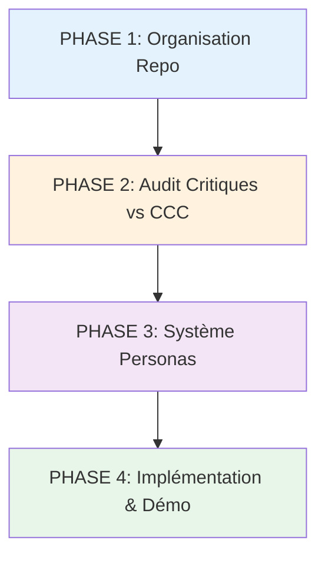

# 📋 TODO - Refonte Questionnaire Monka par Personas

> **Objectif** : Personnaliser le questionnaire selon les personas (aidant/aidé) avec recommandations adaptées  
> **Date création** : 03/02/2026  
> **Statut** : Plan d'action complet à valider

---

## 🎯 Vision Globale

**Problème actuel** : Questionnaire unique pour tous, recommandations génériques  

**Solution - Personnalisation multi-niveaux** : 

```
14 PERSONAS (basé sur doc existante)
├── CATÉGORIE AIDANTS (~5+ personas)
│   ├── Persona Aidant 1 (ex: Aidant épuisé)
│   ├── Persona Aidant 2 (ex: Aidant débutant)
│   ├── Persona Aidant 3 (ex: Aidant isolé)
│   └── ...
└── CATÉGORIE AIDÉS (~5+ personas)
    ├── Persona Aidé 1 (ex: Aidé autonome)
    ├── Persona Aidé 2 (ex: Aidé dépendant total)
    ├── Persona Aidé 3 (ex: Aidé avec TNC)
    └── ...
```

**Principe** : **MULTIPLIER l'existant** par le nombre de personas applicables

1. Identifier le persona dès le début (via questions triggers)
2. Pour chaque vulnérabilité, créer autant de versions que de personas applicables
3. Adapter questions, recommandations ET CCC selon le persona
4. Assembler dynamiquement le questionnaire personnalisé

---

## 📊 Plan Macro (4 grandes phases)



---

## 🔵 PHASE 1 : Organisation & Nettoyage du Repo

> **Objectif** : Avoir un repo propre, structuré, sans duplication, prêt pour le versionning par persona

### 📁 Structure cible

```
/monka/
├── SOURCES/
│   ├── legacy/                    # Legacy à jour (sans duplications)
│   ├── excel/                     # Tous les Excel regroupés
│   └── doc_tampon_modifications.md  # 🆕 Document des décisions/modifs non-legacy
│
├── QUESTIONNAIRE/
│   ├── V1_social_relationnel/
│   │   ├── base/                  # Version de base
│   │   ├── aidants/               # 🆕 Catégorie AIDANTS
│   │   │   ├── persona_01_aidant_epuise/
│   │   │   ├── persona_02_aidant_debutant/
│   │   │   ├── persona_03_aidant_isole/
│   │   │   └── ... (~5+ personas aidants)
│   │   └── aides/                 # 🆕 Catégorie AIDÉS
│   │       ├── persona_01_aide_autonome/
│   │       ├── persona_02_aide_dependant/
│   │       ├── persona_03_aide_tnc/
│   │       └── ... (~5+ personas aidés)
│   ├── V2_fragilite_proche/
│   │   ├── base/
│   │   ├── aidants/
│   │   │   └── [même structure ~5+ personas]
│   │   └── aides/
│   │       └── [même structure ~5+ personas]
│   ├── V3_sante_aidant/
│   ├── V4_parcours_medical/
│   └── V5_administrative/
│
├── PERSONNAS/                     # 🆕 Définitions des 14 personas
│   ├── triggers_questions.md      # Questions qui définissent le persona
│   ├── AIDANTS/
│   │   ├── persona_01_aidant_epuise.md
│   │   ├── persona_02_aidant_debutant.md
│   │   ├── persona_03_aidant_isole.md
│   │   └── ... (~5+ fichiers)
│   └── AIDES/
│       ├── persona_01_aide_autonome.md
│       ├── persona_02_aide_dependant.md
│       ├── persona_03_aide_tnc.md
│       └── ... (~5+ fichiers)
│
├── CCC/                           # Refonte CCC
│   ├── ccc_base.md
│   ├── ccc_persona_aidant.md      # 🆕 CCC spécifiques aidant
│   └── ccc_persona_aide.md        # 🆕 CCC spécifiques aidé
│
└── DEMO/                          # 🆕 Visuels et démos
    ├── arbre_decision_personas.md
    └── demo_call_visuel.html
```

### ✅ Tâches PHASE 1

- [ ] **1.1** Créer la structure de dossiers cible
- [ ] **1.2** Analyser tous les fichiers Legacy existants
- [ ] **1.3** Supprimer duplications Legacy (garder versions les plus récentes)
- [ ] **1.4** Déplacer tous les Legacy dans `/SOURCES/legacy/`
- [ ] **1.5** Déplacer tous les Excel dans `/SOURCES/excel/`
- [ ] **1.6** Créer `/SOURCES/doc_tampon_modifications.md` avec template
- [ ] **1.7** Migrer V1 actuel vers `/QUESTIONNAIRE/V1_social_relationnel/base/`
- [ ] **1.8** Migrer V2 actuel vers `/QUESTIONNAIRE/V2_fragilite_proche/base/`
- [ ] **1.9** Créer dossiers `/persona_aidant/` et `/persona_aide/` pour V1-V5
- [ ] **1.10** Créer `/PERSONNAS/` avec structure de base
- [ ] **1.11** Créer `/CCC/` avec structure de base
- [ ] **1.12** Créer `/DEMO/` vide
- [ ] **1.13** Mettre à jour `.gitignore` si nécessaire
- [ ] **1.14** Documenter la nouvelle structure dans un README.md racine

---

## 🟠 PHASE 2 : Audit Questions Critiques vs CCC

> **Objectif** : S'assurer qu'**AUCUNE question critique ne déclenche de CCC** (séparation stricte)

### 🎯 Règle absolue
> **Questions critiques** = Priorité Niveau 1 DIRECTE (sans combinaison)  
> **CCC** = Combinaison de 2+ questions NON critiques

### ✅ Tâches PHASE 2

- [ ] **2.1** Lister TOUTES les questions critiques dans V1 (actuellement : E2, E6)
- [ ] **2.2** Vérifier si ces questions apparaissent dans des CCC V1
  - Si OUI → ❌ ERREUR à corriger
  - Si NON → ✅ Conforme
- [ ] **2.3** Lister TOUTES les questions critiques dans V2 (hypothèses : O7, O8, N27)
- [ ] **2.4** Vérifier si ces questions apparaissent dans des CCC V2
  - Si OUI → ❌ ERREUR à corriger
  - Si NON → ✅ Conforme
- [ ] **2.5** Pour chaque CCC invalide trouvée :
  - Décider : supprimer la CCC OU retirer le statut critique de la question
  - Documenter la décision dans `doc_tampon_modifications.md`
  - Expliquer le raisonnement de façon **vulgarisée** (pour votre père)
- [ ] **2.6** Créer un tableau récapitulatif :
  ```
  | Vulnérabilité | Questions Critiques | CCC existantes | Conflit ? | Action |
  |---------------|---------------------|----------------|-----------|--------|
  | V1            | E2, E6              | 8 CCC          | À vérifier| ...    |
  | V2            | O7, O8, N27         | 6 CCC          | À vérifier| ...    |
  ```
- [ ] **2.7** Valider le tableau avec l'équipe clinique
- [ ] **2.8** Appliquer les corrections dans les fichiers de documentation
- [ ] **2.9** Mettre à jour le simulateur si nécessaire

---

## 🟣 PHASE 3 : Système de Personas & Conditionnement

> **Objectif** : Définir les personas, identifier les questions triggers, et préparer la personnalisation

### 🎯 Vision

```
Début questionnaire
    ↓
Questions TRIGGERS (5-10 questions)
    ↓
Identification PERSONA (Aidant / Aidé / Mixte)
    ↓
Chargement version personnalisée du questionnaire
    ↓
Questions adaptées + Recommandations adaptées + CCC spécifiques
```

### ✅ Tâches PHASE 3

#### 3.A - Extraction des 14 Personas (depuis doc existante)

- [ ] **3.1** Scanner TOUS les fichiers Excel/Legacy pour identifier les personas
- [ ] **3.2** Extraire la liste complète des **~14 personas documentés** :
  - **CATÉGORIE AIDANTS** (~5+ personas) : aidant épuisé, débutant, isolé, etc.
  - **CATÉGORIE AIDÉS** (~5+ personas) : aidé autonome, dépendant, TNC, etc.
- [ ] **3.3** Pour CHAQUE persona, créer un fichier de définition :
  - `/PERSONNAS/AIDANTS/persona_XX_nom.md`
  - `/PERSONNAS/AIDES/persona_XX_nom.md`
- [ ] **3.4** Contenu de chaque fichier persona :
  - Critères d'identification (questions triggers)
  - Caractéristiques principales
  - Vulnérabilités applicables (V1-V5)
  - Spécificités recommandations/CCC
- [ ] **3.5** Identifier les **questions triggers** qui permettent de détecter chaque persona :
  - Questions générales (catégorie AIDANT vs AIDÉ)
  - Questions spécifiques (quel persona précis dans la catégorie)
- [ ] **3.6** Créer `/PERSONNAS/triggers_questions.md` avec :
  - Arbre de décision questions → persona
  - Exemple : `N3="Oui" → AIDANT → Si O27+O28="Oui" → Aidant Épuisé`

#### 3.B - Mapping Questions par Persona (Multiplication par 14)

- [ ] **3.7** Pour chaque vulnérabilité (V1-V5), déterminer :
  - Quels personas de la **CATÉGORIE AIDANTS** sont concernés (~5+)
  - Quels personas de la **CATÉGORIE AIDÉS** sont concernés (~5+)
- [ ] **3.8** Pour chaque persona applicable, créer la version :
  - `/QUESTIONNAIRE/VX_nom/aidants/persona_XX_nom/questions.md`
  - `/QUESTIONNAIRE/VX_nom/aides/persona_XX_nom/questions.md`
- [ ] **3.9** Classifier CHAQUE question selon les personas applicables :
  ```
  | Question ID | Texte | Catégorie | Personas applicables |
  |-------------|-------|-----------|---------------------|
  | E1 | Répartition aide | AIDANT | Tous aidants (5+) |
  | N20 | Difficultés relations | AIDÉ | Tous aidés (5+) |
  | O27 | Vie familiale | AIDANT | Aidant épuisé, isolé uniquement |
  ```
- [ ] **3.10** Répéter pour V2-V5

**Estimation volume** : 5 vulnérabilités × ~10 personas applicables/vulnérabilité = **~50 versions à créer**

#### 3.C - Recommandations Conditionnelles

- [ ] **3.8** Identifier les questions dont les recommandations CHANGENT selon le persona
- [ ] **3.9** Pour chaque question conditionnelle, créer 2 versions :
  - Recommandation version AIDANT
  - Recommandation version AIDÉ
- [ ] **3.10** Documenter dans un fichier type :
  ```markdown
  ### Question E1 - Répartition aide
  
  **Version AIDANT** :
  - Recommandation : "Faites-vous aider par votre entourage"
  - Micro-tâches : Contacter famille, amis...
  
  **Version AIDÉ** :
  - Recommandation : "Encouragez la personne aidée à accepter l'aide"
  - Micro-tâches : Expliquer l'importance du soutien...
  ```

#### 3.D - CCC Spécifiques par Persona (14 variations)

- [ ] **3.14** Analyser si certaines CCC ne sont pertinentes QUE pour certains personas
- [ ] **3.15** Créer une structure CCC par catégorie :
  - `/CCC/ccc_base.md` (CCC communes à tous)
  - `/CCC/AIDANTS/ccc_aidant_global.md` (communes catégorie aidants)
  - `/CCC/AIDES/ccc_aide_global.md` (communes catégorie aidés)
- [ ] **3.16** Pour chaque persona avec CCC spécifiques :
  - `/CCC/AIDANTS/ccc_persona_XX.md` (si CCC unique à ce persona)
  - `/CCC/AIDES/ccc_persona_XX.md` (si CCC unique à ce persona)
- [ ] **3.17** Exemple CCC persona-spécifique :
  ```
  Persona "Aidant Épuisé" → CCC spéciale :
  - Burn-out + Refus aide (combinaison critique pour CE persona uniquement)
  ```

#### 3.E - Documentation Globale (14 personas)

- [ ] **3.18** Pour CHAQUE des ~14 personas, créer un fichier complet :
  - `/PERSONNAS/AIDANTS/persona_XX_nom.md` (~5+ fichiers)
  - `/PERSONNAS/AIDES/persona_XX_nom.md` (~5+ fichiers)
  - Contenu : Critères activation, questions spécifiques, CCC, recommandations
- [ ] **3.19** Créer un schéma de décision multi-niveaux :
  ```mermaid
  flowchart TD
      Start[Début questionnaire] --> Q1[Questions TRIGGERS Niveau 1]
      Q1 --> C{Catégorie ?}
      C -->|AIDANT| Q2A[Questions TRIGGERS Niveau 2]
      C -->|AIDÉ| Q2B[Questions TRIGGERS Niveau 2]
      Q2A --> PA{Quel persona aidant ?}
      Q2B --> PB{Quel persona aidé ?}
      PA -->|Épuisé| V1A[Questionnaire personnalisé]
      PA -->|Débutant| V2A[Questionnaire personnalisé]
      PA -->|Isolé| V3A[Questionnaire personnalisé]
      PB -->|Autonome| V1B[Questionnaire personnalisé]
      PB -->|Dépendant| V2B[Questionnaire personnalisé]
      PB -->|TNC| V3B[Questionnaire personnalisé]
  ```
- [ ] **3.20** Créer un tableau récapitulatif des 14 personas :
  ```
  | # | Catégorie | Nom persona | Critères clés | Vulnérabilités applicables |
  |---|-----------|-------------|---------------|---------------------------|
  | 1 | AIDANT    | Épuisé      | O27+O28=Oui   | V1, V3                    |
  | 2 | AIDANT    | Débutant    | O49<6mois     | V1, V5                    |
  | ...| ...      | ...         | ...           | ...                       |
  ```

---

## 🟢 PHASE 4 : Implémentation & Industrialisation

> **Objectif** : Créer le visuel démo + standardiser le dev pour agents parallèles

### ✅ Tâches PHASE 4

#### 4.A - Visuel HTML Interactif pour Démo Call

- [ ] **4.1** Créer `/DEMO/arbre_decision_personas.md` (version textuelle de référence)
- [ ] **4.2** Créer `/DEMO/demo_call_visuel.html` (**format HTML interactif**)
  - Interface visuelle avec animations
  - Navigation interactive entre les 14 personas
  - Comparaisons dynamiques
- [ ] **4.3** Inclure dans l'interface HTML :
  - **Écran 1** : Arbre de décision interactif (questions triggers → 14 personas)
  - **Écran 2** : Sélection persona → Questions personnalisées affichées
  - **Écran 3** : Comparaison avant/après (générique vs personnalisé)
  - **Écran 4** : Exemples de CCC spécifiques par persona
  - **Écran 5** : Recommandations adaptées (aidant vs aidé)
- [ ] **4.4** Préparer 3 cas d'usage concrets (personas réels) :
  - Cas 1 : Aidant Épuisé (catégorie AIDANT)
  - Cas 2 : Aidé Dépendant Total (catégorie AIDÉ)
  - Cas 3 : Comparaison 2 personas similaires
- [ ] **4.5** Fonctionnalités interactives HTML :
  - Boutons de navigation entre personas
  - Affichage/masquage dynamique des sections
  - Filtres par vulnérabilité
- [ ] **4.6** Tester le visuel sur navigateur (Chrome, Firefox)
- [ ] **4.7** Ajuster selon feedback

#### 4.B - Standardisation Dev & Versionning

- [ ] **4.7** Créer un template de fichier pour chaque vulnérabilité/persona :
  ```
  /QUESTIONNAIRE/VX_nom/persona_Y/
  ├── questions.md          # Questions de cette version
  ├── recommendations.md    # Recommandations adaptées
  ├── ccc.md               # CCC spécifiques
  ├── asr.md               # ASR si spécifiques
  └── micro_taches.md      # Micro-tâches associées
  ```
- [ ] **4.8** Créer une **rule globale** `.agent/rules/monka_persona_dev.md` :
  - Instructions pour créer une version persona
  - Template à suivre
  - Vérifications à faire
  - Format de validation
- [ ] **4.9** Documenter le processus de création version persona :
  ```
  1. Copier template
  2. Extraire questions du persona
  3. Adapter recommandations
  4. Créer CCC spécifiques
  5. Valider cohérence
  ```

#### 4.C - Agents Parallèles (Industrialisation × 14 personas)

- [ ] **4.10** Lister tous les "jobs" à paralléliser :
  ```
  CATÉGORIE AIDANTS (~5+ personas) :
  - V1_persona_aidant_01_epuise
  - V1_persona_aidant_02_debutant
  - V1_persona_aidant_03_isole
  - ... (~5+ jobs pour V1)
  → Répéter pour V2, V3, V4, V5
  
  CATÉGORIE AIDÉS (~5+ personas) :
  - V2_persona_aide_01_autonome
  - V2_persona_aide_02_dependant
  - V2_persona_aide_03_tnc
  - ... (~5+ jobs pour V2)
  → Répéter pour V1, V3, V4, V5
  
  → Total estimé : ~50 jobs (selon applicabilité persona/vulnérabilité)
  ```
- [ ] **4.11** Pour chaque job, créer un fichier de contexte agent :
  - `/QUESTIONNAIRE/VX_nom/aidants|aides/persona_XX/_agent_context.md`
  - Contient : persona définition, sources, règles, format attendu
- [ ] **4.12** Créer un **mapping applicabilité** :
  ```
  | Persona | V1 | V2 | V3 | V4 | V5 | Total jobs |
  |---------|----|----|----|----|----| ----------|
  | Aidant Épuisé | ✅ | ❌ | ✅ | ❌ | ✅ | 3 |
  | Aidé TNC      | ✅ | ✅ | ❌ | ✅ | ❌ | 3 |
  | ...           | ...| ...| ...| ...| ...| ...       |
  ```
- [ ] **4.13** Créer un script de lancement agents parallèles
- [ ] **4.14** **Phase test** : Lancer 2-3 jobs pilotes (V1 × 2 personas)
- [ ] **4.15** Vérifier qualité, ajuster template si besoin
- [ ] **4.16** **Phase production** : Lancer tous les jobs applicables (~50)
- [ ] **4.17** Consolider les résultats par vulnérabilité
- [ ] **4.18** Revue manuelle de cohérence (échantillon 20%)

#### 4.D - Intégration Simulateur

- [ ] **4.17** Adapter `monka_simulator.html` pour gérer les personas :
  - Ajout des questions triggers en début
  - Logique de détection persona
  - Chargement dynamique questions/recos selon persona
- [ ] **4.18** Créer 2-3 personas de test
- [ ] **4.19** Tester le flow complet
- [ ] **4.20** Ajuster si bugs

---

## 📝 Document Tampon (SOURCES/doc_tampon_modifications.md)

### Structure attendue

```markdown
# 📝 Document Tampon - Modifications & Décisions Monka

> Toutes les modifications/décisions NON décrites dans les Legacy

## 🎯 Règle de rédaction
**Vulgarisé pour mon père (médecin)** - Pas de jargon technique

---

## 🔴 Décision 1 : Question E6 ne déclenche plus CCC R4_CC_03

**Date** : XX/02/2026  
**Contexte** : E6 était identifiée comme critique directe ET apparaissait dans R4_CC_03  
**Problème** : Violation de la règle "question critique ≠ CCC"  
**Décision** : Suppression de R4_CC_03 (car E6 suffit seule)  
**Pourquoi ?** : Quand un patient refuse toute aide (E6), c'est déjà critique en soi. Pas besoin de combiner avec autre chose. La priorité doit être immédiate.  
**Impact** : 1 CCC en moins pour V1 (7 au lieu de 8)

---

## 🟢 Décision 2 : Création persona AIDANT vs AIDÉ

**Date** : XX/02/2026  
**Contexte** : Questions mélangent "vous" (aidant) et "la personne" (aidé)  
**Problème** : Recommandations génériques pas toujours adaptées  
**Décision** : Séparer en 2 parcours selon qui répond  
**Pourquoi ?** : Un aidant épuisé n'a pas les mêmes besoins qu'une personne âgée isolée. Les conseils doivent être différents.  
**Impact** : 2 versions par vulnérabilité (× volume de travail mais + précision)

---
```

---

## 🎯 Résumé Exécutif

| Phase | Objectif | Durée estimée | Complexité | Volume |
|-------|----------|---------------|------------|--------|
| **PHASE 1** | Organisation repo | 1-2 jours | 🟢 Faible | 14 tâches |
| **PHASE 2** | Audit critiques vs CCC | 1 jour | 🟡 Moyenne | 9 tâches |
| **PHASE 3** | Système 14 personas | 5-7 jours | 🔴 **Très élevée** | 20 tâches |
| **PHASE 4** | Démo HTML + 50 jobs agents | 4-6 jours | 🔴 **Très élevée** | 27 tâches |
| **TOTAL** | — | **11-16 jours** | — | **70 tâches** |

**Notes** :
- Phase 3 : Extraire 14 personas + créer mapping applicabilité
- Phase 4 : ~50 jobs parallèles (14 personas × 5 vulnérabilités ajusté)
- **Multiplication par ~10-14** par rapport au plan initial (2 personas)

---

## ✅ Validation & Prochaines Étapes

### Ce que j'ai compris ✅

✅ **Nettoyage** : Repo propre et structuré (SOURCES/ QUESTIONNAIRE/ PERSONNAS/ CCC/ DEMO/)  
✅ **Séparation stricte** : Questions critiques ≠ CCC (règle absolue)  
✅ **14 PERSONAS** : 2 catégories (AIDANTS ~5+ / AIDÉS ~5+) selon doc existante  
✅ **Multiplication** : Chaque vulnérabilité × personas applicables = ~50 versions  
✅ **Conditionnement multi-niveaux** :
  - Niveau 1 : Catégorie (AIDANT vs AIDÉ)
  - Niveau 2 : Persona spécifique (Épuisé, Débutant, TNC, etc.)
  - Niveau 3 : Questions/Recos/CCC adaptées
✅ **Démo** : HTML **interactif** avec navigation entre personas  
✅ **Industrialisation** : Agents parallèles pour ~50 jobs  
✅ **Principe** : MULTIPLIER l'existant, pas réinventer

### Clarifications reçues ✅

1. **Personas** : ~~2~~ → **14 personas** (5+ aidants, 5+ aidés) basés sur doc
2. **Questions triggers** : Extraction depuis doc existante
3. **Format démo** : HTML **interactif** (confirmé)
4. **Volume** : ~50 versions à créer (5 vulnérabilités × ~10 personas applicables)

---

> 📄 TODO créée le 03/02/2026 - Refonte Questionnaire Monka par Personas  
> 🎯 **Prêt à actionner intelligemment**
