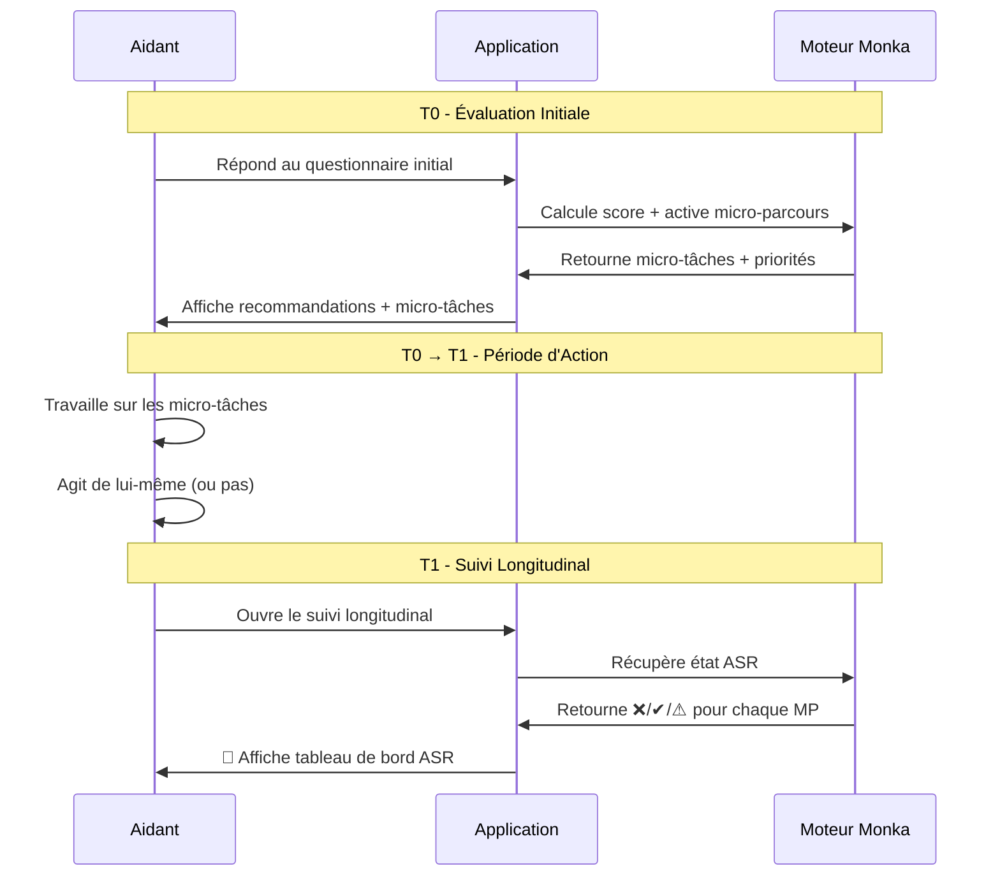

# 📱 UX Design : Affichage ASR dans le Suivi Longitudinal

> **Wireframe et spécifications fonctionnelles** pour l'interface aidant  
> Date : 03/02/2026

---

## 🎯 Objectif

Permettre à l'aidant de **visualiser l'état de sécurisation** de la dyade via les ASR lors de son suivi longitudinal, après avoir reçu et travaillé sur les micro-tâches.

---

## 📋 Contexte d'Usage

### Parcours Utilisateur



---

## 🖼️ Wireframe Interface Aidant

### Écran Principal : Tableau de Bord ASR

```
┌─────────────────────────────────────────────┐
│  ◀  Suivi de votre situation               │
│                                             │
│  📊 État de Sécurisation                    │
│                                             │
│  ┌─────────────────────────────────────┐   │
│  │ 🟢 Dyade Sécurisée                 │   │
│  │ 2/4 risques contenus               │   │
│  └─────────────────────────────────────┘   │
│                                             │
│  ───────────────────────────────────────   │
│                                             │
│  Vos Micro-Parcours                         │
│                                             │
│  ✔ R2 - Soutien de l'entourage             │
│     Vous avez maintenant un relais         │
│     Dernière confirmation : il y a 2 sem.  │
│     ─────────────────────                  │
│     [Reconfirmer ✓]  [Voir détails →]     │
│                                             │
│  ✔ R1 - Vie personnelle/professionnelle    │
│     Votre équilibre est rétabli            │
│     ─────────────────────                  │
│     [Voir détails →]                       │
│                                             │
│  ⚠ R4 - Relation avec votre proche         │
│     À reconfirmer                          │
│     Dernière validation : il y a 3 mois    │
│     ─────────────────────                  │
│     [Reconfirmer maintenant →]             │
│                                             │
│  ❌ R3 - Isolement social du proche        │
│     Risque non encore contenu              │
│     ─────────────────────                  │
│     [Voir les actions possibles →]         │
│                                             │
└─────────────────────────────────────────────┘
```

---

## 🎨 Spécifications Visuelles

### Indicateur Global (en haut)

| État | Couleur | Icône | Texte | Condition |
|------|---------|-------|-------|-----------|
| **Dyade Sécurisée** | 🟢 Vert | ✔✔ | "X/4 risques contenus" | ≥2 ASR atteintes |
| **Sécurisation Active** | 🟠 Orange | ⚡ | "En cours de sécurisation" | 1 ASR atteinte |
| **Non Sécurisée** | 🔴 Rouge | ⚠ | "Risques actifs" | 0 ASR atteintes |

---

### Carte Micro-Parcours (états ASR)

#### État ✔ **Atteinte**

```
┌───────────────────────────────────────┐
│ ✔ R2 - Soutien de l'entourage        │ ← Badge vert
│                                       │
│ 💚 Vous avez maintenant un relais    │ ← Message personnalisé
│                                       │
│ 📅 Dernière confirmation : 2 sem.    │ ← Date de validation
│ ─────────────────────────             │
│ [Reconfirmer ✓]  [Voir détails →]   │ ← Actions
└───────────────────────────────────────┘
```

**Couleurs** :
- Fond : Vert très clair (#F0FDF4)
- Bordure : Vert (#22C55E)
- Icône : ✔ Vert

**Texte personnalisé** (selon signature détectée) :
- R1 : "Vous avez retrouvé une marge pour tenir dans la durée"
- R2 : "Vous avez maintenant un relais humain mobilisable"
- R3 : "Votre proche bénéficie de contacts sociaux réguliers"
- R4 : "L'aide peut être apportée sans opposition majeure"

---

#### État ⚠ **Non Confirmée**

```
┌───────────────────────────────────────┐
│ ⚠ R4 - Relation avec votre proche    │ ← Badge orange
│                                       │
│ 🔄 À reconfirmer                     │ ← Demande douce
│                                       │
│ Dernière validation : il y a 3 mois   │
│ ─────────────────────────             │
│ [Reconfirmer maintenant →]           │ ← Appel à l'action
└───────────────────────────────────────┘
```

**Couleurs** :
- Fond : Orange très clair (#FFF7ED)
- Bordure : Orange (#FB923C)
- Icône : ⚠ Orange

**Message** : Demande douce, non culpabilisante
- "Est-ce toujours le cas ?"
- "Avez-vous toujours un relais ?"

---

#### État ❌ **Non Atteinte**

```
┌───────────────────────────────────────┐
│ ❌ R3 - Isolement social du proche    │ ← Badge rouge
│                                       │
│ ⚡ Risque non encore contenu          │ ← Message neutre
│                                       │
│ Actions possibles :                   │
│ • Inscrire à un accueil de jour       │ ← Micro-tâches STRUC/SEC
│ • Organiser des visites bénévoles     │
│ ─────────────────────────             │
│ [Voir toutes les actions →]          │ ← Renvoi vers micro-tâches
└───────────────────────────────────────┘
```

**Couleurs** :
- Fond : Rouge très clair (#FEF2F2)
- Bordure : Rouge (#EF4444)
- Icône : ❌ Rouge

**Contenu** :
- Message non culpabilisant ("pas encore contenu" au lieu de "échec")
- Affichage de 2-3 micro-tâches STRUC/SEC prioritaires
- Lien vers liste complète

---

## 🔄 Flow Utilisateur : Reconfirmation ASR

### Cas ⚠ Non Confirmée → Besoin de reconfirmer

```
Aidant clique "Reconfirmer maintenant"
        ↓
┌─────────────────────────────────────┐
│ R2 - Soutien de l'entourage        │
│                                     │
│ Avez-vous toujours un relais       │
│ humain mobilisable ?                │
│                                     │
│ ○ Oui, toujours                    │ ← Reconfirme → ASR ✔
│ ○ Non, je n'ai plus de relais      │ ← Invalide → ASR ❌
│ ○ Je ne sais pas                   │ ← Reste ⚠
│                                     │
│ [Valider]                           │
└─────────────────────────────────────┘
```

**Résultat** :
- **Oui** → ASR passe de ⚠ à ✔ (vert)
- **Non** → ASR passe de ⚠ à ❌ (rouge), réactivation micro-parcours
- **Je ne sais pas** → ASR reste ⚠, rappel dans 1 semaine

---

## 📝 Spécifications Techniques

### Structure de Données

```javascript
const asrStates = {
  R1: {
    code: 'R1',
    name: 'Vie personnelle / professionnelle',
    state: 'atteinte', // 'non_atteinte' | 'atteinte' | 'non_confirmee'
    lastConfirmed: '2026-01-15T10:00:00Z',
    signature: 'R1-A', // Signature détectée
    message: 'Vous avez retrouvé une marge pour tenir dans la durée',
    actions: [] // Vide si atteinte
  },
  R2: {
    code: 'R2',
    name: 'Soutien de l\'entourage',
    state: 'atteinte',
    lastConfirmed: '2026-01-28T14:30:00Z',
    signature: 'R2-B',
    message: 'Vous avez maintenant un relais humain mobilisable',
    actions: []
  },
  R3: {
    code: 'R3',
    name: 'Isolement social du proche',
    state: 'non_atteinte',
    lastConfirmed: null,
    signature: null,
    message: 'Risque non encore contenu',
    actions: [
      { text: 'Inscrire à un accueil de jour', type: 'STRUC' },
      { text: 'Organiser des visites bénévoles', type: 'STRUC' }
    ]
  },
  R4: {
    code: 'R4',
    name: 'Relation avec votre proche',
    state: 'non_confirmee',
    lastConfirmed: '2025-11-03T09:15:00Z',
    signature: 'R4-A', // Était atteinte
    message: 'À reconfirmer',
    actions: []
  }
};
```

---

### Calcul Indicateur Global

```javascript
function calculateGlobalSecurityState(asrStates) {
  const atteinteCount = Object.values(asrStates)
    .filter(asr => asr.state === 'atteinte').length;
  
  if (atteinteCount >= 2) {
    return {
      level: 'securisee',
      color: 'green',
      icon: '✔✔',
      text: `${atteinteCount}/4 risques contenus`
    };
  } else if (atteinteCount === 1) {
    return {
      level: 'active',
      color: 'orange',
      icon: '⚡',
      text: 'Sécurisation active'
    };
  } else {
    return {
      level: 'non_securisee',
      color: 'red',
      icon: '⚠',
      text: 'Risques actifs'
    };
  }
}
```

---

### Règles d'Affichage Temporel

| Dernière confirmation | Affichage | Action |
|----------------------|-----------|--------|
| < 1 mois | "il y a X jours/semaines" | Aucune |
| 1-3 mois | "il y a X mois" | Demande douce de reconfirmation |
| > 3 mois | "il y a X mois" | ⚠ Passe en "Non confirmée" automatiquement |

---

## 🎯 Wireframe Vue Détail (clic sur "Voir détails")

```
┌─────────────────────────────────────────────┐
│  ◀  R2 - Soutien de l'entourage            │
│                                             │
│  ✔ Relais humain en place                  │
│                                             │
│  📅 Historique                               │
│  ─────────────────────────────             │
│  28 jan. 2026  ✔ ASR atteinte              │
│  └─ Signature : R2-B (professionnel actif) │
│                                             │
│  15 déc. 2025  ⚠ Non confirmée             │
│  10 nov  2025  ✔ ASR atteinte              │
│  └─ Signature : R2-A (relais familial)     │
│                                             │
│  ───────────────────────────────────────   │
│                                             │
│  💡 Actions réalisées                       │
│  • Contact régulier avec IDE (28/01)       │
│  • Inscription association aidants (10/11) │
│                                             │
│  ───────────────────────────────────────   │
│                                             │
│  [Reconfirmer ✓]  [Signaler un problème]  │
└─────────────────────────────────────────────┘
```

---

## ✅ Checklist Implémentation

### Phase 1 : Backend
- [ ] API GET `/api/asr/status` retourne états ASR
- [ ] Logique de détection signatures d'état
- [ ] Calcul temporalité (dernière confirmation)
- [ ] API POST `/api/asr/reconfirm` pour reconfirmation

### Phase 2 : Frontend
- [ ] Composant `ASRCard` (3 états)
- [ ] Composant `GlobalSecurityIndicator`
- [ ] Écran `SuiviLongitudinal` avec liste ASR
- [ ] Flow reconfirmation modale

### Phase 3 : UX
- [ ] Messages personnalisés par ASR
- [ ] Micro-animations transitions d'état
- [ ] Notifications push demande reconfirmation (⚠ → 3 mois)

---

## 📎 Documents Liés

- `/Users/antonin/monka/asr_definitions.md` : Définitions ASR et signatures
- `/Users/antonin/monka/micro_taches_typologie.md` : Typologie micro-tâches
- **Legacy Suivi Longitudinal 030226.docx** : Règles officielles

---

> 📄 Document créé le 03/02/2026 – UX Design ASR Suivi Longitudinal
