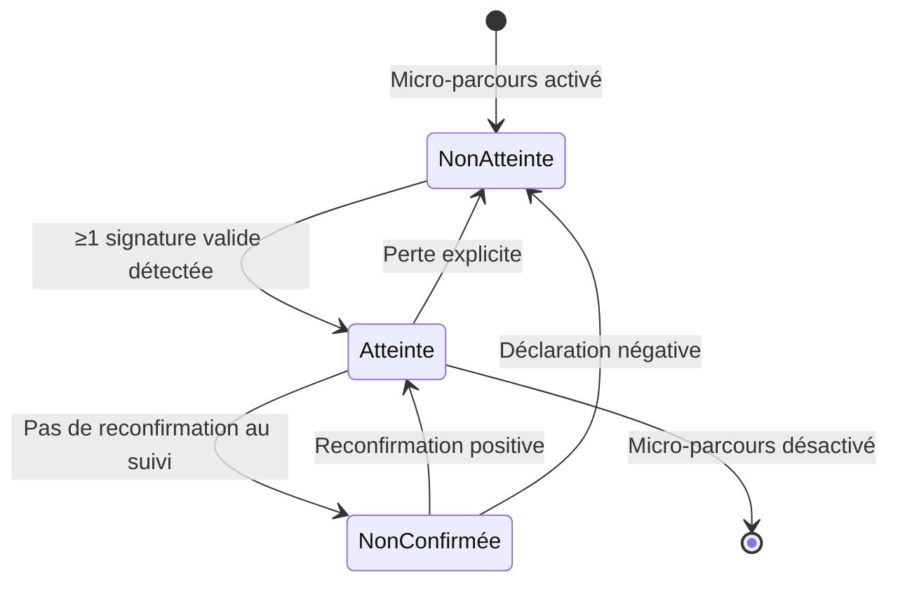

# 🔒 Définition des ASR par Micro-Parcours (v2 - Legacy Conforme)

> **Actions Structurantes de Référence** – Vulnérabilité "Sociale & Relationnelle"  
> Conforme Legacy ASR Référent op. 030226 + Legacy Typologie MT 030226  
> Date : 03/02/2026 (version 2)

---

## ⚠️ MISE À JOUR MAJEURE v2

**Raison** : Alignement strict avec Legacy Typologie des micro-tâches (03/02) et Legacy ASR Référent op. (03/02)

**Corrections critiques** :
1. ❌ **Supprimé** : Typage STRUC/SEC/MED des signatures d'état (n'existe pas dans Legacy)
2. ❌ **Supprimé** : Liens directs micro-tâches → ASR (violation R-MT-ASR-01)
3. ❌ **Supprimé** : Mention "peut valider ASR" pour micro-tâches
4. ✅ **Ajouté** : Règle R-MT-ASR-01 (séparation stricte micro-tâches / ASR)
5. ✅ **Simplifié** : Signatures d'état courtes et génériques (format Legacy)

---

## 📖 Rappel du Framework ASR

### Qu'est-ce qu'une ASR ?

Une **Action Structurante de Référence (ASR)** est un **état du monde observable** traduisant un **changement réel et structurant** de la capacité d'agir de la dyade aidant-aidé face à un risque identifié.

**Principes Legacy** :
- ✅ Une ASR décrit un **état**, non une intention
- ✅ Chaque micro-parcours a **UNE et UNE SEULE** ASR (R-ASR-01)
- ✅ Une ASR est validée par **signature d'état**, jamais par comptage de tâches (R-ASR-04)
- ❌ **Aucune micro-tâche** ne valide directement une ASR (R-MT-ASR-01)

---

## 🛑 Règle Critique : R-MT-ASR-01

### Interdiction de correspondance directe

> **Aucune micro-tâche, quel que soit son type** :
> - n'est équivalente à une ASR
> - ne constitue une signature d'état
> - ne peut être interprétée comme une validation d'état
>
> **Toute correspondance directe micro-tâche → ASR est interdite.**

**Principe fondamental** :
- **Les micro-tâches sont des moyens d'action**
- **Les ASR sont des états du monde observés**, validés exclusivement par signatures d'état

---

## 🎯 Les 4 ASR de la Vulnérabilité Sociale & Relationnelle

### ASR-R1 : Vie personnelle / professionnelle de l'aidant

**Micro-parcours** : R1 (Impact sur la vie personnelle et professionnelle de l'aidant)

**État cible** : L'aidant dispose d'une marge réelle lui permettant de tenir dans la durée.

**Signatures d'état** (source : Legacy ASR Référent op. 030226) :
- **R1-A** : existence déclarée d'un temps personnel ou professionnel rendu possible par un changement d'organisation
- **R1-B** : réduction déclarée d'une contrainte majeure liée à l'aide (présence continue, arbitrage constant)

**Validation** : ≥1 signature suffit pour considérer l'ASR comme ✔ **Atteinte**

**États possibles** :
- ❌ **Non atteinte** : Aucune signature valide
- ✔ **Atteinte** : Au moins 1 signature valide
- ⚠ **Non confirmée** : Atteinte précédemment mais non reconfirmée au suivi

---

### ASR-R2 : Soutien de l'entourage

**Micro-parcours** : R2 (Soutien de l'entourage et partage de l'aide)

**État cible** : Un relais humain mobilisable est effectivement en place.

**Signatures d'état** (source : Legacy ASR Référent op. 030226) :
- **R2-A** : au moins une personne de l'entourage identifiée comme relais avec une disponibilité définie
- **R2-B** : intervention active d'un professionnel ou service mobilisable

**Validation** : ≥1 signature suffit pour considérer l'ASR comme ✔ **Atteinte**

**États possibles** :
- ❌ **Non atteinte** : L'aidant reste seul
- ✔ **Atteinte** : Au moins 1 relais identifié et actif
- ⚠ **Non confirmée** : Relais précédent non confirmé au suivi

---

### ASR-R3 : Isolement social du proche

**Micro-parcours** : R3 (Isolement social de la personne aidée)

**État cible** : Le proche bénéficie de contacts sociaux extérieurs réguliers.

**Signatures d'état** (source : Legacy ASR Référent op. 030226) :
- **R3-A** : interactions régulières (visites, activités) avec des tiers
- **R3-B** : accompagnement social structuré via association, bénévole ou service

**Validation** : ≥1 signature suffit pour considérer l'ASR comme ✔ **Atteinte**

**États possibles** :
- ❌ **Non atteinte** : Le proche reste isolé
- ✔ **Atteinte** : Au moins 1 contact social régulier actif
- ⚠ **Non confirmée** : Contact précédent non confirmé (ex: accueil de jour arrêté ?)

---

### ASR-R4 : Relation aidant / aidé

**Micro-parcours** : R4 (Relation aidant / aidé et acceptation de l'aide)

**État cible** : L'aide peut être apportée sans opposition majeure bloquante.

**Signatures d'état** (source : Legacy ASR Référent op. 030226) :
- **R4-A** : aide possible dans un cadre fonctionnel identifié
- **R4-B** : existence d'un tiers régulateur permettant de maintenir l'aide

**Validation** : ≥1 signature suffit pour considérer l'ASR comme ✔ **Atteinte**

**États possibles** :
- ❌ **Non atteinte** : Relation toujours tendue sans cadre
- ✔ **Atteinte** : Cadre fonctionnel ou tiers régulateur en place
- ⚠ **Non confirmée** : Cadre précédent non confirmé au suivi

---

## 📊 Tableau Récapitulatif

| Micro-Parcours | ASR | Nb signatures | Validation | Source Legacy |
|----------------|-----|---------------|------------|---------------|
| **R1** | Marge personnelle/pro rétablie | 2 | ≥1 signature | ASR Référent op. 030226 |
| **R2** | Relais humain activé | 2 | ≥1 signature | ASR Référent op. 030226 |
| **R3** | Contacts sociaux du proche | 2 | ≥1 signature | ASR Référent op. 030226 |
| **R4** | Aide sans opposition | 2 | ≥1 signature | ASR Référent op. 030226 |

**Total** : 4 ASR, 8 signatures d'état au total

---

## 🔄 Cycle de Vie d'une ASR

---

## 🔍 Comment une ASR est-elle validée ?

### Principe (Legacy ASR 020226, R-ASR-04)

> Une ASR n'est jamais validée sur la simple déclaration d'une action.  
> Une ASR est validée lorsque le moteur détecte **au moins une signature d'état compatible** avec l'état cible du micro-parcours.

### Caractéristiques des signatures d'état

**Une signature d'état est** (Legacy ASR 020226, R-ASR-04) :
- ✅ **déclarative mais structurée** (pas "comment te sens-tu ?" mais "qui t'aide ?")
- ✅ **non subjective** (faits observables, pas ressenti)
- ✅ **indépendante d'un ressenti** ou appréciation personnelle
- ✅ **non exhaustive** (une signature suffit, pas besoin de toutes)

**Les signatures** (Legacy ASR Référent op. 030226, Section 4) :
- ❌ **ne sont jamais exposées telles quelles à l'aidant**
- ✅ **sont déduites de déclarations simples dans l'app**
- ✅ **décrivent des chemins possibles, jamais obligatoires**

---

## 🧩 Relation Micro-tâches / ASR

### Ce que les micro-tâches PEUVENT faire

**Selon Legacy Typologie 030226** :
- **STRUC** (Structurante) : ✅ **peut contribuer** à l'atteinte d'une ASR
- **SEC** (Sécurisante) : ✅ **peut contribuer** à une ASR si signature d'état distincte détectée
- **MED** (Médicale) : ⚠️ **peut jouer un rôle de contexte** pour une STRUC ou SEC

**Principe** :
- La STRUC **rend possible** un état sécurisé, elle ne le constate pas
- La SEC **agit sur le risque**, pas sur l'état validé
- La MED **n'est jamais interprétée** comme changement d'état par Monka

---

### Ce que les micro-tâches NE PEUVENT JAMAIS faire

**Selon Legacy Typologie 030226** :
- ❌ **STRUC** : ne valide jamais seule une ASR, ne constitue jamais une signature d'état
- ❌ **SEC** : ne déclenche jamais seule une ASR, ne constitue jamais une signature d'état
- ❌ **MED** : ne valide jamais une ASR, ne constitue jamais une signature d'état
- ❌ **INFO** : n'a aucun impact moteur, ne contribue à aucune ASR
- ❌ **ORGA** : ne déclenche jamais seule une ASR, ne constitue jamais une signature d'état

**Règle absolue (R-MT-ASR-01)** :
> **Aucune micro-tâche, quel que soit son type**, n'est équivalente à une ASR.

---

## 🧪 Exemples de Validation

### Exemple 1 : ASR-R2 validée par signature R2-A

**Cas** : Marie (aidante seule, E2="Personne")  
**Micro-tâches effectuées** :
- INFO : "Informer sur les associations d'entraide" ✅ Faite
- ORGA : "Identifier les membres de la famille disponibles" ✅ Faite
- STRUC : "Mobiliser un relais familial" ✅ Faite

**Déclaration app** : Marie déclare "Ma sœur vient maintenant tous les mercredis pour me relayer"

**Validation moteur** :
- Signature **R2-A** détectée : "personne de l'entourage identifiée comme relais avec disponibilité définie"
- → **ASR-R2 = ✔ Atteinte**

**Note** : Ce n'est PAS la micro-tâche STRUC qui valide l'ASR, c'est la **déclaration structurée** qui déclenche la signature d'état.

---

### Exemple 2 : Micro-tâches faites mais ASR non atteinte

**Cas** : Jean (relation tendue, O30="Oui")  
**Micro-tâches effectuées** :
- SEC : "Proposer un accompagnement psychologique" ✅ Faite
- ORGA : "Organiser une réunion familiale" ✅ Faite

**Déclaration app** : Jean déclare "J'ai refusé le psy et ma famille ne veut pas se voir"

**Validation moteur** :
- Aucune signature **R4-A** ni **R4-B** détectée
- → **ASR-R4 = ❌ Non atteinte**

**Important** : Les micro-tâches ont été **proposées et préparées**, mais l'**état du monde n'a pas changé**.

---

### Exemple 3 : ASR validée sans micro-tâche

**Cas** : Sophie (aidante avec enfants, E3="Oui")  
**Micro-tâches effectuées** : Aucune (Sophie n'a pas encore vu l'IDEC)

**Déclaration app** : Sophie déclare spontanément "Mon mari a pris un congé parental pour m'aider avec ma mère"

**Validation moteur** :
- Signature **R2-A** détectée : "personne de l'entourage identifiée comme relais"
- → **ASR-R2 = ✔ Atteinte**

**Important** : L'ASR peut être atteinte **sans AUCUNE micro-tâche**, car l'aidant a agi de lui-même.

---

## ✅ Conformité Legacy

| Règle Legacy | Référence | Implémentation | Statut |
|--------------|-----------|----------------|--------|
| **Unicité ASR** | R-ASR-01 (ASR 020226) | 1 ASR par MP | ✅ OK |
| **Séparation tâches/ASR** | R-ASR-02 (ASR 020226) | Aucun lien direct | ✅ OK |
| **Validation sans IDEC** | R-ASR-03 (ASR 020226) | Déclaration app suffit | ✅ OK |
| **Validation par signature** | R-ASR-04 (ASR 020226) | ≥1 signature | ✅ OK |
| **États officiels** | R-ASR-05 (ASR 020226) | ❌ / ✔ / ⚠ | ✅ OK |
| **Interdiction MT→ASR** | R-MT-ASR-01 (Typo 030226) | Respecté | ✅ OK |
| **STRUC ne valide pas ASR** | Section 3.3 (Typo 030226) | Contribution uniquement | ✅ OK |
| **SEC ne valide pas ASR** | Section 3.4 (Typo 030226) | Contribution uniquement | ✅ OK |
| **MED ne valide pas ASR** | Section 3.5 (Typo 030226) | Contexte uniquement | ✅ OK |
| **Signatures courtes** | Section 5 (ASR Réf. op.) | Format identique | ✅ OK |

---

## 📎 Documents Liés

- **Legacy ASR 020226.docx** : Règles fondamentales ASR
- **Legacy ASR Référent op. 030226.docx** : Référentiel officiel des 24 ASR
- **Legacy Typologie des micro-tâches 030226.docx** : Typage et règles MT
- **Legacy Micro-parcours 030226.docx** : Référentiel des 24 micro-parcours

---

## 🔒 Clause de Stabilité

Ce document est aligné sur les Legacy du 03/02/2026.

Toute modification :
- d'une ASR
- d'une signature d'état
- ou d'une règle de validation

implique obligatoirement :
- analyse d'impact globale
- validation produit et médicale
- versionnage explicite

---

> 📄 Document créé le 03/02/2026 – **Version 2** conforme Legacy 030226  
> **Principe directeur** : Monka ne mesure pas ce que l'aidant fait. Monka observe ce qui a réellement changé.
