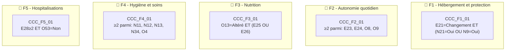

# 🧪 Test Complet – Vulnérabilité "Fragilité du Proche"

> **Document de référence** démontrant le fonctionnement du moteur Monka sur la vulnérabilité V2.
> 
> Date : 04/02/2026

---

## 📋 Table des matières

1. [Référentiel des questions](#1-référentiel-des-questions)
2. [Règles de déclenchement](#2-règles-de-déclenchement)
3. [Mapping Question → Recommandations](#3-mapping-question--recommandations)
4. [Scoring et calcul](#4-scoring-et-calcul)
5. [Cas de test simulés](#5-cas-de-test-simulés)
6. [Conformité Legacy](#6-conformité-legacy)

---

## 1. Référentiel des questions

### 1.1 Questions avec typologie

| ID | Libellé complet | Type | Scoring |
|----|-----------------|------|---------|
| **O2** | Où vit la personne aidée aujourd'hui ? | Descriptive + Déclenchante | ✅ |
| **N31** | La personne aidée bénéficie-t-elle d'une prise en charge en établissement spécialisé ? | Descriptive | ✅ |
| **N10** | Quelle est la nature de l'aide que vous apportez ? | Descriptive | ✅ |
| **N9** | La personne aidée rencontre-t-elle des problèmes pour gérer ses affaires ? | Déclenchante | ❌ |
| **N21** | Rencontre-t-elle des problèmes financiers ? | Déclenchante | ❌ |
| **N23** | La personne aidée a-t-elle des difficultés à maintenir une activité quotidienne ? | Scorante | ✅ |
| **N27** | Estimez-vous que la personne aidée est socialement isolée ? | Scorante | ✅ |
| **O7** | Avez-vous constaté des changements dans la manière dont elle communique ? | Scorante | ✅ |
| **E20** | Quel serait selon vous le meilleur lieu de vie pour votre proche ? | Déclenchante | ❌ |
| **E21** | Pensez-vous qu'il sera possible de maintenir cette situation dans les 6-12 mois ? | **Critique directe** | ❌ |
| **E23** | Votre proche est-il capable de préparer ses repas seul ? | Scorante + Déclenchante | ✅ |
| **E24** | Votre proche est-il capable de faire ses courses seul ? | Scorante + Déclenchante | ✅ |
| **E25** | Votre proche rencontre-t-il des difficultés à manger seul ? | Scorante | ✅ |
| **E26** | Votre proche rencontre-t-il des problèmes de déglutition ? | Scorante + Déclenchante | ✅ |
| **E28** | Combien de fois votre proche a-t-il été hospitalisé ces 12 derniers mois ? | Scorante + Déclenchante | ✅ |
| **N11** | Votre proche a-t-il besoin d'aide pour sa toilette ? | Déclenchante | ❌ |
| **N12** | Votre proche a-t-il besoin d'aide pour s'habiller ? | Déclenchante | ❌ |
| **N13** | Votre proche a-t-il des problèmes de continence ? | Déclenchante | ❌ |
| **N34** | Votre proche a-t-il besoin d'aide pour ses soins quotidiens ? | Déclenchante | ❌ |
| **O4** | Comment qualifieriez-vous l'état bucco-dentaire de votre proche ? | Déclenchante | ❌ |
| **O8** | Votre proche gère-t-il ses finances seul ? | Déclenchante | ❌ |
| **O9** | Votre proche effectue-t-il ses déplacements seul ? | Déclenchante | ❌ |
| **O13** | Comment évalueriez-vous l'appétit de votre proche ? | Déclenchante | ❌ |
| **O53** | Votre proche a-t-il eu une évaluation AGGIR ? | Déclenchante | ❌ |

> **Total** : 57 questions (24 principales + options multiples)

---

## 2. Règles de déclenchement

### 2.1 Questions déclenchantes simples

| ID | Réponse déclenchante | Micro-parcours | Sens clinique |
|----|---------------------|----------------|---------------|
| **N21** | "Oui" | **F1** | Fragilité financière du proche |
| **N9** | "Oui" | **F1** | Problèmes de gestion des affaires |
| **E21** | "Non, changement nécessaire" | **F1** | Maintien à domicile compromis |
| **E23** | "Pas du tout une aide" | **F2** | Incapacité repas |
| **E24** | "Pas du tout une aide" | **F2** | Incapacité courses |
| **O8** | "Ne gère pas seul" | **F2** | Dépendance financière |
| **O9** | "N'effectue pas seul" | **F2** | Dépendance déplacements |
| **O13** | "Diminution notable/Altération totale" | **F3** | Risque nutritionnel |
| **E26** | "Oui" | **F3** | Troubles de déglutition |
| **N11** | "Oui" | **F4** | Aide toilette nécessaire |
| **N12** | "Oui" | **F4** | Aide habillage nécessaire |
| **N13** | "Oui" | **F4** | Problèmes de continence |
| **N34** | "Oui" | **F4** | Aide soins nécessaire |
| **O4** | "Altéré/Dégradé" | **F4** | État bucco-dentaire altéré |
| **E28** | "≥ 2" | **F5** | Hospitalisations récurrentes |

### 2.2 Questions critiques directes → Priorité Niveau 1

| ID | Réponse critique | Effet Legacy | Sens clinique |
|----|-----------------|--------------|---------------|
| **E21** | "Non, un changement sera nécessaire" | ⚡ Priorité niveau 1 | Maintien à domicile impossible à terme |

> [!CAUTION]
> Cette réponse déclenche automatiquement une **priorité niveau 1** (≤ 7 jours) sans attendre le calcul du score.

### 2.3 Conditions Critiques Composites (CCC)



| Code | Questions | Logique booléenne | Micro-parcours | Sens clinique |
|------|-----------|-------------------|----------------|---------------|
| **CCC_F1_01** | E21 + N21/N9 | E21="Changement" **ET** (N21="Oui" **OU** N9="Oui") | F1 | Hébergement instable + fragilité financière/gestion |
| **CCC_F2_01** | E23+E24+O8+O9 | ≥2 conditions vraies parmi les 4 | F2 | Effondrement autonomie globale |
| **CCC_F3_01** | O13 + E25/E26 | O13="Altéré" **ET** (E25="Problème" **OU** E26="Oui") | F3 | Risque de dénutrition avéré |
| **CCC_F4_01** | N11+N12+N13+N34+O4 | ≥2 conditions vraies parmi les 5 | F4 | Dépendance hygiène/soins critique |
| **CCC_F5_01** | E28 + O53 | E28≥2 **ET** O53="Non" | F5 | Hospitalisations sans évaluation AGGIR |

---

## 3. Mapping Question → Recommandations

### 3.1 O2 – Lieu de vie du proche

| Réponse | Recommandation | Acteur | Micro-tâches |
|---------|----------------|--------|--------------|
| **À son domicile** | Faites vous aider | IDEC | • Orienter et accompagner la mise en place des aides matérielles et humaines |
| **À mon domicile** | Faites vous aider | IDEC | • Orienter et accompagner la mise en place des aides matérielles et humaines |
| **En établissement** | — | N/A | — |

### 3.2 N10 – Nature de l'aide apportée

| Réponse | Recommandation | Acteur | Micro-tâches |
|---------|----------------|--------|--------------|
| **Tâches vie quotidienne** | Demandez une aide pour les actes de la vie quotidienne | Services à domicile (SAD) | • Confirmer avec l'aidant le nombre d'heures envisagées pour l'intervention du SAD |
| **Gestion administrative et budgétaire** | Contacter une assistante sociale | Assistante sociale | • Rappeler à l'aidant de contacter l'AS |
| **Aide aux soins médicaux** | Envisager l'intervention d'un IDEL | IDEL | • Évaluer le besoin de soins infirmiers à domicile |
| **Accompagnement psychologique** | Orienter vers un soutien psychologique | Psychologue | • Proposer un accompagnement adapté |

### 3.3 E21 – Maintien de la situation à 6-12 mois

| Réponse | Recommandation | Acteur | Micro-tâches |
|---------|----------------|--------|--------------|
| **Oui, sans changement** | — | — | — |
| **Oui, avec aménagements** | Anticiper les aménagements nécessaires | IDEC | • Identifier les aménagements à prévoir<br/>• Planifier leur mise en place |
| **Non, un changement sera nécessaire** 🔴 | Accompagnement urgent pour préparer la transition | IDEC / AS / Gériatre | • Organiser une concertation sous 7 jours<br/>• Évaluer les options d'hébergement<br/>• Préparer l'aidant psychologiquement |

> [!WARNING]
> La réponse "Non, un changement sera nécessaire" est une **critique directe** → Priorité niveau 1

### 3.4 E23/E24 – Capacité repas/courses

| Réponse | Recommandation | Acteur | Micro-tâches |
|---------|----------------|--------|--------------|
| **Seul sans difficulté** | — | — | — |
| **Avec aide partielle** | Renforcer l'aide existante | SAD | • Évaluer le niveau d'aide nécessaire |
| **Pas du tout une aide** | Mise en place urgente portage repas/aide courses | SAD / IDEC | • Activer le portage de repas<br/>• Mettre en place l'aide aux courses<br/>• Réévaluer sous 1 mois |

### 3.5 E28 – Hospitalisations récurrentes

| Réponse | Recommandation | Acteur | Micro-tâches |
|---------|----------------|--------|--------------|
| **Aucune** | — | — | — |
| **1 fois** | Surveiller et prévenir | IDEC | • Analyser la cause de l'hospitalisation |
| **2 fois ou plus** | Déclencher une évaluation gérontologique | Médecin / Gériatre | • Demander une évaluation AGGIR<br/>• Analyser les causes des hospitalisations<br/>• Créer un plan de prévention |

---

## 4. Scoring et calcul

### 4.1 Questions scorantes et pondération

> [!CAUTION]
> **INCOHÉRENCE DÉTECTÉE (04/02/2026)**
> 
> Les scorantes ci-dessous sont extraites de notre analyse IA mais **diffèrent du Legacy scoring officiel**.
> 
> **Legacy scoring 310127.docx dit :**
> - 14 scorantes : O7, O13, N24, E25, E26, O4, N11, N12, N13, N34, O26, E32, E33, O6
> - Score brut max = 28
> - Formule = (brut/28)×20
>
> **À RÉVISER : aligner cette section sur le Legacy.**

| Question | Réponse | Score |
|----------|---------|-------|
| **⚠️ Section à réviser selon Legacy scoring** | | |

### 4.2 Formule de calcul (LEGACY)

```
Score brut max = 28 (14 questions scorantes - Legacy scoring)
Score normalisé = (Score brut / 28) × 20
```

> ⚠️ **Ancienne valeur erronée** : max 21 (9 scorantes) - À NE PLUS UTILISER

### 4.3 Grille de lecture

| Score /20 | Couleur | Interprétation |
|-----------|---------|----------------|
| 0 – 6 | 🟢 Vert | Fragilité du proche limitée |
| 7 – 13 | 🟠 Orange | Fragilité significative nécessitant vigilance |
| 14 – 20 | 🔴 Rouge | Fragilité majeure, intervention prioritaire |

> [!NOTE]
> Le score **ne déclenche jamais** de micro-parcours. Il détermine uniquement la **temporalité** d'action.

---

## 5. Cas de test simulés

### 5.1 Profil A – Madeleine, 84 ans (Critique directe → Niveau 1)

| Question | Réponse | Score |
|----------|---------|-------|
| O2 | À mon domicile | 3 |
| E21 | **Non, un changement sera nécessaire** 🔴 | — |
| N21 | Oui | — |
| E23 | Pas du tout une aide | 2 |
| E24 | Pas du tout une aide | 2 |
| E28 | 2 hospitalisations | 2 |
| O53 | Non | — |

**Résultat :**
- **Score brut** = 9/21 → **Score normalisé = 8.6/20** 🟠
- **Question critique directe activée** : E21 = "Non, changement nécessaire"
- **Priorité** : ⚡ **Niveau 1** (≤ 7 jours)
- **Micro-parcours activés** : **F1** + **F2** + **F5**
- **CCC activées** : CCC_F1_01, CCC_F2_01, CCC_F5_01

### 5.2 Profil B – Henri, 78 ans (CCC activée → Niveau 2)

| Question | Réponse | Score |
|----------|---------|-------|
| O2 | À son domicile | 1 |
| E21 | Oui, avec aménagements | — |
| N11 | Oui | — |
| N12 | Oui | — |
| N13 | Oui | — |
| O13 | Diminution notable | — |
| E25 | Oui | 2 |

**Résultat :**
- **Score brut** = 3/21 → **Score normalisé = 2.9/20** 🟢
- **Aucune critique directe**
- **CCC activées** : CCC_F3_01, CCC_F4_01
- **Priorité** : ⚡ **Niveau 2** (≤ 7 jours)
- **Micro-parcours activés** : **F3** + **F4**

### 5.3 Profil C – Simone, 72 ans (Score modéré → Niveau 3)

| Question | Réponse | Score |
|----------|---------|-------|
| O2 | À son domicile | 1 |
| E21 | Oui, sans changement | — |
| E23 | Avec aide partielle | 1 |
| E24 | Seul sans difficulté | 0 |
| N23 | Partiellement | 1 |
| E28 | 0 hospitalisation | 0 |

**Résultat :**
- **Score brut** = 3/21 → **Score normalisé = 2.9/20** 🟢
- **Aucune critique directe**
- **Aucune CCC activée**
- **Priorité** : **Niveau 3** (>1 mois, planifié)
- **Micro-parcours** : Aucun activé, surveillance régulière

---

## 6. Conformité Legacy

### Checklist de vérification

| Règle Legacy | Statut | Implémentation |
|--------------|--------|----------------|
| Score ne déclenche jamais | ✅ | Score utilisé uniquement pour temporalité |
| Critique directe = Niveau 1 | ✅ | E21="Changement nécessaire" → priorité immédiate |
| CCC = Niveau 2 | ✅ | 5 conditions composites avec logique ET/OU |
| Max 3 micro-parcours actifs | ✅ | 6 MP disponibles (F1-F6), sélection par priorité |
| Hiérarchie inter-vulnérabilités | ✅ | Fragilité du Proche = rang 2/5 |
| Pas de comptage micro-tâches | ✅ | Progression par ASR uniquement |
| Questions à catégorie unique | ✅ | Chaque question a un type fixe |

---

> 📄 Document généré le 04/02/2026 – Test vulnérabilité Fragilité du Proche (V2)
