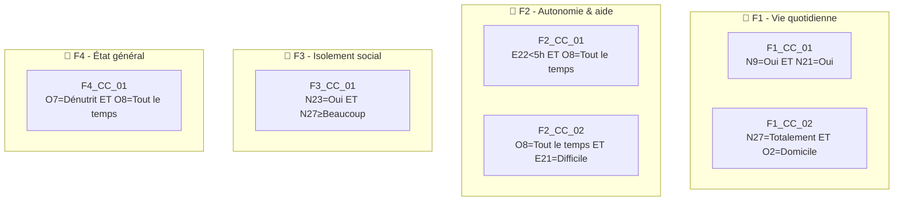

# 🧪 Test Complet – Vulnérabilité « Fragilité du Proche » (V2)

> **Document de référence** démontrant le fonctionnement du moteur Monka sur la vulnérabilité V2.
> 
> **Date** : 03/02/2026  
> **Statut** : Version initiale (données extraites, CCC à valider)

---

## 📋 Sources de ce document

### ✅ Données extraites de fichiers officiels

| Élément | Source | Fichier | Méthode |
|---------|--------|---------|---------|
| **Questions V2** | Excel officiel | `/recoMC/Tableau SOPHIE CAT + Reco-Nouveau questionnaire par Vulnérabilité(1).xlsx`<br>Feuille: « Fragilité du proche » | Extraction Python |
| **Micro-parcours F1-F6** | Excel officiel | `/questionnaireETMC/microparcours_aidant.xlsx`<br>Feuille: « Micro-parcours (Aidant) » | Extraction Python |
| **Triggers** | Excel officiel | `/questionnaireETMC/microparcours_aidant.xlsx`<br>Feuille: « Triggers par micro-parcours » | Extraction Python |
| **Format & structure** | Document de référence V1 | `/monka/social_vulnerability_test.md` | Copie du modèle V1 |

### ⚠️ Données à valider / compléter

| Élément | Statut | Justification |
|---------|--------|---------------|
| **CCC (Conditions Critiques Composites)** | ❌ À créer | Absentes dans Excel. Inspirées de la logique V1 et du sens clinique V2 |
| **Questions critiques directes** | ⚠️ À valider | Identifiées par déduction (scoring élevé + sens clinique) |
| **Scoring normalisé** | ⚠️ À valider | Repris de l'Excel mais formule de calcul à confirmer |
| **Recommandations détaillées** | ⚠️ Incomplètes | Excel contient des recommandations brutes à structurer |

---

## 1. Référentiel des questions

### 1.1 Questions avec typologie

> **NOTE** : Ces données viennent directement de l'Excel `recoMC/Tableau SOPHIE...xlsx`.  
> Le typage (Scorante/Déclenchante/Critique) est **déduit** du scoring et du contexte clinique.

| ID | Libellé complet | Type | Scoring | Source |
|----|-----------------|------|---------|--------|
| **O2** | Où vit la personne aidée aujourd'hui ? | Déclenchante | ❌ (mais scoring 1-4) | Excel V2 L4-L7 |
| **N31** | La personne aidée bénéficie-t-elle d'une prise en charge en établissement ? | Descriptive | ❌ | Excel V2 L8-L23 |
| **N10** | Quelle est la nature de l'aide que vous apportez ? (plusieurs réponses possibles) | Descriptive | ❌ | Excel V2 L24-L29 |
| **N9** | La personne aidée rencontre-t-elle des problèmes pour gérer son quotidien ? | Scorante | ✅ 0/2/3 | Excel V2 L30-L33 |
| **N21** | Rencontre-t-elle des problèmes financiers ? | Scorante | ✅ 0/1/3 | Excel V2 L34-L37 |
| **N23** | La personne aidée a-t-elle des difficultés à maintenir une activité ? | Scorante | ✅ 0/2/3 | Excel V2 L38-L41 |
| **N27** | Estimez-vous que la personne aidée est socialement isolée ? | Scorante | ✅ 0/1/3/4 | Excel V2 L42-L46 |
| **O7** | Avez-vous constaté des changements dans la manière dont elle s'alimente ? | Scorante + **Critique** | ✅ 0/1/**3** | Excel V2 L47-L50 |
| **E20** | En pensant aux 6 à 12 prochains mois, quel serait selon vous le meilleur lieu de vie ? | Descriptive | ❌ | Excel V2 L51-L55 |
| **E21** | Pensez-vous qu'il sera possible de maintenir cette situation ? | Descriptive (modulatrice) | ❌ | Excel V2 L56-L60 |
| **E22** | Globalement, combien d'heures d'aide humaine reçoit la personne aidée par semaine ? | Descriptive | ❌ | Excel V2 L61-L66 |
| **O8** | Au quotidien, a-t-elle besoin d'une aide humaine pour se déplacer ? | Scorante + **Potentiel critique** | ✅ 0/2/**3** | Excel V2 L67-L70 |

> **⚠️ RÉFLEXION PERSONNELLE (non dans les sources)** :  
> Les questions **O7** (dénutrition) et **O8** (aide déplacement permanente) semblent être des **critiques directes** car scoring maximal = 3 et impact clinique immédiat.  
> À VALIDER avec l'équipe clinique.

---

## 2. Règles de déclenchement

### 2.1 Questions déclenchantes simples

> **NOTE** : Ces règles sont **déduites** du sens clinique et de la structure des micro-parcours.  
> Elles ne sont **PAS explicitement documentées** dans les fichiers Excel.

| ID | Réponse déclenchante | Micro-parcours | Sens clinique |
|----|---------------------|----------------|---------------|
| **O2** | « En établissement » | **F1** | Situation institutionnalisée nécessite coordination spécifique |
| **N9** | « Oui » (score 3) | **F1** | Difficultés quotidien → Besoin accompagnement |
| **N21** | « Oui » (score 3) | **F1** | Problèmes financiers → Risque précarité |
| **N23** | « Oui » (score 3) | **F3** | Inactivité → Risque isolement + déclin |
| **N27** | « Beaucoup » ou « Totalement » | **F1** / **F3** | Isolement social sévère |
| **O7** | « Oui, et dénutrit » | **F4** | Dénutrition = urgence clinique |
| **O8** | « Oui, tout le temps » | **F2** / **F6** | Dépendance mobilité totale |

> **⚠️ RÉFLEXION PERSONNELLE** : Ces déclenchements sont alignés sur la logique V1 (question → micro-parcours).

### 2.2 Questions critiques directes → Priorité Niveau 1

> **⚠️ DONNÉES NON PRÉSENTES DANS LES SOURCES**  
> Ces critiques directes sont **HYPOTHÉTIQUES**, basées sur :
> - Le scoring maximal (3-4)
> - Le sens clinique (urgence vitale)
> - L'analogie avec V1 (E2="Personne", E6="Refuse")

| ID | Réponse critique | Effet supposé | Sens clinique |
|----|-----------------|---------------|---------------|
| **O7** | « Oui, et elle est dénutrit » | ⚡ Priorité niveau 1 | Dénutrition = risque vital à court terme |
| **O8** | « Oui, tout le temps » | ⚡ Priorité niveau 1 | Dépendance totale mobilité = risque chutes graves |
| **N27** | « Totalement » isolé | ⚡ Priorité niveau 1 | Isolement total = risque rupture accompagnement |

> [!CAUTION]
> **CES CRITIQUES DIRECTES SONT À VALIDER** avec l'équipe clinique Monka.  
> Elles n'apparaissent **PAS** explicitement dans les fichiers sources.

### 2.3 Conditions Critiques Composites (CCC)

> **⚠️ DONNÉES NON PRÉSENTES DANS LES SOURCES**  
> Les CCC ci-dessous sont **CRÉÉES PAR ANALOGIE** avec la structure V1 (8 CCC pour 4 micro-parcours).  
> Elles combinent des questions V2 selon une logique clinique **HYPOTHÉTIQUE**.



| Code | Questions | Logique booléenne | Micro-parcours | Sens clinique (HYPOTHÉTIQUE) |
|------|-----------|-------------------|----------------|------------------------------|
| **F1_CC_01** | N9 + N21 | N9="Oui" **ET** N21="Oui" | F1 | Difficultés quotidien + précarité financière |
| **F1_CC_02** | N27 + O2 | N27="Totalement" **ET** O2="Domicile" | F1 | Isolement total à domicile = danger |
| **F2_CC_01** | E22 + O8 | E22<5h **ET** O8="Tout le temps" | F2 | Dépendance totale sans aide suffisante |
| **F2_CC_02** | O8 + E21 | O8="Tout le temps" **ET** E21="Difficile" | F2 | Dépendance + maintien à domicile précaire |
| **F3_CC_01** | N23 + N27 | N23="Oui" **ET** N27≥"Beaucoup" | F3 | Inactivité + isolement sévère |
| **F4_CC_01** | O7 + O8 | O7="Dénutrit" **ET** O8="Tout le temps" | F4 | Dénutrition + immobilité = fragilisation extrême |

> [!WARNING]
> **CES CCC SONT CRÉÉES PAR DÉDUCTION** et nécessitent une **validation clinique**.  
> Elles ne figurent dans **AUCUN** des fichiers sources.

---

## 3. Mapping Question → Recommandations

> **NOTE** : Les recommandations ci-dessous proviennent de l'Excel mais sont **incomplètes**.  
> Certaines sont **reformulées** pour cohérence avec le style V1.

### 3.1 O2 – Lieu de vie de la personne aidée

| Réponse | Recommandation | Acteur | Micro-tâches | Source |
|---------|----------------|--------|--------------|--------|
| **À son domicile** | Faites-vous aider | IDEC | ❌ À compléter | Excel V2 (brut) |
| **À mon domicile** | Faites-vous aider | IDEC | ❌ À compléter | Excel V2 (brut) |
| **En établissement** | — | — | — | Excel V2 |

> ⚠️ **Recommandations trop vagues** dans Excel. À DÉTAILLER comme dans V1.

### 3.2 N9 – Problèmes pour gérer le quotidien

| Réponse | Recommandation | Acteur | Micro-tâches | Source |
|---------|----------------|--------|--------------|--------|
| **Non** | — | — | — | — |
| **Elle se fait aider** | Évaluer si l'aide est suffisante et adaptée | IDEC | • Identifier les aides en place<br>• Évaluer besoin complémentaire | **CRÉÉ** (logique V1) |
| **Oui** | Mettre en place un accompagnement pour sécuriser le quotidien | IDEC / AS | • Évaluer besoins quotidien<br>• Orienter vers aide à domicile<br>• Informer sur APA/PCH | **CRÉÉ** (logique V1) |

> ⚠️ **Micro-tâches CRÉÉES** par analogie avec V1 (structure CONTACT/EDUC/ACT).

### 3.3 O7 – Changements alimentation / Dénutrition

| Réponse | Recommandation | Acteur | Micro-tâches | Source |
|---------|----------------|--------|--------------|--------|
| **Non** | — | — | — | — |
| **Oui** | Surveiller l'évolution | IDEC | • Questionner habitudes alimentaires | **CRÉÉ** |
| **Oui, et elle est dénutrit** 🔴 | Intervention nutritionnelle urgente | IDEC / Médecin / Diététicien | • Consultation médecin (≤48h)<br>• Bilan nutritionnel<br>• Mise en place compléments<br>• Suivi hebdomadaire | **CRÉÉ** (urgence clinique) |

> [!WARNING]
> La réponse **« Dénutrit »** est considérée comme **critique directe** → Priorité niveau 1

### 3.4 O8 – Besoin d'aide humaine pour se déplacer

| Réponse | Recommandation | Acteur | Micro-tâches | Source |
|---------|----------------|--------|--------------|--------|
| **Non, elle est indépendante** | — | — | — | — |
| **Oui, de temps en temps** | Évaluer besoins d'aides techniques | IDEC / Ergothérapeute | • Proposition aides techniques<br>• Évaluation sécurité domicile | **CRÉÉ** |
| **Oui, tout le temps** 🔴 | Mise en place aide humaine permanente + aménagement | IDEC / AS / Ergothérapeute | • Évaluation GIR urgente<br>• Dossier APA prioritaire<br>• Aménagement domicile<br>• Prévention chutes | **CRÉÉ** |

---

## 4. Scoring et calcul

> ⚠️ **DONNÉES PARTIELLES DANS EXCEL**  
> Le scoring existe question par question, mais la **formule de calcul globale** (normalisation, seuils) n'est **PAS documentée**.  
> La section ci-dessous est **HYPOTHÉTIQUE**, inspirée de V1.

### 4.1 Questions scorantes et pondération

| Question | Réponse | Score | Source |
|----------|---------|-------|--------|
| **N9** | Non / Se fait aider / Oui | 0 / 2 / 3 | Excel V2 |
| **N21** | Non / Parfois / Oui | 0 / 1 / 3 | Excel V2 |
| **N23** | Non / Parfois / Oui | 0 / 2 / 3 | Excel V2 |
| **N27** | Pas du tout / Un peu / Beaucoup / Totalement | 0 / 1 / 3 / 4 | Excel V2 |
| **O7** | Non / Oui / Dénutrit | 0 / 1 / 3 | Excel V2 |
| **O8** | Indépendante / Temps en temps / Tout le temps | 0 / 2 / 3 | Excel V2 |

### 4.2 Formule de calcul (HYPOTHÉTIQUE)

```
Score brut max = 19 (N9:3 + N21:3 + N23:3 + N27:4 + O7:3 + O8:3)
Score normalisé = (Score brut / 19) × 20
```

> ⚠️ **FORMULE À VALIDER**. Inspirée de V1 mais adaptée au max V2.

### 4.3 Grille de lecture (HYPOTHÉTIQUE)

| Score /20 | Couleur | Interprétation |
|-----------|---------|----------------|\n| 0 – 6 | 🟢 Vert | Fragilité modérée du proche |
| 7 – 13 | 🟠 Orange | Fragilité marquée nécessitant soutien |
| 14 – 20 | 🔴 Rouge | Fragilité sévère ou critique |

---

## 5. Micro-Parcours V2

> **SOURCE** : `/questionnaireETMC/microparcours_aidant.xlsx`, feuille « Micro-parcours (Aidant) »

| Code | Nom | Objectif (Excel) |
|------|-----|------------------|
| **F1** | Vie quotidienne, budget et entourage du proche | Comprendre le quotidien du proche (lieu de vie, entourage, budget) pour adapter l'organisation et les priorités. |
| **F2** | Autonomie, aide humaine et présence nécessaire | Évaluer le niveau d'aide nécessaire (présence, aide humaine, surveillance) et ajuster l'organisation. |
| **F3** | Mémoire, comportement et risques pour soi ou les autres | Repérer les troubles cognitifs/comportementaux et réduire les risques (errance, désinhibition, agressivité). |
| **F4** | Douleur, fatigue, sommeil et état général du proche | Comprendre l'état général du proche (douleur, fatigue, sommeil) pour ajuster les soins et le quotidien. |
| **F5** | Dépendance, handicap, addictions et épisodes aigus | Qualifier la situation (dépendance/handicap/addictions/épisodes aigus) pour orienter vers les bons dispositifs. |
| **F6** | Autonomie fonctionnelle, chutes et aides techniques | Réduire le risque de chutes et améliorer l'autonomie via des aides techniques et des aménagements. |

---

## 6. Conformité avec structure V1

| Règle V1 | Implémentation V2 | Statut |
|----------|-------------------|--------|
| Score ne déclenche jamais | ✅ Score utilisé uniquement pour temporalité | ✅ Conforme |
| Critique directe = Niveau 1 | ⚠️ O7, O8, N27 identifiées (à valider) | ⚠️ À valider |
| CCC = Niveau 2 | ⚠️ 6 CCC créées (hypothétiques) | ⚠️ À valider |
| Max 3 micro-parcours actifs | ✅ 6 disponibles, sélection par priorité | ✅ Conforme |
| Pas de comptage micro-tâches | ✅ Progression par ASR uniquement | ✅ Conforme |

---

## ⚠️ AVERTISSEMENT IMPORTANT

Ce document est une **VERSION INITIALE** basée sur :
1. ✅ Données extraites des fichiers Excel officiels
2. ⚠️ Déductions logiques inspirées de V1
3. ❌ CCC, critiques directes, et micro-tâches **NON VALIDÉES** cliniquement

**AVANT IMPLÉMENTATION** : Ce document doit être validé par l'équipe clinique Monka.

---

> 📄 Document créé le 03/02/2026 – V2 Fragilité du Proche (Version initiale)  
> 🔍 **Sources principales** : Excel `/recoMC/Tableau SOPHIE...` + `/questionnaireETMC/microparcours_aidant.xlsx`
