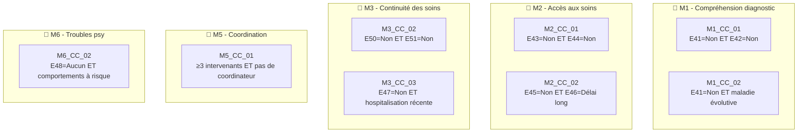

# 🧪 Test Complet – Vulnérabilité "Parcours Médical du Proche"

> **Document de référence** démontrant le fonctionnement du moteur Monka sur la vulnérabilité V4.
> 
> Date : 04/02/2026

---

## 📋 Table des matières

1. [Référentiel des questions](#1-référentiel-des-questions)
2. [Règles de déclenchement](#2-règles-de-déclenchement)
3. [Mapping Question → Recommandations](#3-mapping-question--recommandations)
4. [Scoring et calcul](#4-scoring-et-calcul)
5. [Cas de test simulés](#5-cas-de-test-simulés)
6. [Conformité Legacy](#6-conformité-legacy)

---

## 1. Référentiel des questions

### 1.1 Questions avec typologie

| ID | Libellé complet | Type | Scoring |
|----|-----------------|------|---------|
| **E40** | Quel est le diagnostic principal de votre proche ? | Descriptive | ❌ |
| **E41** | Comprenez-vous bien le diagnostic et son évolution ? | Scorante + Déclenchante | ✅ |
| **E42** | Avez-vous eu des explications claires sur les traitements ? | Scorante | ✅ |
| **E43** | Votre proche a-t-il un médecin traitant identifié ? | **Critique directe** + Déclenchante | ❌ |
| **E44** | Votre proche voit-il régulièrement son médecin traitant ? | Scorante + Déclenchante | ✅ |
| **E45** | Votre proche a-t-il un spécialiste de référence ? | Déclenchante | ❌ |
| **E46** | Y a-t-il un délai d'attente problématique pour les RDV ? | Scorante | ✅ |
| **E47** | La conduite à tenir en cas de crise est-elle claire ? | **Critique directe** + Scorante | ✅ |
| **E48** | Votre proche est-il suivi pour des troubles psychiques ? | Déclenchante | ❌ |
| **E49** | Quels professionnels sont impliqués dans le suivi addiction ? | Déclenchante | ❌ |
| **E50** | Les différents médecins communiquent-ils entre eux ? | Scorante | ✅ |
| **E51** | Y a-t-il un professionnel qui coordonne les soins ? | Scorante + Déclenchante | ✅ |
| **E52** | La gestion des médicaments pose-t-elle problème ? | Scorante + Déclenchante | ✅ |
| **E53** | Y a-t-il des effets secondaires des traitements ? | Scorante | ✅ |
| **E54** | Le proche suit-il correctement ses traitements ? | **Critique directe** + Scorante | ✅ |
| **E55** | Avez-vous des difficultés d'accès aux soins ? | Scorante | ✅ |

> **Total** : 36 questions (16 principales + options multiples)

---

## 2. Règles de déclenchement

### 2.1 Questions déclenchantes simples

| ID | Réponse déclenchante | Micro-parcours | Sens clinique |
|----|---------------------|----------------|---------------|
| **E41** | "Non, pas du tout" | **M1** | Incompréhension du diagnostic |
| **E44** | "Non/Rarement" | **M2** | Suivi médical insuffisant |
| **E45** | "Non" | **M2** | Absence de référent spécialisé |
| **E48** | "Aucun suivi" | **M6** | Troubles psy non suivis |
| **E51** | "Non" | **M5** | Absence de coordination |
| **E52** | "Oui, problèmes majeurs" | **M4** | Problèmes de médication |

### 2.2 Questions critiques directes → Priorité Niveau 1

| ID | Réponse critique | Effet Legacy | Sens clinique |
|----|-----------------|--------------|---------------|
| **E43** | "Non" | ⚡ Priorité niveau 1 | Pas de médecin traitant |
| **E47** | "Non, on improvise/urgences" | ⚡ Priorité niveau 1 | Pas de conduite à tenir en crise |
| **E54** | "Non, refus ou incapacité" | ⚡ Priorité niveau 1 | Non-observance thérapeutique |

> [!CAUTION]
> Ces réponses déclenchent automatiquement une **priorité niveau 1** (≤ 7 jours).

### 2.3 Conditions Critiques Composites (CCC)



| Code | Questions | Logique booléenne | Micro-parcours | Sens clinique |
|------|-----------|-------------------|----------------|---------------|
| **M1_CC_01** | E41 + E42 | E41="Non" **ET** E42="Non" | M1 | Incompréhension totale diagnostic + traitement |
| **M1_CC_02** | E41 + maladie | E41="Non" **ET** maladie évolutive | M1 | Incompréhension sur maladie qui évolue |
| **M2_CC_01** | E43 + E44 | E43="Non" **ET** E44="Non/Rarement" | M2 | Pas de MT + pas de suivi |
| **M2_CC_02** | E45 + E46 | E45="Non" **ET** E46="Délai problématique" | M2 | Pas de spécialiste + difficultés RDV |
| **M3_CC_02** | E50 + E51 | E50="Non" **ET** E51="Non" | M3 | Pas de communication + pas de coordinateur |
| **M3_CC_03** | E47 + hospi | E47="Non" **ET** hospitalisation récente | M3 | Pas de CAT en crise après hospitalisation |
| **M5_CC_01** | Intervenants + E51 | ≥3 intervenants **ET** E51="Non" | M5 | Multi-intervenants sans coordination |
| **M6_CC_02** | E48 + comportements | E48="Aucun suivi" **ET** comportements à risque | M6 | Troubles psy non pris en charge |

---

## 3. Mapping Question → Recommandations

### 3.1 E41 – Compréhension du diagnostic

| Réponse | Recommandation | Acteur | Micro-tâches |
|---------|----------------|--------|--------------|
| **Oui, parfaitement** | — | — | — |
| **Globalement oui** | Proposer de clarifier les zones d'ombre | IDEC | • Identifier les points non compris |
| **Pas vraiment / Pas du tout** | Organiser un temps d'explication avec le médecin | IDEC / Médecin | • Préparer les questions avec l'aidant<br/>• Organiser un RDV d'explication<br/>• Proposer une documentation adaptée |

### 3.2 E43 – Médecin traitant identifié

| Réponse | Recommandation | Acteur | Micro-tâches |
|---------|----------------|--------|--------------|
| **Oui** | — | — | — |
| **Non** 🔴 | Identifier un médecin traitant en urgence | IDEC / AS | • Rechercher un médecin prenant de nouveaux patients<br/>• Aider à l'inscription<br/>• Organiser le premier RDV |

> [!WARNING]
> L'absence de médecin traitant est une **critique directe** → Priorité niveau 1

### 3.3 E47 – Conduite à tenir en cas de crise

| Réponse | Recommandation | Acteur | Micro-tâches |
|---------|----------------|--------|--------------|
| **Oui, très claire** | — | — | — |
| **Quelques repères** | Formaliser un plan d'action | IDEC / Médecin | • Clarifier les zones de flou<br/>• Documenter la conduite à tenir |
| **Non, on improvise/urgences** 🔴 | Créer un plan d'urgence personnalisé | IDEC / Médecin | • Construire un plan d'urgence<br/>• Identifier les contacts clés<br/>• Former l'aidant à réagir |

### 3.4 E50 – Communication entre médecins

| Réponse | Recommandation | Acteur | Micro-tâches |
|---------|----------------|--------|--------------|
| **Oui, bien coordonnés** | — | — | — |
| **Partiellement** | Améliorer la transmission d'informations | IDEC | • Identifier les lacunes de communication |
| **Non, pas du tout** | Mettre en place un outil de coordination | IDEC / Médecin | • Proposer un carnet de liaison<br/>• Identifier un coordinateur<br/>• Organiser une réunion de coordination |

### 3.5 E54 – Observance thérapeutique

| Réponse | Recommandation | Acteur | Micro-tâches |
|---------|----------------|--------|--------------|
| **Oui, parfaitement** | — | — | — |
| **Globalement, quelques oublis** | Mettre en place des outils d'aide | IDEC | • Proposer un pilulier<br/>• Évaluer le besoin d'IDE |
| **Non, refus ou incapacité** 🔴 | Accompagnement renforcé pour observance | IDEC / Médecin / IDE | • Comprendre les causes du refus<br/>• Adapter les traitements si possible<br/>• Mettre en place un passage IDE |

---

## 4. Scoring et calcul

### 4.1 Questions scorantes et pondération

> [!CAUTION]
> **INCOHÉRENCE MAJEURE DÉTECTÉE (04/02/2026)**
> 
> Les scorantes ci-dessous (extraites IA) **ne correspondent pas au Legacy scoring officiel**.
> 
> **Legacy scoring 310127.docx dit :**
> - 6 scorantes : **E36, E37, E43, E47, E54, E57**
> - Score brut max = 12
> - Formule = (brut/12)×20
>
> **Notre fichier dit :**
> - 11 scorantes : E41, E42, E44, E46, E47, E50, E51, E52, E53, E54, E55
> - Seulement 2 correspondent (E47, E54)
>
> **À RÉVISER D'URGENCE : aligner cette section sur le Legacy.**

| Question | Réponse | Score |
|----------|---------|-------|
| **⚠️ Section à réviser selon Legacy scoring** | | |

### 4.2 Formule de calcul (LEGACY)

```
Score brut max = 12 (6 questions scorantes - Legacy scoring)
Score normalisé = (Score brut / 12) × 20
```

> ⚠️ **Ancienne valeur erronée** : max 27 (11 scorantes) - À NE PLUS UTILISER

### 4.3 Grille de lecture

| Score /20 | Couleur | Interprétation |
|-----------|---------|----------------|
| 0 – 6 | 🟢 Vert | Parcours médical bien structuré |
| 7 – 13 | 🟠 Orange | Fragilités dans le parcours de soins |
| 14 – 20 | 🔴 Rouge | Parcours médical désorganisé, risques majeurs |

---

## 5. Cas de test simulés

### 5.1 Profil A – Roger, 79 ans (Critiques multiples → Niveau 1)

| Question | Réponse | Score |
|----------|---------|-------|
| E43 | **Non** 🔴 | — |
| E44 | Non | 3 |
| E47 | **Non, on improvise** 🔴 | 3 |
| E50 | Non | 2 |
| E51 | Non | 2 |
| E54 | Globalement | 1 |

**Résultat :**
- **Score brut** = 11/27 → **Score normalisé = 8.1/20** 🟠
- **Questions critiques directes activées** : E43, E47
- **Priorité** : ⚡ **Niveau 1** (≤ 7 jours)
- **Micro-parcours activés** : **M2** + **M3** + **M5**
- **CCC activées** : M2_CC_01, M3_CC_02

### 5.2 Profil B – Yvonne, 82 ans (CCC activées → Niveau 2)

| Question | Réponse | Score |
|----------|---------|-------|
| E43 | Oui | — |
| E41 | Pas vraiment | 2 |
| E42 | Non | 2 |
| E50 | Non | 2 |
| E51 | Non | 2 |

**Résultat :**
- **Score brut** = 8/27 → **Score normalisé = 5.9/20** 🟢
- **Aucune critique directe**
- **CCC activées** : M1_CC_01, M3_CC_02
- **Priorité** : ⚡ **Niveau 2** (≤ 7 jours)
- **Micro-parcours activés** : **M1** + **M3**

### 5.3 Profil C – Lucienne, 75 ans (Score faible → Niveau 3)

| Question | Réponse | Score |
|----------|---------|-------|
| E43 | Oui | — |
| E41 | Globalement oui | 1 |
| E44 | Parfois | 1 |
| E47 | Quelques repères | 1 |
| E54 | Oui, parfaitement | 0 |

**Résultat :**
- **Score brut** = 3/27 → **Score normalisé = 2.2/20** 🟢
- **Aucune critique directe**
- **Aucune CCC activée**
- **Priorité** : **Niveau 3** (>1 mois, planifié)

---

## 6. Conformité Legacy

### Checklist de vérification

| Règle Legacy | Statut | Implémentation |
|--------------|--------|----------------|
| Score ne déclenche jamais | ✅ | Score utilisé uniquement pour temporalité |
| Critique directe = Niveau 1 | ✅ | E43, E47, E54 → priorité immédiate |
| CCC = Niveau 2 | ✅ | 8 conditions composites |
| Max 3 micro-parcours actifs | ✅ | 6 MP disponibles (M1-M6) |
| Hiérarchie inter-vulnérabilités | ✅ | Parcours Médical = rang 3/5 |
| Coordination médicale | ✅ | Focus sur communication inter-professionnels |

---

> 📄 Document généré le 04/02/2026 – Test vulnérabilité Parcours Médical du Proche (V4)
