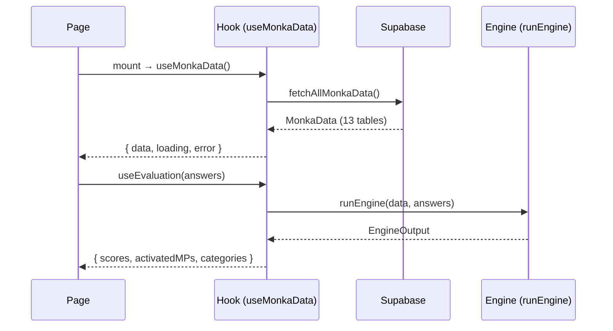
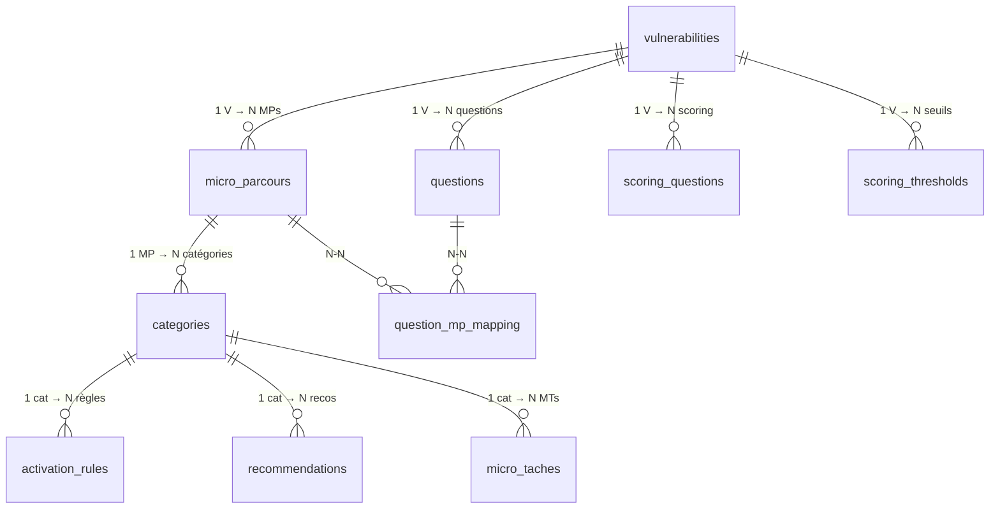

# 🏗️ Architecture — Monka Clinical Engine

> **Version :** 1.0 — 19/02/2026
> **ADR principal :** [001 — Clinical Engine Isolation](adr/001_clinical_engine_isolation.md)
> **Framework :** PRAGMA Senior Dev Framework v2.1

---

## 1. Vue d'Ensemble

```
┌──────────────────────────────────────────────────────────┐
│                    NAVIGATEUR                            │
│                                                          │
│  ┌──────────┐   ┌──────────────────┐   ┌──────────────┐ │
│  │  Pages   │──→│  Clinical Hooks  │──→│   Engine      │ │
│  │ (< 200L) │   │ (connecteurs)    │   │ (logique     │ │
│  │          │   │                  │   │  pure, 0     │ │
│  │          │   │                  │   │  React)      │ │
│  └────┬─────┘   └──────────────────┘   └──────┬───────┘ │
│       │                                        │         │
│  ┌────┴─────┐                            ┌────┴───────┐ │
│  │Components│                            │ Supabase   │ │
│  │ (UI)     │                            │ Data Layer │ │
│  └──────────┘                            └────────────┘ │
│                                                          │
└──────────────────────────────────────────────────────────┘
                           │
                    ┌──────┴──────┐
                    │  Supabase   │
                    │  PostgreSQL │
                    │  13 tables  │
                    └─────────────┘
```

---

## 2. Couches Architecturales

### Couche 1 — Clinical Engine (`clinical/engine/`)

**Responsabilité :** Logique métier pure. Zéro import React.

| Fichier | Rôle | Fonctions clés |
|---------|------|----------------|
| `clinicalEngine.ts` | Évaluation des règles d'activation | `evaluateCondition()`, `evaluateRule()`, `getActivatedCategories()`, `runEngine()` |
| `scoringEngine.ts` | Calcul des scores V1-V5 | `computeScore()`, `getScoreLevel()` |
| `ruleParser.ts` | Parsing du JSONB `condition_logic` | 9 opérateurs : eq, neq, ne, in, nin, gte, contains, count_gte, has_any |
| `crGenerator.ts` | Génération du CR Médecin | `generateCR()`, `buildTopActions()` |

**Règle d'import :** Ce module n'importe RIEN de React, des pages, ou des composants.

### Couche 2 — Data Layer (`clinical/data/`)

**Responsabilité :** Interface avec Supabase. Fetch, cache, validation.

| Fichier | Rôle |
|---------|------|
| `supabaseClient.ts` | Singleton client Supabase |
| `supabaseData.ts` | Types DB + fetch all data en parallèle |
| `dataValidator.ts` | Vérification intégrité (FK, complétude) |

### Couche 3 — Types (`clinical/types/`)

**Responsabilité :** Types TypeScript partagés. Aucune logique.

| Fichier | Contenu |
|---------|---------|
| `clinical.types.ts` | `DBQuestion`, `DBActivationRule`, `DBMicroParcours`, etc. |
| `engine.types.ts` | `VulnerabilityId`, `AnswerValue`, `Condition`, `EngineOutput`, etc. |

### Couche 4 — Hooks (`clinical/hooks/`)

**Responsabilité :** Connecteurs React ↔ Engine. Seul point de contact avec React.

| Hook | Usage |
|------|-------|
| `useMonkaData()` | Fetch et cache des données Supabase |
| `useEvaluation()` | Exécution du moteur avec les réponses courantes |
| `useCR()` | Génération du CR Médecin |

### Couche 5 — Components (`components/`)

**Responsabilité :** UI réutilisable. Reçoit des props, affiche du JSX.

| Sous-répertoire | Contenu |
|-----------------|---------|
| `ui/` | Design system — `StatusBadge`, `ScoreGauge`, `HeroCard`, `Tooltip`, `ProgressBar`, `FilterBar` |
| `clinical/` | Composants métier — `RuleCard`, `MPCard`, `RecoCard`, `WhyThisQuestion`, `ClinicalChain` |
| `layout/` | `Sidebar`, layout principal |

### Couche 6 — Pages (`pages/`)

**Responsabilité :** Orchestration uniquement. < 200 lignes par page. Importe hooks + components. JAMAIS de logique métier.

---

## 3. Règles d'Import

```
✅ AUTORISÉ :
  pages/       → clinical/hooks/    (hooks comme API)
  pages/       → components/        (composants UI)
  hooks/       → clinical/engine/   (logique métier)
  hooks/       → clinical/data/     (fetch données)
  hooks/       → clinical/types/    (types)
  components/  → clinical/types/    (types pour props)
  engine/      → clinical/types/    (types moteur)

❌ INTERDIT :
  pages/       → clinical/engine/   (raccourci = dette technique)
  pages/       → clinical/data/     (data fetch = dans hooks)
  components/  → clinical/engine/   (UI ne connait pas le moteur)
  engine/      → React              (moteur = pur TS, testable sans React)
```

---

## 4. Flux de Données



### Cycle de vie d'une évaluation

1. **Chargement** : `useMonkaData()` fetch les 13 tables en parallèle, résultat caché en singleton
2. **Sélection persona** : Les réponses du persona sont injectées comme `Answers`
3. **Évaluation** : `runEngine()` parcourt les 235 règles, renvoie catégories activées + scores
4. **Rendu** : Les hooks exposent les résultats, les pages orchestrent l'UI

---

## 5. Schéma Base de Données



### Tables (13)

| Table | Lignes | Clé Primaire | FK vers |
|-------|:------:|-------------|---------|
| `vulnerabilities` | 5 | `id` (V1-V5) | — |
| `questions` | 165 | `id` | `vulnerability_id` |
| `micro_parcours` | 24 | `id` | `vulnerability_id` |
| `question_mp_mapping` | 155 | `id` | `question_id`, `mp_id` |
| `categories` | 73 | `id` | `mp_id` |
| `activation_rules` | 235 | `id` | `category_id`, `mp_id` |
| `scoring_questions` | 321 | `id` | `question_id`, `vulnerability_id` |
| `scoring_thresholds` | 20 | `id` | `vulnerability_id` |
| `recommendations` | 198 | `id` | `category_id`, `mp_id` |
| `micro_taches` | 369 | `id` | `category_id`, `mp_id` |
| `suivi_questions` | 30 | `id` | `vulnerability_id`, `mp_id` |
| `content_blocks` | — | `id` | `entity_id` (polymorphe) |
| `cr_templates` | — | `id` | `vulnerability_id` |

---

## 6. État Actuel vs État Cible

### Avant le sprint (état actuel)

```
APP/src/
├── engine/                    ← Logique + data + types mélangés
│   ├── clinicalEngine.ts     ← 265L ✅ (pure, bien isolé)
│   ├── supabaseData.ts       ← 546L ❌ (> 300L, à splitter)
│   ├── crMedecinPhrases.ts   ← 9KB (données statiques)
│   ├── types.ts              ← 57L ✅
│   ├── constants.ts
│   ├── useMonkaData.ts       ← Hook React dans engine/ ❌
│   └── hooks/
├── pages/
│   ├── SimulatorPage.tsx     ← 191KB ❌❌❌ (~5000 lignes !)
│   ├── DashboardPage.tsx     ← 32KB
│   ├── PersonasPage.tsx      ← 37KB
│   └── ... (tous > 300L)
├── components/layout/
└── data/personaAnswers.ts
```

### Après le sprint (état cible)

```
APP/src/
├── clinical/                  ← 🧠 MODULE ISOLÉ
│   ├── engine/               ← Pure TS, 0 React
│   │   ├── clinicalEngine.ts ← < 300L
│   │   ├── scoringEngine.ts  ← Extrait de clinicalEngine
│   │   ├── ruleParser.ts     ← Extrait de clinicalEngine
│   │   └── crGenerator.ts    ← Extrait de crMedecinPhrases
│   ├── data/                 ← Data layer
│   │   ├── supabaseClient.ts ← Singleton
│   │   ├── supabaseData.ts   ← < 300L (types + fetch)
│   │   └── dataValidator.ts  ← Intégrité (Bloc 17)
│   ├── types/                ← Types partagés
│   │   ├── clinical.types.ts ← Types DB
│   │   └── engine.types.ts   ← Types moteur
│   ├── hooks/                ← Connecteurs React
│   │   ├── useMonkaData.ts
│   │   ├── useEvaluation.ts
│   │   └── useCR.ts
│   └── index.ts              ← Barrel export
├── components/
│   ├── ui/                   ← Design system
│   ├── clinical/             ← Composants métier
│   └── layout/
├── pages/                    ← < 200L chacune
│   ├── SimulatorPage.tsx     ← Orchestrateur (< 200L)
│   ├── simulator/            ← Sub-components
│   │   ├── SimulatorMPTab.tsx
│   │   ├── SimulatorScoringTab.tsx
│   │   ├── SimulatorRulesTab.tsx
│   │   └── SimulatorCRTab.tsx
│   └── ...
├── lib/                      ← Utilitaires
│   ├── logger.ts
│   ├── constants.ts
│   └── utils.ts
└── styles/
```

---

## 7. Stratégie de Migration

La migration de l'état actuel vers l'état cible se fait **progressivement** au fil des blocs :

| Bloc | Action de migration |
|------|-------------------|
| 2 | Créer `components/ui/` (design system) |
| 3 | Créer `clinical/` + déplacer `engine/` → `clinical/engine/`, splitter `SimulatorPage` → 4 tabs |
| 4 | Déplacer types dans `clinical/types/`, créer hooks dans `clinical/hooks/` |
| 17 | Créer `clinical/data/dataValidator.ts` |

> [!NOTE]
> On ne fait PAS un big-bang. Chaque bloc migre une partie, avec QG de validation.

---

## 8. Auth Future (~6 mois)

Quand l'authentification sera ajoutée :

1. **Supabase Auth** (Magic Link ou Email/Password)
2. **RLS** sur toutes les tables
3. **Hook `useAuth()`** dans `clinical/hooks/` — le moteur n'est pas impacté
4. **Middleware** dans les routes sensibles

L'architecture isolée du `clinical/` rend ce branchement non-invasif : l'auth se greffe dans les hooks sans toucher `engine/`.

---

*Référence : [PRD](prd.md) — [ADR-001](adr/001_clinical_engine_isolation.md) — [SPRINT.md](../SPRINT.md)*
