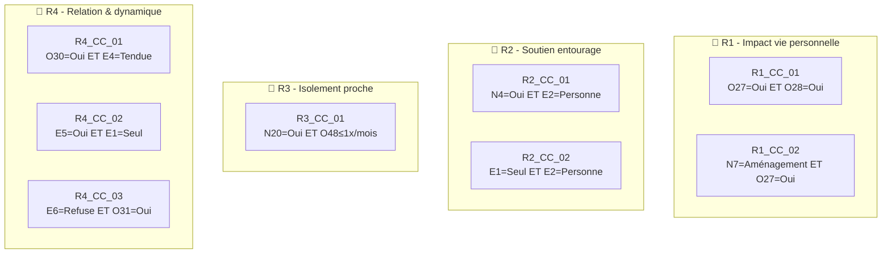

# 🧪 Test Complet – Vulnérabilité "Sociale & Relationnelle"

> **Document de référence** démontrant le fonctionnement du moteur Monka sur la vulnérabilité pilote.
> 
> Date : 02/02/2026

---

## 📋 Table des matières

1. [Référentiel des questions](#1-référentiel-des-questions)
2. [Règles de déclenchement](#2-règles-de-déclenchement)
3. [Mapping Question → Recommandations](#3-mapping-question--recommandations)
4. [Scoring et calcul](#4-scoring-et-calcul)
5. [Cas de test simulés](#5-cas-de-test-simulés)
6. [Conformité Legacy](#6-conformité-legacy)

---

## 1. Référentiel des questions

### 1.1 Questions avec typologie

| ID | Libellé complet | Type | Scoring |
|----|-----------------|------|---------|
| **N4** | Êtes-vous le seul membre de la famille à vous occuper de votre proche ? | Déclenchante | ❌ |
| **N7** | Avez-vous aménagé votre activité professionnelle depuis que vous êtes aidant ? | Descriptive + Déclenchante | ❌ |
| **N20** | Votre proche a-t-il des difficultés à maintenir des relations sociales ? | Scorante | ✅ |
| **E1** | Comment décririez-vous la répartition de l'aide au sein de votre entourage ? | Scorante | ✅ |
| **E2** | En cas de coup dur, avez-vous des personnes sur qui compter pour vous aider ? | Scorante + **Critique directe** | ✅ |
| **E3** | Avez-vous d'autres personnes à charge en plus de votre proche (enfants, autre parent...) ? | Descriptive (modulatrice) | ❌ |
| **E4** | Comment a évolué votre relation avec votre proche depuis que vous l'aidez ? | Scorante | ✅ |
| **E5** | Existe-t-il des tensions ou des désaccords au sein de la famille concernant la prise en charge de votre proche ? | Scorante | ✅ |
| **E6** | Votre proche accepte-t-il l'aide de personnes extérieures (aide à domicile, infirmier, structure, etc.) ? | **Critique directe** + Déclenchante | ❌ |
| **O27** | La situation de votre proche a-t-elle des répercussions sur votre vie familiale ? | Scorante | ✅ |
| **O28** | La situation de votre proche a-t-elle des répercussions sur votre vie sociale, vos loisirs ou votre travail ? | Scorante | ✅ |
| **O30** | Avez-vous le sentiment de ne plus reconnaître votre proche ? | Scorante | ✅ |
| **O31** | Avez-vous peur pour l'avenir de votre proche ? | Descriptive (modulatrice) | ❌ |
| **O48** | À quelle fréquence rendez-vous visite à votre proche ? | Déclenchante | ❌ |

---

## 2. Règles de déclenchement

### 2.1 Questions déclenchantes simples

| ID | Réponse déclenchante | Micro-parcours | Sens clinique |
|----|---------------------|----------------|---------------|
| **N7** | "Aménagement des horaires" / "Congés" | **R1** | Déséquilibre vie pro ↔ rôle d'aidant |
| **O48** | "1 fois par mois ou moins" | **R3** | Faible présence auprès du proche |
| **N4** | "Oui" | **R2** | Absence de relais familial |
| **E6** | "Refuse la plupart du temps" | **R4** | Blocage organisationnel |

### 2.2 Questions critiques directes → Priorité Niveau 1

| ID | Réponse critique | Effet Legacy | Sens clinique |
|----|-----------------|--------------|---------------|
| **E6** | "Refuse la plupart du temps" | ⚡ Priorité niveau 1 | Refus d'aide compromettant toute sécurisation |
| **E2** | "Personne" | ⚡ Priorité niveau 1 | Isolement relationnel sévère de l'aidant |

> [!CAUTION]
> Ces réponses déclenchent automatiquement une **priorité niveau 1** (≤ 7 jours) sans attendre le calcul du score.

### 2.3 Conditions Critiques Composites (CCC)



| Code | Questions | Logique booléenne | Micro-parcours | Sens clinique |
|------|-----------|-------------------|----------------|---------------|
| **R1_CC_01** | O27 + O28 | O27="Oui" **ET** O28="Oui" | R1 | Retentissement massif sur vie privée et sociale |
| **R1_CC_02** | N7 + O27 | N7=aménagement **ET** O27="Oui" | R1 | Ajustement pro + impact familial |
| **R2_CC_01** | N4 + E2 | N4="Oui" **ET** E2="Très peu/personne" | R2 | Aidant seul sans soutien mobilisable |
| **R2_CC_02** | E1 + E2 | E1="Presque tout seul" **ET** E2="Très peu/personne" | R2 | Charge exclusive sans filet |
| **R3_CC_01** | N20 + O48 | N20="Oui" **ET** O48≤1x/mois | R3 | Isolement social du proche confirmé |
| **R4_CC_01** | O30 + E4 | O30="Oui" **ET** E4="Plus tendue" | R4 | Dégradation du lien avec perte de reconnaissance |
| **R4_CC_02** | E5 + E1 | E5="Oui" **ET** E1="Presque tout seul" | R4 | Conflits + charge déséquilibrée |
| **R4_CC_03** | E6 + O31 | E6="Refuse" **ET** O31="Oui" | R4 | Refus d'aide + anxiété projetée |

---

## 3. Mapping Question → Recommandations

### 3.1 E1 – Répartition de l'aide

| Réponse | Recommandation | Acteur | Micro-tâches |
|---------|----------------|--------|--------------|
| **Répartition équilibrée et satisfaisante** | — | — | — |
| **Je fais la plus grande partie mais c'est acceptable** | Proposer un temps d'échange pour identifier des relais potentiels | IDEC | • Lister les personnes de l'entourage mobilisables<br/>• Explorer les freins à une meilleure répartition |
| **Je fais presque tout / seul·e** | Identifier et mobiliser des ressources d'aide complémentaires | IDEC / Assistante sociale | • Évaluer les aides disponibles (services, associations)<br/>• Proposer un accompagnement pour solliciter de l'aide<br/>• Orienter vers des groupes d'entraide |

### 3.2 E2 – Soutien mobilisable en cas de coup dur

| Réponse | Recommandation | Acteur | Micro-tâches |
|---------|----------------|--------|--------------|
| **Oui, plusieurs personnes** | — | — | — |
| **Oui, une personne** | Renforcer le réseau de soutien existant | IDEC | • Identifier d'autres personnes potentiellement mobilisables<br/>• Informer sur les solutions de répit |
| **Très peu de personnes / personne** 🔴 | Mettre en place un accompagnement renforcé et identifier des solutions de soutien | IDEC / Assistante sociale | • Évaluer l'urgence de la situation d'isolement<br/>• Proposer un contact régulier avec un professionnel<br/>• Orienter vers des dispositifs d'aide aux aidants<br/>• Envisager un accueil temporaire pour le proche |

> [!WARNING]
> La réponse "Très peu de personnes / personne" est une **critique directe** → Priorité niveau 1

### 3.3 E4 – Évolution de la relation

| Réponse | Recommandation | Acteur | Micro-tâches |
|---------|----------------|--------|--------------|
| **Relation renforcée ou globalement similaire** | — | — | — |
| **Relation plus tendue / plus compliquée** | Proposer un espace d'écoute pour aborder les difficultés relationnelles | IDEC / Psychologue | • Échanger sur les sources de tension identifiées<br/>• Proposer un accompagnement psychologique si besoin<br/>• Informer sur les groupes de parole |

### 3.4 E5 – Tensions familiales

| Réponse | Recommandation | Acteur | Micro-tâches |
|---------|----------------|--------|--------------|
| **Non** | — | — | — |
| **Parfois** | Échanger sur les sources de désaccord | IDEC | • Identifier les points de tension récurrents |
| **Oui** | Se rapprocher du référent, envisager une médiation familiale | IDEC / Médecin / Médiateur | • Proposer un entretien de médiation<br/>• Orienter vers des dispositifs de soutien ou médiation adaptés |

### 3.5 E6 – Acceptation de l'aide extérieure

| Réponse | Recommandation | Acteur | Micro-tâches |
|---------|----------------|--------|--------------|
| **Oui, facilement** | — | — | — |
| **Oui, mais avec des réticences** | Échanger sur les réticences exprimées | IDEC | • Comprendre les freins à l'acceptation de l'aide |
| **Non, refuse la plupart du temps** 🔴 | Accompagnement renforcé pour lever les blocages | IDEC / Médecin | • Proposer un temps d'échange avec le proche et l'aidant<br/>• Explorer les causes du refus<br/>• Proposer une approche progressive |
| **Je ne sais pas / pas encore essayé** | Informer sur les types d'aides existantes | IDEC | • Proposer une première mise en relation avec un intervenant |

> [!WARNING]
> La réponse "Non, refuse la plupart du temps" est une **critique directe** → Priorité niveau 1

### 3.6 N4 – Aidant seul dans la famille

| Réponse | Recommandation | Acteur | Micro-tâches |
|---------|----------------|--------|--------------|
| **Non** | — | — | — |
| **Oui** | Identifier des relais possibles et sécuriser l'aidant principal | IDEC | • Évaluer les possibilités de mobilisation d'autres membres<br/>• Proposer des solutions de répit<br/>• Orienter vers des associations d'aide aux aidants |

### 3.7 O27 – Répercussions vie familiale

| Réponse | Recommandation | Acteur | Micro-tâches |
|---------|----------------|--------|--------------|
| **Pas du tout** | — | — | — |
| **Un peu** | Surveiller l'évolution et proposer un échange si besoin | IDEC | • Rester attentif aux signaux de dégradation |
| **Oui** | Mettre en place un accompagnement pour préserver l'équilibre familial | IDEC / Psychologue | • Identifier les domaines les plus impactés<br/>• Proposer un soutien psychologique<br/>• Orienter vers des solutions de répit |

### 3.8 O28 – Répercussions vie sociale/loisirs/travail

| Réponse | Recommandation | Acteur | Micro-tâches |
|---------|----------------|--------|--------------|
| **Pas du tout** | — | — | — |
| **Un peu** | Surveiller et proposer un échange | IDEC | • Identifier les activités les plus impactées |
| **Oui** | Mettre en place un accompagnement renforcé | IDEC / Assistante sociale | • Évaluer l'impact professionnel<br/>• Informer sur les droits des aidants<br/>• Proposer des solutions d'aménagement |

### 3.9 O30 – Sentiment de ne plus reconnaître le proche

| Réponse | Recommandation | Acteur | Micro-tâches |
|---------|----------------|--------|--------------|
| **Pas du tout** | — | — | — |
| **Un peu** | Proposer un espace d'écoute | IDEC | • Échanger sur les changements observés |
| **Oui** | Accompagnement psychologique recommandé | IDEC / Psychologue | • Proposer un soutien psychologique<br/>• Informer sur la maladie et son évolution<br/>• Orienter vers des groupes de parole |

### 3.10 N20 – Difficultés relationnelles du proche

| Réponse | Recommandation | Acteur | Micro-tâches |
|---------|----------------|--------|--------------|
| **Non** | — | — | — |
| **Parfois** | Surveiller l'évolution | IDEC | • Identifier les situations problématiques |
| **Oui** | Évaluer les besoins de stimulation sociale | IDEC / Ergothérapeute | • Proposer des activités adaptées<br/>• Évaluer l'intérêt d'un accueil de jour |

---

## 4. Scoring et calcul

### 4.1 Questions scorantes et pondération

| Question | Réponse | Score |
|----------|---------|-------|
| **O27** | Pas du tout / Un peu / Oui | 0 / 1 / 2 |
| **O28** | Pas du tout / Un peu / Oui | 0 / 1 / 2 |
| **E1** | Équilibrée / Acceptable / Seul | 0 / 1 / 2 |
| **E2** | Plusieurs / Une personne / Personne | 0 / 1 / 2 |
| **N20** | Non / Parfois / Oui | 0 / 1 / 2 |
| **O30** | Pas du tout / Un peu / Oui | 0 / 1 / 2 |
| **E4** | Renforcée ou similaire / Tendue | 0 / 1 |
| **E5** | Non / Parfois / Oui | 0 / 1 / 2 |

### 4.2 Formule de calcul

```
Score brut max = 16 (8 questions × 2 sauf E4 = 1 max)
Score normalisé = (Score brut / 16) × 20
```

### 4.3 Grille de lecture

| Score /20 | Couleur | Interprétation |
|-----------|---------|----------------|
| 0 – 6 | 🟢 Vert | Situation sociale globalement préservée |
| 7 – 13 | 🟠 Orange | Fragilisation sociale et relationnelle |
| 14 – 20 | 🔴 Rouge | Isolement ou rupture relationnelle probable |

> [!NOTE]
> Le score **ne déclenche jamais** de micro-parcours. Il détermine uniquement la **temporalité** d'action (≤1 mois si élevé, >1 mois si modéré).

---

## 5. Cas de test simulés

### 5.1 Profil A – Marie, 67 ans (Critique directe → Niveau 1)

| Question | Réponse | Score |
|----------|---------|-------|
| E2 | **Personne** 🔴 | 2 |
| E1 | Je fais presque tout seule | 2 |
| O27 | Oui | 2 |
| O28 | Oui | 2 |
| N4 | Oui | — |
| E4 | Plus tendue | 1 |
| E5 | Parfois | 1 |
| O30 | Un peu | 1 |
| N20 | Non | 0 |

**Résultat :**
- **Score brut** = 11/16 → **Score normalisé = 13.75/20** 🟠
- **Question critique directe activée** : E2 = "Personne"
- **Priorité** : ⚡ **Niveau 1** (≤ 7 jours)
- **Micro-parcours activés** : **R2** (isolement aidant) + **R1** (via CCC R1_CC_01)
- **CCC activées** : R2_CC_01 (N4=Oui ET E2=Personne), R1_CC_01 (O27=Oui ET O28=Oui)

### 5.2 Profil B – Jean, 52 ans (CCC activée → Niveau 2)

| Question | Réponse | Score |
|----------|---------|-------|
| E2 | Une personne | 1 |
| E1 | Je fais presque tout | 2 |
| O27 | Un peu | 1 |
| O28 | Oui | 2 |
| N7 | Aménagement horaires | — |
| E4 | Plus tendue | 1 |
| E5 | Oui | 2 |
| O30 | Un peu | 1 |
| N20 | Parfois | 1 |

**Résultat :**
- **Score brut** = 11/16 → **Score normalisé = 13.75/20** 🟠
- **Aucune critique directe**
- **CCC activée** : R4_CC_02 (E5=Oui ET E1=Seul)
- **Priorité** : ⚡ **Niveau 2** (≤ 7 jours)
- **Micro-parcours activé** : **R4** (relation & dynamique familiale)

### 5.3 Profil C – Sophie, 45 ans (Score élevé → Niveau 3)

| Question | Réponse | Score |
|----------|---------|-------|
| E2 | Plusieurs personnes | 0 |
| E1 | Acceptable | 1 |
| O27 | Un peu | 1 |
| O28 | Un peu | 1 |
| E4 | Similaire | 0 |
| E5 | Non | 0 |
| O30 | Pas du tout | 0 |
| N20 | Non | 0 |

**Résultat :**
- **Score brut** = 3/16 → **Score normalisé = 3.75/20** 🟢
- **Aucune critique directe**
- **Aucune CCC activée**
- **Priorité** : **Niveau 3** (>1 mois, planifié)
- **Micro-parcours** : Aucun activé, surveillance régulière

---

## 6. Conformité Legacy

### Checklist de vérification

| Règle Legacy | Statut | Implémentation |
|--------------|--------|----------------|
| Score ne déclenche jamais | ✅ | Score utilisé uniquement pour temporalité |
| Critique directe = Niveau 1 | ✅ | E2="Personne" et E6="Refuse" → priorité immédiate |
| CCC = Niveau 2 | ✅ | 8 conditions composites avec logique ET |
| Max 3 micro-parcours actifs | ✅ | 4 MP disponibles (R1-R4), sélection par priorité |
| Hiérarchie inter-vulnérabilités | ✅ | Social & Relationnel = rang 4/5 |
| Pas de comptage micro-tâches | ✅ | Progression par ASR uniquement |
| Questions à catégorie unique | ✅ | Chaque question a un type fixe |

---

> 📄 Document généré le 02/02/2026 – Test vulnérabilité Sociale & Relationnelle
